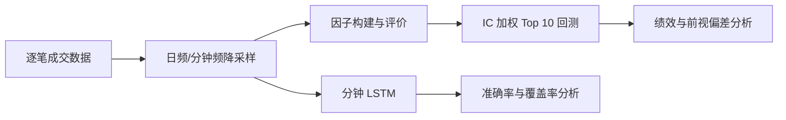

# 兆信基金量化研究项目

这是一个从逐笔成交数据出发的完整量化研究工程，覆盖数据降采样、因子构建与评价、IC 加权组合回测，以及分钟级 LSTM 涨跌预测。仓库只保存代码、测试、依赖和说明文档；原始行情、复权因子、生成结果和模型权重不上传。

> 研究用途声明：项目中的回测和预测结果只用于课程/研究展示，不构成投资建议。

## 一眼看懂项目



项目完成五项工作：

1. 将 300 只股票、302 个交易日的逐笔成交数据整理成日频和分钟频 11 个字段。
2. 构建示例因子、5 日动量、主买主卖失衡和日内振幅。
3. 计算分层收益、IC、IR、ICIR、Rank IC、Rank IR 和 Rank ICIR。
4. 用历史滚动 IC 加权构建每日 Top 10 组合，对比收盘/次日开盘调仓，并展示前视偏差的影响。
5. 用分钟数据训练 LSTM，分别研究非平价条件方向预测和全窗口跌/平/涨预测。

## 仓库里有什么

| 路径 | 用途 | 队友阅读建议 |
|---|---|---|
| [`quant_downsampler/README.md`](quant_downsampler/README.md) | 完整技术口径、公式、命令和结果解释 | 第一次接手先读这里 |
| [`quant_downsampler/qd/`](quant_downsampler/qd/) | 降采样、因子、回测、LSTM 的核心实现 | 按 `config → pipeline → factors → backtest/lstm` 顺序读 |
| [`quant_downsampler/scripts/`](quant_downsampler/scripts/) | 各阶段可直接执行的入口 | 复现时从这里运行 |
| [`quant_downsampler/tests/`](quant_downsampler/tests/) | 核心口径和研究流程测试 | 修改代码后先跑测试 |
| [`docs/FILE_GUIDE.md`](docs/FILE_GUIDE.md) | 每个主要文件的输入、输出和职责 | 分工或讲代码时使用 |
| [`docs/PRESENTATION_GUIDE.md`](docs/PRESENTATION_GUIDE.md) | 汇报结构、关键数字、讲稿提示和答辩问题 | 制作 presentation 时直接参考 |
| [`量化项目展示文档.docx`](量化项目展示文档.docx) | 已整理的长版展示材料 | 可作为 PPT 文案底稿 |

## 数据为什么没有上传

本仓库明确排除了以下内容：

- `data/` 下的原始逐笔行情；
- `adjfactor.pkl` 复权因子；
- `output/` 下生成的日频/分钟频表、图、模型和回测明细；
- `.pt/.pth/.ckpt` 模型权重、缓存、压缩包和 Office 临时文件。

这样既避免公开或重复分发行情数据，也避免 Git 仓库被数 GB 的生成文件拖慢。`.gitignore` 已加入对应规则。

运行时建议保持下面的目录结构。仓库目录名可以修改，但数据和复权因子应放在仓库的上一级：

```text
workspace/
├── data/
│   └── TRADE/
│       └── YYYYMMDD/
│           └── XXXXXX.csv
├── adjfactor.pkl
└── project/                 # 本仓库
    ├── quant_downsampler/
    └── output/              # 运行后自动生成，不提交
```

## 快速开始

要求 Python 3.11 或更高版本。以下命令均从仓库根目录执行：

```bash
cd quant_downsampler
python -m venv .venv
source .venv/bin/activate       # Windows: .venv\Scripts\activate
python -m pip install -r requirements.txt

# 无须跑完整数据即可做基本验收
python -m scripts.smoke_test
python -m unittest discover -s tests -v
```

完整流水线按下面顺序运行：

```bash
python -m scripts.run_step1 --overwrite
python -m scripts.run_factor_eval
python -m scripts.run_backtest
python -m scripts.run_lstm --stocks 5 --epochs 12
python -m scripts.run_lstm_full --stocks 5 --epochs 12 --device cpu
python -m scripts.evaluate_lstm_full --split test
python -m scripts.validate_outputs
```

`run_step1` 会生成后续步骤需要的日频和分钟频表；完整 LSTM 训练耗时较长。各命令参数、输出文件和复现边界见 [`quant_downsampler/README.md`](quant_downsampler/README.md)。

## 已完成结果摘要

以下数字来自本地完整数据产物，仓库不上传对应明细文件：

- 无前视偏差的收盘调仓回测：总收益 37.13%，年化收益 32.87%，Sharpe 1.63，最大回撤 -20.42%。
- 无前视偏差的次日开盘调仓回测：总收益 34.40%，年化收益 30.49%，Sharpe 1.47，最大回撤 -25.76%。
- 非平价条件方向 LSTM：测试准确率 68.10%，但只覆盖全部合法窗口的 56.32%。
- 全窗口跌/平/涨 LSTM：测试准确率 46.88%，Macro F1 45.87%，多数类基线 43.68%。
- 全窗口模型的高置信度档位存在明显准确率—覆盖率权衡：balanced 为 55.60% / 30.85%，strict 为 64.10% / 9.68%。

这些结果不能脱离口径解读：68.10% 是已知下一分钟发生价格变化后的条件方向准确率，不等同于可实时覆盖全部窗口的预测准确率；Naive 回测使用未来信息，只能作为前视偏差反例。

## 协作建议

1. 新建分支再改代码，例如 `feature/factor-name` 或 `fix/backtest-timing`。
2. 不要提交原始数据、`output/`、模型权重或压缩包。
3. 修改核心逻辑后运行 `smoke_test` 和单元测试。
4. PR 中写清楚：改了什么、为何修改、验证命令、指标口径是否变化。
5. 做汇报前先统一“数据口径、信息时序、预测分母”这三件事，避免把不可比较的数字放在同一张图里。
