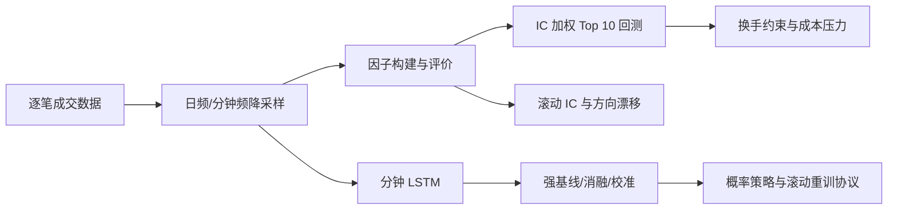

# 兆信基金量化研究项目

这是一个从逐笔成交数据出发的完整量化研究工程，覆盖数据降采样、因子构建与稳健性评价、换手约束与成本压力、分钟级 LSTM/传统机器学习对照，以及概率信号到策略回测的闭环。仓库只保存代码、测试、依赖和说明文档；原始行情、复权因子、生成结果和模型权重不上传。

> 研究用途声明：项目中的回测和预测结果只用于课程/研究展示，不构成投资建议。

## 一眼看懂项目



项目完成五项工作：

1. 将 300 只股票、302 个交易日的逐笔成交数据整理成日频和分钟频 11 个字段。
2. 构建示例因子、5 日动量、主买主卖失衡和日内振幅。
3. 计算分层收益、IC、IR、ICIR、Rank IC、Rank IR 和 Rank ICIR。
4. 用历史滚动 IC 加权构建每日 Top 10 组合，对比收盘/次日开盘调仓，并展示前视偏差的影响。
5. 用分钟数据训练 LSTM，分别研究非平价条件方向预测和全窗口跌/平/涨预测。

在五项基本任务之上，项目还补充了区块 bootstrap、季度/滚动 IC、波动状态、因子相关性、换手缓冲、双边成本压力、Logistic/HistGradientBoosting 强基线、组件消融、验证集温度校准、验证集驱动的组件融合调整与 LSTM+HistGB 概率融合、分钟策略回测，以及 11 折 walk-forward 协议。目前严格独立重训只实际完成第 1 折，其余 10 折仍是待执行计划。

## 仓库里有什么

| 路径 | 用途 | 队友阅读建议 |
|---|---|---|
| [`quant_downsampler/README.md`](quant_downsampler/README.md) | 完整技术口径、公式、命令和结果解释 | 第一次接手先读这里 |
| [`quant_downsampler/qd/`](quant_downsampler/qd/) | 降采样、因子、回测、LSTM 的核心实现 | 按 `config → pipeline → factors → backtest/lstm` 顺序读 |
| [`quant_downsampler/scripts/`](quant_downsampler/scripts/) | 各阶段可直接执行的入口 | 复现时从这里运行 |
| [`quant_downsampler/tests/`](quant_downsampler/tests/) | 核心口径和研究流程测试 | 修改代码后先跑测试 |
| [`docs/FILE_GUIDE.md`](docs/FILE_GUIDE.md) | 每个主要文件的输入、输出和职责 | 分工或讲代码时使用 |
| [`docs/TEAM_DEFENSE_GUIDE.md`](docs/TEAM_DEFENSE_GUIDE.md) | 面向队友的项目介绍、关键数字、答辩分工和建议问答 | 答辩准备时先读这份 |
| [`docs/PRESENTATION_GUIDE.md`](docs/PRESENTATION_GUIDE.md) | 汇报结构、关键数字、讲稿提示和答辩问题 | 制作 presentation 时直接参考 |

## 数据为什么没有上传

本仓库明确排除了以下内容：

- `data/` 下的原始逐笔行情；
- `adjfactor.pkl` 复权因子；
- `output/` 下生成的日频/分钟频表、图、模型和回测明细；
- `.pt/.pth/.ckpt` 模型权重、缓存、压缩包和 Office 临时文件。

这样既避免公开或重复分发行情数据，也避免 Git 仓库被数 GB 的生成文件拖慢。`.gitignore` 已加入对应规则。

运行时建议保持下面的目录结构。仓库目录名可以修改，但数据和复权因子应放在仓库的上一级：

```text
workspace/
├── data/
│   └── TRADE/
│       └── YYYYMMDD/
│           └── XXXXXX.csv
├── adjfactor.pkl
└── project/                 # 本仓库
    ├── quant_downsampler/
    └── output/              # 运行后自动生成，不提交
```

## 快速开始

要求 Python 3.11 或更高版本。以下命令均从仓库根目录执行：

```bash
cd quant_downsampler
python -m venv .venv
source .venv/bin/activate       # Windows: .venv\Scripts\activate
python -m pip install -r requirements.txt

# 无须跑完整数据即可做基本验收
python -m scripts.smoke_test
python -m unittest discover -s tests -v
```

完整流水线按下面顺序运行：

```bash
python -m scripts.run_step1 --overwrite
python -m scripts.run_factor_eval
python -m scripts.run_factor_robustness
python -m scripts.run_backtest
python -m scripts.run_backtest_robustness
python -m scripts.run_lstm --stocks 5 --epochs 12
python -m scripts.run_lstm_full --stocks 5 --epochs 12 --device cpu
python -m scripts.evaluate_lstm_full --split test
python -m scripts.run_lstm_baselines --stocks 5
python -m scripts.run_lstm_hybrid --overwrite
python -m scripts.run_lstm_research --evaluate-components --calibrate --overwrite
python -m scripts.adjust_lstm_fusion --overwrite
python -m scripts.run_lstm_strategy --side long_short
python -m scripts.validate_outputs
```

`run_step1` 会生成后续步骤需要的日频和分钟频表；完整 LSTM 训练耗时较长。各命令参数、输出文件和复现边界见 [`quant_downsampler/README.md`](quant_downsampler/README.md)。

## 已完成结果摘要

以下数字来自本地完整数据产物，仓库不上传对应明细文件：

- 四个因子的全样本平均 IC 均为负，5 日区块 bootstrap 的 95% 置信区间均不跨 0；但 2026Q2 中示例因子、5 日动量和日内振幅的平均 IC 已转正，说明方向存在漂移，不能把全样本负号固定为永久方向。
- 无前视偏差的收盘调仓原策略在题目规定的“卖出 5 bps、买入 0”口径下总收益 37.06%，但日均卖出换手达 72.04%。加入 Top 20 缓冲区、每日最多替换 3 只及滞后流动性/波动过滤后，总收益 22.82%、最大回撤 -18.01%、日均卖出换手降至 30.04%。
- 对称双边成本压力下，原策略与换手约束策略的盈亏平衡单边成本分别约 10.32 和 14.73 bps；在 10 bps 下累计收益分别为 1.30% 和 8.28%。成本已包含样本末持仓退出；压力测试仍未模拟冲击、涨跌停和容量。
- 非平价条件方向 LSTM 准确率 68.10%，但只覆盖全部合法窗口的 56.32%；全窗口三分类 LSTM 为 46.88% Accuracy、45.87% Macro F1、0.6079 Brier 和 0.9979 NLL。
- 强树基线 HistGradientBoosting 达到 46.80% Accuracy、46.02% Macro F1、0.6050 Brier 和 0.9927 NLL。原 LSTM 与树模型的配对 McNemar 精确检验 `p=0.894`，没有建立显著的结构优势。
- 只用验证集重新选择融合参数后，move bias 从 -0.05 调为 -0.16、joint weight 从 0.50 调为 0.34；测试 Accuracy 为 46.97%、Macro F1 为 46.76%，但 Brier 恶化至 0.6117。调整后与树基线仍无显著差异（`p=0.770`）。
- 验证集冻结的跨模型融合给 LSTM/HistGradientBoosting 权重 0.49/0.51；测试 Accuracy 为 47.31%、Macro F1 为 46.39%、Brier 为 0.6032、NLL 为 0.9906。它相对原 LSTM 和树模型的 McNemar 检验分别为 `p=0.269/0.165`，仍不能宣称显著领先。
- walk-forward 已规划 11 折，目前只完成第 1 折独立重训示范：10 个测试日上 Accuracy 54.46%、Macro F1 46.54%，多数类 46.95%。单折结果不能证明跨时期稳定性。
- 分钟策略把概率转成仓位并按精确时间戳接入下一分钟收益。在单边 5 bps 下，strict 置信档的 long-short/long-only 10 日净收益分别为 5.67%/2.54%，但全覆盖和 balanced 方案均转负；结果只适合说明换手与成本约束，不能外推为长期收益。
- 混合模型虽然改善了 Accuracy/Brier/NLL，其 strict 档同口径策略净收益只有 long-short 0.09%、long-only 1.70%，低于原 LSTM；分类或概率指标的微小改进不等于经济价值提升。
- 当前测试套件共有 56 项，覆盖数据口径、信息时序、因子稳健性、成本重定价、概率校准、融合调整、传统基线和策略收益对齐。

原始 `output/backtest/` 按样本末持仓市值计价、不强制清仓，因此保存的累计收益仍为 37.13%；本轮稳健性报告为统一比较成本而补计期末全部退出，得到更保守的 37.06%。两者相差约 0.07 个百分点，来自终止清仓费用，并非数据或选股路径改变。

这些结果不能脱离口径解读：68.10% 是事后已知下一分钟发生价格变化后的条件方向准确率；固定的 10 日模型测试段已被多次查看；策略收益也只来自这 10 日。Naive 回测使用未来信息，只能作为前视偏差反例。真正的泛化结论仍需新增日期或完成全部预先定义的独立重训折。

## 协作建议

1. 新建分支再改代码，例如 `feature/factor-name` 或 `fix/backtest-timing`。
2. 不要提交原始数据、`output/`、模型权重或压缩包。
3. 修改核心逻辑后运行 `smoke_test` 和单元测试。
4. PR 中写清楚：改了什么、为何修改、验证命令、指标口径是否变化。
5. 做汇报前先统一“数据口径、信息时序、预测分母”这三件事，避免把不可比较的数字放在同一张图里。
