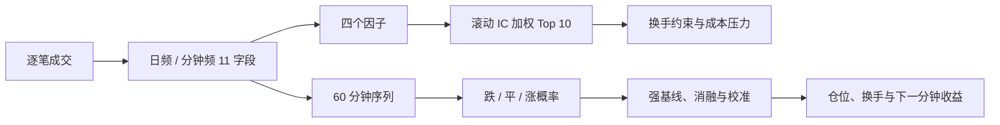

# 队友答辩准备指南

这份 README 写给需要快速接手项目的队友。它不按代码文件逐个介绍，而是回答答辩现场最实际的问题：项目做了什么，数字怎么解释，我们相对只做涨跌判断的方案多了什么，以及哪些结论不能夸大。

## 如果只有 20 分钟

按下面的顺序阅读：

1. 先记住“一句话介绍”和“项目主线”。
2. 找到自己负责的模块，看完对应的“为什么做—怎么做—结果如何”。
3. 背熟“关键数字速查表”和“容易说错的话”。
4. 最后过一遍常见问题。

## 一句话介绍

我们把 300 只股票、302 个交易日的逐笔成交数据整理成日频和分钟频数据，完成了因子选股与分钟预测两条研究线，然后用信息时序、强基线、交易成本和时间外重训来检查结论是否站得住。

可以直接用这段作为 30 秒开场：

> 我们的项目从逐笔成交数据出发，先统一复权、停牌、无成交分钟和集合竞价的口径，再做因子回测和下一分钟三分类预测。我们不只报一个准确率，还检查前视偏差、因子漂移、强树模型基线、概率质量和成本后收益。最后的结论是：流程已经完整，但 LSTM 相对强树模型还没有显著优势。

## 项目主线



这里有两条研究线：

- 日频线：因子能否预测次日收益，选出的组合在换手和成本后还能不能保留收益。
- 分钟线：过去 60 分钟能否给出下一分钟的跌、平、涨概率，概率转成仓位后是否经得住成本。

因子模型和分钟模型不是两个互不相关的小实验。它们共用同一套数据处理口径，也都要回答“信息在当时是否可见”和“收益能否支付交易成本”。

## 第一部分：数据到底是怎么处理的

### 原始输入

- 300 只股票；
- 302 个交易日，区间为 2025-04-01 至 2026-06-30；
- 逐笔数据包含成交时间、价格、成交量和主买主卖标记；
- 额外使用复权因子修正分红配股带来的价格跳变。

### 生成了什么

日频和分钟频都有 11 个字段：

```text
open / high / low / close
volume / trade_count / amount
buy_volume / sell_volume / buy_amount / sell_amount
```

每个交易日的分钟表有 242 行：上午 121 行，下午 121 行，并保留 15:00 的收盘集合竞价。

### 答辩时值得讲的细节

- 原始价格先除以 100，再乘以“当日复权因子 / 样本首日复权因子”。
- 成交量、成交笔数和成交额保留真实成交口径，成交额不复权。
- 停牌日的 OHLC 延用前收，成交字段填 0。
- 连续竞价中没有成交的分钟延用前一分钟 close；14:57–14:59 不伪造价格，实际撮合放在 15:00。
- 股票文件的六位代码和复权表的 `.SH/.SZ` 代码全部一一匹配。

这一部分看似只是工程处理，但复权、停牌、15:00 和无成交分钟任何一处写错，后面的因子和模型数字都会失真。

## 第二部分：因子和日频组合

### 四个因子

| 因子 | 直白解释 |
|---|---|
| 示例因子 | 不同期限成交额均线的离散程度 |
| 5 日动量 | 近 5 日价格涨跌 |
| 主买主卖失衡 | 主动买入与主动卖出的相对强弱 |
| 日内振幅 | 当日高低价差占收盘价的比例 |

IC 是当日因子值与下一交易日收益的横截面相关系数。IC 为负不等于因子无效，而是说当期应该反向使用。

| 因子 | 全样本平均 IC | 5 日区块 bootstrap 95% CI | 2026Q2 IC |
|---|---:|---:|---:|
| 示例因子 | -0.0780 | [-0.0959, -0.0585] | 0.0227 |
| 5 日动量 | -0.0276 | [-0.0445, -0.0099] | 0.0299 |
| 主买主卖失衡 | -0.0479 | [-0.0610, -0.0336] | -0.0320 |
| 日内振幅 | -0.0736 | [-0.0927, -0.0541] | 0.0056 |

全样本上四个因子的 IC 都显著为负，但到 2026Q2，其中三个已经转正。所以我们不把“全样本负号”当成永久方向，而是使用严格滞后的历史滚动 IC 来定方向和权重。

### 回测时序

在交易日 `t` 做选股决策时：

- 因子只能用 `t-1` 的数值；
- IC 权重只能用截至 `t-2` 已实现的收益；
- 新建仓的股票要确认当日可交易；
- 已持有但停牌的股票不假设可以卖出。

Naive 版本故意用了未来收益，只用来演示前视偏差会把净值夸张到什么程度。它不是策略成果。

### 成本压力后的结果

| 方案 | 题目费用口径累计收益 | 日均卖出换手 | 最大回撤 | 对称单边盈亏平衡成本 |
|---|---:|---:|---:|---:|
| 原修正版 | 37.06% | 72.04% | -20.42% | 10.32 bps |
| 换手约束版 | 22.82% | 30.04% | -18.01% | 14.73 bps |

换手约束版使用 Top 20 缓冲区、每日最多替换 3 只，并用滞后的成交额与波动率过滤新建仓。它牺牲了部分样本内收益，但把日均卖出换手从 72.04% 降到 30.04%，对称单边成本到 10 bps 时仍有 8.28% 累计收益。到 20 bps 时两个方案都为负。

答辩时要补一句：这里还没有模拟冲击、滑点、涨跌停和策略容量。

## 第三部分：分钟预测不只是“猜涨跌”

### 任务怎么定义

每个样本使用过去 60 分钟的数据，标签比较下一分钟 close 与当前 close。窗口不跨交易日，也不跨午休。标准化只在训练集上拟合，训练、验证和测试按日期先后切分。

项目保留了两种口径：

| 口径 | 预测目标 | 测试覆盖 | Accuracy | 正确解读 |
|---|---|---:|---:|---|
| 条件方向模型 | 在已知下一分钟非平价时判断 down/up | 56.32% | 68.10% | 事后诊断方向能力 |
| 全窗口模型 | 对所有合法窗口预测 down/flat/up | 100.00% | 46.88% | 可在预测时实际使用的口径 |

68.10% 更高，不代表它是更好的实时模型。“下一分钟会不会平价”在预测当时并不知道，如果只保留事后非平价样本，样本是否出现本身就泄露了未来。

### 三组件结构

全窗口 LSTM 包含三个组件：

- movement 判断下一分钟是平价还是变动；
- direction 在价格变动时区分跌和涨；
- joint 直接预测跌、平、涨。

前两个组件构成 two-stage 路径，再与 joint 路径在验证集上选择融合参数。测试集只在参数冻结后读取。

消融结果很克制：joint only 的 Accuracy 是 46.61%，two-stage only 是 46.47%，原融合是 46.88%。这说明融合有小幅互补，但不是数量级提升。

### 强基线是整个模型章节的重点

所有模型使用相同的 5 只股票、日期切分和 5,900 个测试窗口。

| 模型 | Accuracy | Macro F1 | Brier | NLL |
|---|---:|---:|---:|---:|
| 训练集多数类 | 43.68% | 20.27% | 0.6507 | 1.0755 |
| Logistic Regression | 46.58% | 42.83% | 0.6213 | 1.0238 |
| HistGradientBoosting | 46.80% | 46.02% | 0.6050 | 0.9927 |
| 原 LSTM | 46.88% | 45.87% | 0.6079 | 0.9979 |
| LSTM + HistGB hybrid | 47.31% | 46.39% | 0.6032 | 0.9906 |

原 LSTM 只比 HistGradientBoosting 高 0.085 个百分点 Accuracy，而树模型的 Macro F1、Brier 和 NLL 略好。McNemar 配对检验 `p=0.894`，差异不显著。

hybrid 的权重只在验证集上选择，LSTM/HistGB 分别为 0.49/0.51。它将 Accuracy 提到 47.31%，同时改善 Brier 和 NLL，但相对原 LSTM 和树模型的配对检验仍不显著，`p=0.269/0.165`。

这一页不是为了证明 LSTM 失败。它说明项目组知道不能只拿复杂模型和多数类比，也能坦白地区分“数值略高”与“证据支持显著领先”。

## 相对“只有涨跌”的模型，我们多了什么

| 只做涨跌二分类 | 本项目 | 实际价值 |
|---|---|---|
| 强制每个时点判断涨或跌 | 显式建模 flat | 平价或低信心时可以不交易，避免无效换手 |
| 常只报 Accuracy | 同时报 Macro F1、Brier、NLL、ECE、覆盖率 | 能看出小类表现和概率是否可信 |
| 只输出硬标签 | 保留 down/flat/up 完整概率 | 可以设置置信档位、仓位权重和风险预算 |
| 事后删掉平价样本 | 三分类覆盖全部合法窗口 | 样本是否出现不会泄露下一分钟结果 |
| 只与随机或多数类比 | 与 Logistic、HistGB 在同窗口比较并做配对检验 | 能判断复杂模型是否真有新增价值 |
| 准确率高就结束 | 把概率接入下一分钟收益、换手和成本 | 直接检查“预测更好”能否转成“成本后更好” |
| 固定一次时间切分 | 预先生成 11 折 walk-forward 协议 | 要求每折重训标准化、模型、融合和阈值 |

最有说服力的例子是 strict 档。它不是事后挑对的样本，而是按验证集冻结的概率阈值选择高信心预测。原 LSTM 在测试集 strict 档的 Accuracy 为 64.10%，覆盖率为 9.68%。因此不能直接说“模型全市场准确率 64.10%”，必须同时交代低覆盖的代价。

## 概率到交易：为什么准确率高不一定赚钱

分钟策略使用 `P(up) - P(down)` 生成方向和信心度，然后按横截面归一化成仓位，接入精确的下一分钟收益。换手包含进场、调仓、数据断档平仓和样本末退出。

在单边 5 bps 线性成本下，置信加权结果为：

| 原 LSTM 策略 | 10 日净收益 | 盈亏平衡单边成本 |
|---|---:|---:|
| all long-short | -13.27% | 4.14 bps |
| balanced long-short | -5.82% | 4.47 bps |
| strict long-short | 5.67% | 6.36 bps |
| strict long-only | 2.54% | 6.68 bps |

宽覆盖方案在成本后转负，只有 strict 档在这 10 日仍为正。这支持“flat 与低信心不交易能降低无效换手”，但不能证明长期稳定盈利。

还有一个很好的反例：hybrid 的 Accuracy、Brier 和 NLL 都略好，但它的 strict long-short/long-only 同口径净收益只有 0.09%/1.70%，低于原 LSTM 的 5.67%/2.54%。分类指标改善不等于经济价值改善，这就是为什么项目不停在模型测试表。

## 时间外重训做到了哪一步

项目已预先生成 11 折扩展窗口 walk-forward 协议。每一折都应该重新拟合标准化、三个 LSTM 组件、融合参数和置信阈值。把同一个静态模型按日期切片，不算 walk-forward。

目前只完成第 1 折独立重训：

| 分段 | 日期 |
|---|---|
| train | 2025-04-01 至 2025-12-23 |
| validation | 2025-12-24 至 2026-01-08 |
| test | 2026-01-09 至 2026-01-22 |

这一折的 Accuracy 为 54.46%，Macro F1 为 46.54%，多数类基线为 46.95%。这说明独立重训代码可以执行；由于只有一折，还不能判断模型是否跨时期稳定。剩余 10 折仍需重训，最终还应使用 2026-06-30 之后的新数据做确认。

## 我们相对其他组真正能拉开的地方

答辩时不要把“用了 LSTM”当成最大亮点。目前的强树基线已经说明，模型名字本身不能拉开差距。更有说服力的是下面这些已经落地的工作：

- 数据口径能从逐笔文件一直追到最终概率和仓位。
- 主动保留 Naive 反例，用它解释前视偏差，而不是只展示最好看的净值。
- 因子结果有区块 bootstrap、季度/滚动 IC 和方向漂移，不把全样本显著性等同于未来稳定。
- 回测不只扣一个象征性费率，还检查换手约束、对称成本曲线和盈亏平衡成本。
- 模型与 Logistic、HistGB 在同一样本比较，且使用逐样本配对检验，没有只挑弱基线。
- 概率有校准、可靠性和覆盖率评价，预测结果还接入了真实时间对齐的下一分钟回测。
- 56 项自动化测试和产物验收会检查时间索引、成本、概率和标签收益方向。

这些工作的共同点很简单：答辩委员可以沿着代码和产物复查每个关键结论。

## 8–10 分钟答辩分工

| 时间 | 建议负责人 | 内容 | 必须讲出的一句话 |
|---|---|---|---|
| 0:00–1:30 | A：数据 | 问题、数据量、降采样和复权 | 数据不是简单 resample，停牌、无成交分钟和集合竞价都有明确口径。 |
| 1:30–4:00 | B：因子/回测 | 四因子、方向漂移、信息时序、换手和成本 | 因子全样本显著为负，但近期有三个转正，所以用滞后滚动 IC，不固定方向。 |
| 4:00–6:30 | C：模型 | 三分类、概率、强基线、消融和 hybrid | 原 LSTM 与 HistGB 基本打平，hybrid 略有改善但仍不显著。 |
| 6:30–8:30 | D：策略/验证 | 概率到仓位、成本敏感性、walk-forward 与测试 | 只有 strict 档在 10 日、5 bps 下为正，它是诊断，不是长期盈利证明。 |
| 8:30–9:30 | A 或 D | 结论和限制 | 项目的优势是证据链完整，不是已经证明 LSTM 显著领先。 |

如果只有三个人，让 B 兼讲成本策略，C 兼讲 walk-forward。每个人都要能解释 68.10% 与 46.88% 的差别，这是最容易被追问的口径。

## 关键数字速查表

| 主题 | 数字 | 记法 |
|---|---|---|
| 数据 | 300 股、302 日、11 字段、每日 242 分钟行 | 数据规模与口径 |
| 因子 | 4 个全样本 IC 显著为负，2026Q2 有 3 个转正 | 显著不等于稳定 |
| 原修正回测 | 37.06%；日均卖出换手 72.04% | 收益高，换手也高 |
| 换手约束回测 | 22.82%；卖出换手 30.04%；盈亏平衡 14.73 bps | 用收益换可交易性 |
| 条件二分类 | 68.10% Accuracy；56.32% 覆盖 | 只是非平价诊断 |
| 全窗口 LSTM | 46.88% Accuracy；45.87% Macro F1 | 三分类主口径 |
| HistGB | 46.80% Accuracy；与 LSTM `p=0.894` | LSTM 未显著领先 |
| hybrid | 47.31% Accuracy；0.6032 Brier；0.9906 NLL | 概率略好，仍不显著 |
| 原 LSTM strict 策略 | long-short 5.67%；long-only 2.54% | 10 日、单边 5 bps |
| walk-forward 第 1 折 | 54.46% Accuracy；46.95% 多数类 | 只证明流程可执行 |
| 工程验收 | 56/56 项测试通过 | 口径和产物可自动复核 |

## 术语小抄

| 术语 | 在本项目中怎么理解 |
|---|---|
| Accuracy | 全部样本中猜对类别的比例，但容易被大类别主导 |
| Macro F1 | 先分别计算跌、平、涨的 F1，再平均；小类别不会被忽略 |
| Coverage | 模型实际给出预测或交易信号的样本比例 |
| Brier / NLL | 评价整个概率分布，越低越好；比只看硬标签更严格 |
| ECE | 预测置信度与实际正确率的差距，越低说明概率越可信 |
| bps | 基点，1 bps = 0.01%；“单边 5 bps”指每次买或卖单独按 0.05% 计成本 |
| McNemar `p` 值 | 在同一批样本上比较两个分类器；`p>0.05` 时，当前样本不足以支持它们有稳定差异 |
| walk-forward | 按时间向前滚动，每一折用当时的训练/验证数据重新训练，再测后面一段时间 |

## 容易说错的话

| 不要这样说 | 改成这样说 |
|---|---|
| 我们模型准确率是 68.10% | 条件方向模型在 56.32% 的非平价窗口上是 68.10%；全窗口三分类是 46.88%。 |
| LSTM 比树模型好 | 两者准确率接近，配对检验不显著。 |
| hybrid 已经提升模型 | hybrid 的数值略好，但差异不显著，成本后策略反而更弱。 |
| 我们的因子稳定为负 | 全样本为负，近期三个因子转正，存在方向漂移。 |
| Naive 回测是我们最好的策略 | Naive 回测用了未来信息，只是前视偏差反例。 |
| 回测已经包含真实交易摩擦 | 已做线性成本压力，尚未模拟冲击、滑点、容量和涨跌停。 |
| strict 策略已证明可以盈利 | strict 在已查看的 10 日测试段和 5 bps 线性成本下为正，只能视为诊断。 |
| 我们做完了 11 折 walk-forward | 我们生成了 11 折协议，目前只完成第 1 折独立重训。 |

如果现场看到旧回测产物中的 37.13%，不要慌。`output/backtest/` 按样本末持仓市值计价，没有强制最后清仓；成本压力报告补计末期退出后是 37.06%。0.07 个百分点差异来自最后退出费用，不是数据或选股路径变了。

## 常见问题与建议回答

### 1. 因子 IC 为负，为什么还能用？

负 IC 表示因子值越高，下一日收益倾向越低，反向使用即可。问题不在负号，而在方向会变。最近季度有三个因子转正，所以我们用当时可见的滚动 IC 动态定向。

### 2. 为什么 Naive 回测特别好？

它用了尚未发生的收益计算当日权重，等于提前知道部分答案。它的作用是演示前视偏差，不是与修正版争夺“最好策略”。

### 3. 68.10% 和 46.88% 哪个更好？

不能直接比。68.10% 只算下一分钟确实变动的样本；46.88% 覆盖全部合法窗口，还要识别 flat。答辩时必须同时说标签空间和覆盖率。

### 4. LSTM 和树模型差不多，那为什么还做 LSTM？

LSTM 是用来检验分钟时序是否有额外价值的候选结构。实验结果告诉我们，在当前数据和特征下，这个额外价值尚未建立。这个否定结果也有用：后续应优先增加新数据和改进时序特征，而不是只堆网络层数。

### 5. 为什么三分类比二分类更适合这个任务？

分钟价格有大量平价。三分类把 flat 显式纳入预测，所以无需在事后删样本，也能在平价或低信心时空仓。二分类仍作为条件方向诊断保留，但不能冒充全市场预测。

### 6. hybrid 分类指标更好，为什么策略反而更差？

Accuracy 只看最大概率所对应的类别是否正确，策略则关心 `P(up)-P(down)` 的大小、排序、换手和收益幅度。一个模型可以多猜对几个小波动样本，却在真正影响仓位的样本上排序更差。

### 7. 分钟策略已经证明可以实盘了吗？

没有。当前测试只有 10 个交易日，而且假设在窗口结束收盘价零延迟成交。线性成本没有包含冲击、成交失败和 long-short 的融券费。

### 8. 为什么 walk-forward 只跑一折？

第 1 折是完整流程演练，使用缩小的 hidden=32、1 层、4 epochs 网络，验证每折独立训练和冻结参数的代码可以跑通。目前还不能用它代表多折结论。

### 9. 项目怎么避免用测试集调参？

标准化只拟合训练集；模型候选、融合权重、温度和置信阈值只在验证集选择。冻结文件先落盘，然后才首次读取测试切分并生成概率。不过固定的 10 日测试段在开发中已多次被研究者查看，所以它现在只能称为统一口径诊断，不再是严格盲测。

### 10. 项目还缺什么？

当前最需要的不是换一个更大的网络，而是完成剩余 walk-forward 折，并用 2026-06-30 之后的新数据做真正未见样本验证。因子线还需要真实行业/市值暴露，交易线需要冲击、容量、涨跌停和融券成本。

## 建议使用的图和产物

优先选四张图，不要把每个输出都塞进展示页：

1. 因子时变与置信区间：[`../output/factor_robustness/factor_robustness.png`](../output/factor_robustness/factor_robustness.png)
2. 换手约束和成本压力：[`../output/backtest_robustness/backtest_robustness.png`](../output/backtest_robustness/backtest_robustness.png)
3. LSTM、HistGB 与 hybrid 对比：[`../output/lstm_hybrid/lstm_hybrid_comparison.png`](../output/lstm_hybrid/lstm_hybrid_comparison.png)
4. 分钟策略成本曲线：[`../output/lstm_strategy/strategy_cost_sensitivity.png`](../output/lstm_strategy/strategy_cost_sensitivity.png)

需要核对数字时，优先看脚本自动生成的报告：

- [`../output/factor_robustness/README.md`](../output/factor_robustness/README.md)
- [`../output/backtest_robustness/README.md`](../output/backtest_robustness/README.md)
- [`../output/lstm_baselines/README.md`](../output/lstm_baselines/README.md)
- [`../output/lstm_hybrid/README.md`](../output/lstm_hybrid/README.md)
- [`../output/lstm_research/README.md`](../output/lstm_research/README.md)
- [`../output/lstm_strategy/README.md`](../output/lstm_strategy/README.md)
- [`../output/lstm_walk_forward/fold_01/README.md`](../output/lstm_walk_forward/fold_01/README.md)

`output/` 默认不提交 Git。如果队友本地没有这些产物，不要从截图反推或手写数字，请让有完整数据的队友运行对应脚本后再取图。

## 答辩前的复现与检查

不建议在现场重训 LSTM。答辩前由一位队友统一运行：

```bash
cd quant_downsampler
python -m unittest discover -s tests -v
python -m scripts.validate_outputs
```

如果需要重建某一类研究产物，再按需执行：

```bash
python -m scripts.run_factor_robustness
python -m scripts.run_backtest_robustness
python -m scripts.run_lstm_baselines --stocks 5
python -m scripts.run_lstm_hybrid --overwrite
python -m scripts.run_lstm_research --evaluate-components --calibrate --overwrite
python -m scripts.run_lstm_strategy --side long_short
```

答辩前一天核对：

- 所有百分比保留两位小数，不在不同页使用不同精度。
- 68.10% 旁边必须出现 56.32% 覆盖；64.10% 旁边必须出现 9.68% 覆盖。
- 回测图注明信息时序、费用口径和是否期末清仓。
- 不把 10 日分钟策略的年化 Sharpe 放在主页。
- 不把第 1 折重训说成已完成 11 折。
- 主讲人与备答人都能说清 LSTM 与 HistGB 差异不显著。
- 一位队友保存最终 `validation_report.json`，另一位队友抽查四张核心图的数字。

## 继续阅读

- 项目总览：[`../README.md`](../README.md)
- 完整技术口径：[`../quant_downsampler/README.md`](../quant_downsampler/README.md)
- 文件与代码分工：[`FILE_GUIDE.md`](FILE_GUIDE.md)
- 按展示页组织的长版大纲：[`PRESENTATION_GUIDE.md`](PRESENTATION_GUIDE.md)
