# 兆信基金量化研究项目中期报告（教师审阅版）

> 项目周期：2025-04-01 至 2026-06-30  
> 数据范围：300 只匿名股票、302 个交易日的逐笔成交数据  
> 报告更新日期：2026-08-12  
> 本报告对应代码目录：`project/quant_downsampler`  
> 正式结果目录：`project/output`

---

**教师审阅建议**：第 1 节汇总题目验收情况与扩展研究；第 3、4、5、7 节分别对应 Task 1、Task 2–3、Task 4、Task 5；第 9 节总结研究结论与边界；第 13 节收录正文未展开的结果。若只核对题目完成情况，可依次阅读第 1.1、3.3、4.1–4.4、5.1–5.4、7.1–7.9 和 9.0 节。

## 摘要

本项目完成了题目规定的五项任务，并补充了稳健性与可交易性研究。正式主线包括逐笔成交数据降采样、示例因子与三个自建因子的构建和评价、1,000 万元 Top 10 组合的收盘及次日开盘回测、前视偏差修正，以及分钟级 LSTM 下一分钟涨跌预测。

日频和分钟频的 11 个字段均通过结构、数值与复权验收。四个正式因子均给出 Q1–Q5 净值曲线，以及 IC、IR、ICIR 和 Rank 指标。修正前视偏差后，四因子 `adaptive_close` 与 `adaptive_open` 的总收益分别为 19.85% 和 52.76%。

正式三组件 LSTM 的测试准确率为 46.46%，高于 43.68% 的多数类基线。进一步考虑市场基准、交易成本和真实 T+1 时点后，Task 4 开盘策略的历史超额证据相对较强；Task 5 的可交易超额则较小，且测试期较短。

报告据此区分两类问题：一是题目要求是否完成，二是结果是否稳健、能否跑赢市场并具备可交易性。历史回测和分类准确率均不能直接等同于实盘收益。

---

## 1. 题目要求与完成情况

### 1.1 五项要求逐项验收

| 题目明确要求 | 本项目正式作答 | 关键结果 | 正式证据 |
|---|---|---|---|
| **Task1：逐笔数据降采样为日频和分钟频，并输出开、高、低、收、成交量、成交笔数、成交额、主买量、主卖量、主买额、主卖额** | 严格生成11个字段；日频每字段一张表，分钟频每字段一个文件夹、每日一张表；OHLC按题目要求填充并使用复权因子修正 | 日频11张302×300表；分钟频每字段302张242×300表 | `output/daily`、`output/minute`；第3节 |
| **Task2：按指定逻辑构建示例因子** | 构建 `log(std(MA1(amount), MA5(amount), MA10(amount), MA20(amount)))`，各均线使用完整窗口 | 前19日不以短窗口冒充20日均值，因子方向与分层结果一致 | `required_factor_summary.csv`；第4.1–4.3节 |
| **Task3：因子分层，计算IC、IR、ICIR、Rank IC、Rank IR、Rank ICIR；另构建1至3个因子并测试** | 正式集合严格为示例因子＋3个自建因子；逐日做Q1–Q5分层并保存五条净值曲线，同时计算全部指定指标 | 示例因子和20日量价相关严格单调；另外两个正式因子主要体现极端组效应 | `required_factor_layering_nav.png`及相关CSV；第4节 |
| **Task4：初始资金1,000万元，按IC加权选Top 10；收盘和次日开盘两种调仓；卖出万5、买入免费；计算净值、波动率、最大回撤、夏普；指出原方法问题并修改** | 先原样实现Naive泄漏对照，再以仅使用已实现历史IC的rolling/expanding/hybrid/adaptive四种可交易权重修正；采用现金＋股数账本、停牌锁仓和真实手续费 | 正式4因子 `adaptive_close` 总收益19.85%、Sharpe 0.847、最大回撤-16.06%；`adaptive_open` 总收益52.76%、Sharpe 1.844、最大回撤-18.19% | `output/backtest_required`；第5节 |
| **Task5：基于分钟线设计端到端神经网络（如LSTM），预测下一分钟股价涨跌** | 使用60分钟因果窗口构建down/flat/up三分类LSTM；窗口不跨午休和交易日，所有标准化只拟合训练集；测试集保留逐样本概率与标签 | seed 42 Accuracy 46.46%、Balanced Accuracy 46.18%、Macro F1 45.93%；高于多数类基线 | `output/lstm_ensemble`；第7.1–7.9节 |

### 1.2 正式答案与扩展研究的边界

为保证主线清晰，正式答案与扩展研究按以下边界划分：

- Task2–3 的**正式因子只有4个**：题目示例因子和3个自建因子；其余6个仅作扩展。
- Task4 的**正式回测先只使用上述4因子**；10因子、聚类精选、正交化和因子机器学习均为扩展。
- Task5 的**正式答案是下一分钟三分类LSTM**；T+1收益、涨跌幅回归、强基线、特征去冗余和直接超额标签均为扩展。
- 扩展实验只使用训练集或验证集选择参数，并明确说明其是否进入正式方案。负结果同样保留，不按测试收益事后筛选。

### 1.3 扩展研究完整总览

| 扩展问题 | 实验设计 | 主要结果 | 对正式方案的处理 |
|---|---|---|---|
| 降采样结果是否满足内部一致性 | 全量日频规则检查＋均匀抽取24个交易日的11字段分钟表审计 | 规则违例0；抽样均为242×300，15:00与日频close最大误差0 | 作为Task1质量证据，不改变数据 |
| 因子平均有效是否由少数日期造成 | 5日循环区块Bootstrap、滚动/月度/季度/半年IC | 10因子全样本平均IC均显著为负，但2026Q2有9个Pearson IC转正 | 保留正式因子，强调时变风险 |
| 因子反转是否只是市场整体下跌 | 按市场下一日方向与仅用已知收益构造的趋势状态分组 | 市场状态影响强度，但不能单独解释因子近期衰减 | 不加入事后市场择时 |
| 因子信息能维持多久 | 正式4因子对1/2/5/10日收益做同口径Rank IC与Q1−Q5 | 示例、20日动量、量价相关四期限同向；买卖失衡5/10日反向 | 不按结果事后选择持有期 |
| 单因子与组合是否真正跑赢市场 | 同执行价300股等权市场、直接收益率差和几何超额 | 正式4因子全期close/open分别高市场12.84/44.14个百分点 | 市场对照成为正式报告口径 |
| 超额是否可能源于偶然 | 策略—市场同步收益的5日移动区块Bootstrap及60日滚动Beta/IR | 首次持仓后open几何超额42.45%，95%区间6.04%–91.26%、p=0.008；close区间跨零 | 不改变策略，只区分证据强弱 |
| 换手和成本是否吞噬收益 | Top20缓冲、每日最多替换3只、流动性/波动过滤，0–20 bp成本压力 | 5 bp下收益9.25%→11.33%，平均卖出换手37.42%→24.08% | 作为可执行性增强，不事后替换主表 |
| 10个因子是否重复计权 | 前120日冻结聚类代表与截面正交化，后181日统一回测 | 10→6因子后相关性0.837→0.597、几何超额21.46%；正交化相关性0.096但换手更高 | 候选方案，待多折walk-forward |
| Task4是否依赖单一参数与单段历史 | 40/60/90日×Top5/10/20×close/open共18配置，每组切4个不重叠折 | 正式60日/Top10的close有3/4折正超额，open为2/4；18配置中14组至少3折为正 | 不事后挑选参数，削弱对全期open数字的过度解读 |
| 因子非线性模型是否更好 | 收益率回归、直接Sharpe优化、固定切分与120日滚动 | 全期强、最近45日Sharpe为负，未解决方向时变 | 不替换历史IC主策略 |
| LSTM是否优于简单模型，概率是否可信 | 同样本Logistic、HistGB、规则和多数类；验证集温度校准 | LSTM Accuracy领先Logistic 1.12个百分点；ECE 2.71%→0.91% | 保留LSTM，但不夸大优势 |
| “70%多准确率”是否等于交易胜率 | 同时报全样本/高置信度Accuracy与Coverage，并构造统一T+1策略 | strict约63%但仅覆盖约9%；它不是平仓胜率 | 必须同时披露覆盖率和收益 |
| 预测涨跌幅能否改善策略 | 分类＋signed-return双头LSTM，按验证收益Rank IC冻结checkpoint | 收益Rank IC 0.335，但高换手下扣费收益仍差 | 保留为探索，不替换正式分类模型 |
| 哪个可交易持有期更合适 | `open[t+1]`入场的1/5/15/30分钟和T+1标签，Ridge/HistGB＋低频Top-K | T+1 Ridge同覆盖几何超额+0.69%，紧凑LSTM为-8.08% | Ridge作为收益强基线，不替换题目LSTM答案 |
| 直接预测市场超额是否更合题意 | 原始T+1收益与“个股收益－5股市场收益”同切分对照 | 直接超额标签Rank IC转负，最好超额+0.49%，低于原始收益Ridge | 不采用直接超额标签 |
| 25个分钟特征是否冗余 | 训练集因果摘要聚类，25→19特征；另做原题四字段基线 | 19特征LSTM超额-0.67%，优于25特征-8.08%和4特征-2.40%，但仍弱于Ridge | 19特征作为下一轮候选，不替换正式模型 |
| 三组件是否真正互补 | joint/staged/blend同键概率消融与分歧样本分析 | 验证分歧样本融合更好，短测试期优势未稳定延续 | 保留三组件结构，待多折OOF确认 |
| Task5指标和T+1超额有多大不确定性 | 分类按10个测试交易日整块Bootstrap；T+1按9个结算日2日区块Bootstrap | Accuracy 95%区间44.81%–48.25%；balanced T+1超额区间-0.37%–1.13% | 分类优势较可信，经济超额仍不能排除0 |

### 1.4 总体研究路线

整体流程为：

```text
逐笔成交 + adjfactor
        ↓
日频/分钟频 11 字段
        ↓
日频因子 → IC/Rank IC/分层/bootstrap/市场状态
        ↓
严格历史 IC 加权 → 真实持仓账本 → 市场/换手/成本检验
        ↓
因子收益率回归 / 直接夏普优化
        ↓
分钟序列特征 → LSTM/强基线 → 概率校准 → T+1 收益评价
```

---

## 2. 数据、路径与复权处理

### 2.1 数据结构

原始数据覆盖 2025-04-01 至 2026-06-30，共 302 个交易日、300 只匿名股票。逐笔数据中的价格字段为整数，真实价格为：

```text
raw_price = Price / 100
```

每笔数据还包含成交量和已经预处理好的 `BSFlag`：

- `BSFlag=0`：主动买成交；
- `BSFlag=1`：主动卖成交；
- `BSFlag=2`：集合竞价成交。

### 2.2 路径整理

队友版本中存在其他电脑的绝对路径。最终代码统一由 `qd/config.py` 基于文件位置推导：

- 原始数据：工作区 `data/TRADE`；
- 复权因子：工作区 `adjfactor.pkl`；
- 正式输出：`project/output`。

如更换电脑，可通过 `QD_DATA_DIR`、`QD_ADJFACTOR_PATH` 和 `QD_OUTPUT_DIR` 覆盖，不需要修改源代码。

### 2.3 复权因子处理

`adjfactor.pkl` 是 302×300 的 DataFrame，列名为带 `.SH/.SZ` 后缀的完整证券代码；逐笔文件名为六位匿名代码。去掉市场后缀后，双方 300 个代码一一对应，无缺失、无重复。

最终价格复权公式为：

```text
adjusted_price(date)
= raw_price(date)
× adjfactor(date)
/ adjfactor(first_valid_date)
```

归一化到首个有效因子可以让首日价格保持原始量级，同时消除后续分红配股造成的非交易性跳变。复权只作用于 OHLC；成交量、成交笔数、成交额、主买/主卖量额保留真实交易口径。

---

## 3. Task1：逐笔数据降采样

> **题目要求**：由逐笔成交生成日频和分钟频数据，包含11个指定字段，并遵守集合竞价、连续竞价及缺失价格填充规则。  
> **本项目作答**：11个字段全部实现；日频按“字段一张表”保存，分钟频按“字段一个文件夹、每日一张表”保存；OHLC完成复权。  
> **正式产物**：`output/daily`、`output/minute`，统一验收结果见 `output/validation_report.json`。

### 3.1 日频字段

每只股票、每个交易日计算：

- `open`：当日第一笔成交价；
- `high` / `low`：最高/最低成交价；
- `close`：当日最后一笔成交价；
- `volume`：成交量总和；
- `trade_count`：成交笔数；
- `amount`：逐笔 `raw_price × volume` 后求和；
- `buy_volume` / `sell_volume`：按 BSFlag 拆分；
- `buy_amount` / `sell_amount`：主动买卖成交额。

日频 OHLC 包含开盘和收盘集合竞价。停牌日价格字段使用上一交易日收盘价延续，成交类字段填 0。

### 3.2 分钟频字段

每个交易日输出 242 行：

- 上午 09:30–11:30，共 121 行；
- 下午 13:00–15:00，共 121 行。

连续竞价阶段无成交分钟的 OHLC 使用前一分钟 close 填充；成交类字段填 0。14:57–14:59 是收盘集合竞价等待行，价格保留 NaN、成交字段为 0；最终撮合成交记录在 15:00。

Task5 不使用全部 242 行，而只使用连续竞价区间：上午 09:30–11:30、下午 13:00–14:56，避免把集合竞价等待行当成普通一分钟。

### 3.3 验收结果

统一验收脚本确认：

- 11 张日频表全部为 302×300；
- 每个分钟字段均有 302 个 CSV；
- 抽查首日和末日，每张分钟表均为 242×300；
- 300 个匿名代码均能映射到复权因子完整代码；
- BSFlag 主买/主卖拆分、开盘集合竞价排除和 15:00 收盘撮合规则通过烟雾测试。

### 3.4 扩展：数据质量与跨频一致性审计

除文件数量和首末日形状外，本轮又对全部302×300日频单元执行OHLC顺序、非负成交字段、主买卖量额不超过总量额等规则检查；分钟频数据量较大，因此从完整日期序列均匀抽取24个交易日，读取每一日全部11个字段和300只股票，检查242行结构、14:57–14:59集合竞价等待行，以及15:00分钟收盘与日频收盘的一致性。该口径明确是“日频全量＋分钟均匀抽样”，不把抽样夸写成全量审计。

| 审计项目 | 结果 |
|---|---:|
| 日频全量与分钟抽样规则违例 | **0** |
| 分钟抽样日期 | 24/302 |
| 抽样分钟表形状 | 全部242×300 |
| 14:57–14:59非空价格/成交流 | 0 / 0 |
| 15:00 close与日频close最大绝对误差 | **0** |

现有 Task 1 产物在结构、数值边界、集合竞价和跨频收盘口径上保持一致。审计结果位于 `output/data_quality_extension/`。

---

## 4. Task2–3：因子构建与评价

> **题目要求**：完成指定示例因子；另构建1至3个因子；展示因子分层效果，并计算IC、IR、ICIR、Rank IC、Rank IR、Rank ICIR。  
> **本项目作答**：正式集合严格为1个示例因子＋3个自建因子；每个因子均计算完整指标并保存Q1–Q5逐日收益、五条累计净值和单调性检验。  
> **正式产物**：`output/evaluation/required_factor_summary.csv`、`required_factor_layering_nav.png`及分层CSV。第4.5–4.6节开始属于稳健性扩展。

### 4.1 正式因子与扩展因子

题目要求为“示例因子＋另构建 1 至 3 个因子”，正式答题集合由此限定为 4 个：

| 因子 | 定义 | 信息类型 |
|---|---|---|
| example_factor | `log(std(MA1(amount), MA5, MA10, MA20))` | 题目指定 |
| momentum_20d | `close_t / close_(t-20) - 1` | 价格趋势 |
| buy_sell_imbalance | `(buy_volume-sell_volume)/(buy_volume+sell_volume)` | 主动买卖订单流 |
| volume_price_corr_20d | 过去 20 日成交量变化率与价格收益率滚动相关 | 量价关系 |

示例因子的 MA5/MA10/MA20 必须分别积累满 5/10/20 个观测才有效，前 19 日不再用短窗口冒充“20 日均值”。以下 6 个因子不属于必答数量，只作为扩展敏感性研究：`momentum_5d/10d`、`volatility_5d/10d/20d`、`intraday_range`。完整研究集合仍为 10 个：

| 因子 | 定义 |
|---|---|
| example_factor | `log(std(MA1(amount), MA5, MA10, MA20))`，完整窗口 |
| momentum_5d/10d/20d | `close_t / close_(t-N) - 1` |
| volatility_5d/10d/20d | 日收益率过去 N 日标准差 |
| buy_sell_imbalance | `(buy_volume-sell_volume)/(buy_volume+sell_volume)` |
| intraday_range | `(high-low)/close` |
| volume_price_corr_20d | 过去 20 日成交量变化率与价格收益率滚动相关 |

前向标签为次日复权收盘收益：

```text
forward_return_1d(t) = close(t+1) / close(t) - 1
```

### 4.2 评价口径修正

最终版明确区分 IR 和 ICIR：

```text
ICIR = mean(daily_IC) / std(daily_IC)
IR   = sqrt(252) × ICIR
```

Rank ICIR 与 Rank IR 同理。此前代码把 IR 和 ICIR 输出为同一个数，本次已经修正并增加自动测试。

### 4.3 全样本结果

先给出题目正式4因子的全部指定指标；这里的IR和Rank IR为年化值：

| 正式因子 | IC | IR | ICIR | Rank IC | Rank IR | Rank ICIR |
|---|---:|---:|---:|---:|---:|---:|
| example_factor | -0.0781 | -8.692 | -0.548 | -0.1076 | -11.664 | -0.735 |
| momentum_20d | -0.0364 | -3.962 | -0.250 | -0.0667 | -8.114 | -0.511 |
| buy_sell_imbalance | -0.0480 | -6.940 | -0.437 | -0.0198 | -2.978 | -0.188 |
| volume_price_corr_20d | -0.0243 | -4.271 | -0.269 | -0.0578 | -8.949 | -0.564 |

扩展6因子的同口径结果保存在 `factor_summary.csv`，其IC范围为-0.0747至-0.0281。本报告不把它们混入题目要求的正式4因子主表；扩展因子的完整分层和稳健性结果仍在第4.4–4.6节报告。

负 IC 不是计算错误。它表示因子值越大，下一日收益通常越低，因子可以反向使用。例如，在严格完整窗口下，example_factor 的 Q1 平均次日收益为 +0.2058%，Q5 为 -0.2960%，Q5-Q1 约 -0.5018%，方向与负 IC 一致。

### 4.4 因子分层检验

为检验 IC 是否对应稳定的截面收益排序，每个交易日将约 300 只股票按照当日因子值从低到高排序，并尽量等量划分为 Q1–Q5 五组；随后计算各组下一交易日的等权平均收益，再在全部有效交易日上取时间均值。Q1 表示因子值最低的 20% 股票，Q5 表示因子值最高的 20% 股票。由于本项目各因子的全样本 IC 均为负，因此同时报告反向多空价差 Q1−Q5；该值为正，表示“买入低因子组、卖出高因子组”的方向与负 IC 一致。

下表单位均为单日平均收益率（%），尚未扣除手续费、滑点和冲击成本。

| 因子 | Q1 | Q2 | Q3 | Q4 | Q5 | Q1−Q5 |
|---|---:|---:|---:|---:|---:|---:|
| example_factor | +0.2058 | +0.1677 | +0.1216 | +0.0324 | -0.2960 | **+0.5018** |
| momentum_5d | +0.0665 | +0.1188 | +0.1277 | +0.0944 | -0.0776 | +0.1441 |
| momentum_10d | +0.0467 | +0.1007 | +0.0923 | +0.1094 | -0.0874 | +0.1341 |
| momentum_20d | +0.0945 | +0.1023 | +0.0999 | +0.0295 | -0.1056 | +0.2001 |
| volatility_5d | +0.0426 | +0.1008 | +0.0831 | +0.0741 | -0.1350 | +0.1776 |
| volatility_10d | +0.0953 | +0.1197 | +0.1306 | +0.0850 | -0.1012 | +0.1965 |
| volatility_20d | +0.0743 | +0.1147 | +0.0864 | +0.0621 | -0.0759 | +0.1502 |
| buy_sell_imbalance | +0.0796 | +0.0281 | +0.0548 | +0.0387 | -0.0439 | +0.1235 |
| intraday_range | +0.0726 | +0.0808 | +0.1089 | +0.0918 | -0.1955 | **+0.2681** |
| volume_price_corr_20d | +0.1125 | +0.1073 | +0.0874 | +0.0307 | -0.0768 | **+0.1893** |

五个平均值只反映全期均值，不能代替分层回测。本次还保存每个信号日的 Q1–Q5 收益，并按 `(1+r).cumprod()` 生成五条累计净值曲线：


正式 4 因子的单调性指标如下。`layer_spearman=-1` 且相邻下降数为 4/4 才是严格单调；Q1−Q5 t 值来自逐日多空收益序列。

| 因子 | 分层 Spearman | 相邻下降数 | Q1−Q5 日均 | t 值 | 严格单调 |
|---|---:|---:|---:|---:|---|
| example_factor | -1.0 | 4/4 | +0.5018% | 8.43 | 是 |
| momentum_20d | -0.7 | 3/4 | +0.2001% | 3.85 | 否 |
| buy_sell_imbalance | -0.7 | 3/4 | +0.1235% | 2.96 | 否 |
| volume_price_corr_20d | -1.0 | 4/4 | +0.1893% | 4.98 | 是 |

分层结果给出四点信息：

1. 10 个因子的 Q1−Q5 均为正，与全样本负 IC 的方向一致，并非因子符号计算错误；
2. `example_factor` 的反向分层价差最大，且 Q1 到 Q5 基本单调下降；`volume_price_corr_20d` 也呈现较清晰的单调下降关系；
3. `intraday_range`、动量和波动率因子的收益差异更多集中在 Q5 极端组，中间层并不完全单调，说明其关系具有尾部效应，不能简单理解为线性预测；
4. 五条曲线仍使用全样本标签，只用于 Task3 的描述性因子评价。它不能用于事后确定 Task4 权重，且曲线未扣手续费、滑点和冲击成本。因子的时间稳定性仍应结合下一节的训练、验证、测试分段结果判断。

完整结果分别保存在 `required_factor_summary.csv`、`required_factor_layering.csv`、`factor_layer_daily_returns.csv`、`factor_layer_nav.csv`、`factor_layer_metrics.csv` 和 `factor_layer_monotonicity.csv`；10 因子逐层均值仍保存在 `factor_layering.csv`。

### 4.5 扩展：因子时变

按时间 70%/15%/15% 切分后，多数因子的普通 Pearson IC 在训练和验证阶段为负，但在最后测试阶段转为正：

| 因子 | Train IC | Validation IC | Test IC |
|---|---:|---:|---:|
| example_factor | -0.1007 | -0.0918 | +0.0323 |
| intraday_range | -0.0890 | -0.1012 | +0.0191 |
| momentum_10d | -0.0492 | -0.0365 | +0.0434 |
| momentum_20d | -0.0492 | -0.0659 | +0.0474 |
| buy_sell_imbalance | -0.0568 | -0.0271 | -0.0276 |


上表和图采用 Pearson IC。进一步检查 Rank IC 后，测试期 10 个因子中仍有 8 个为负。`example_factor`、`intraday_range` 和 `buy_sell_imbalance` 的测试期 Rank IC 分别为 -0.0182、-0.0368 和 -0.0179；只有 `momentum_10d`、`momentum_20d` 略微转正，分别为 +0.0116、+0.0108，且均不显著。

由此不能认为“所有因子的排序方向都已反转”。更准确的判断是：多数因子的排序能力近期明显衰减，而 Pearson IC 还受到尾部极端收益影响。买卖失衡的方向相对稳定，但强度较弱。

### 4.6 扩展：区块 Bootstrap 与市场状态检验

参考队友仓库的稳健性框架，本项目增加月度、季度、半年和 60 日滚动 IC、5 日循环区块 Bootstrap、因子平均截面 Spearman 相关矩阵，以及市场状态条件检验。Bootstrap 保留日序列的短期相关性；`p` 值通过对 IC 去均值后在零假设下重采样计算，避免把简单的符号概率误作显著性检验。

在 301 个交易日中，10 个因子的全样本 Pearson IC 区块 Bootstrap 95% 区间均未跨 0，表明负向平均 IC 并非由少数日期偶然造成。不过，2026Q2 有 9 个因子的平均 Pearson IC 转正，只有 `buy_sell_imbalance` 仍为负（-0.0320）。可见，全样本统计显著并不意味着因子方向长期稳定。

为直接回应“最后反转是否只是市场整体出问题”，进一步使用两种状态：

- `target_market_direction`：下一日 300 股等权市场上涨/下跌，只用于事后诊断；
- `known_market_trend`：截至信号日可见的过去 20 日市场累计收益，划分 bull/bear，可用于因果状态分析。

代表性结果如下：

| 因子 | 市场下一日上涨时 IC | 市场下一日下跌时 IC | bull 趋势 IC | bear 趋势 IC |
|---|---:|---:|---:|---:|
| example_factor | -0.0798 | -0.0759 | -0.0918 | -0.0519 |
| momentum_5d | -0.0578 | +0.0093 | -0.0221 | -0.0381 |
| buy_sell_imbalance | -0.0534 | -0.0412 | -0.0591 | -0.0303 |
| intraday_range | -0.0435 | -0.1135 | -0.0888 | -0.0522 |
| volume_price_corr_20d | -0.0128 | -0.0386 | -0.0175 | -0.0362 |

市场状态会改变因子强度，`momentum_5d` 在市场下跌日甚至出现方向差异；但多数代表因子在 bull 和 bear 两种已知趋势中仍保持负 IC。近期变化不能简单归因于市场整体下跌，更可能是市场状态切换、尾部股票收益和因子自身时变共同作用。完整结果位于 `output/factor_robustness/`。

### 4.7 扩展：正式4因子的多期限信息衰减

题目只要求预测次日收益，但因子可能在更长周期才体现。本轮保持“信号日和实现日均有成交”的正式评价规则不变，分别构造1、2、5、10日复权收盘收益，不按结果选择最优期限。

| 正式因子 | 1日 Rank IC | 2日 | 5日 | 10日 | 期限结论 |
|---|---:|---:|---:|---:|---|
| example_factor | -0.108 | -0.122 | -0.143 | -0.147 | 负向关系随期限增强 |
| momentum_20d | -0.067 | -0.075 | -0.092 | -0.109 | 负向关系随期限增强 |
| buy_sell_imbalance | -0.020 | -0.001 | +0.009 | +0.015 | 主要是短周期信号，5日后反向 |
| volume_price_corr_20d | -0.058 | -0.068 | -0.082 | -0.092 | 四个期限同向 |

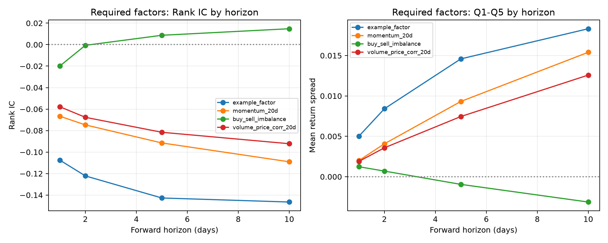

三类慢变量与更长期收益的累计关系更强，但这不等于 10 日策略更优：多日收益彼此重叠，且该分析尚未计入换手和组合约束。买卖失衡的 Q1−Q5 从 1 日的 +0.123% 变为 10 日的 -0.313%，说明它不适合作为长期排序因子。完整 16 行结果见 `output/factor_horizon_extension/horizon_metrics.csv`。

---

## 5. Task4：历史 IC 加权组合回测

> **题目要求**：初始资金1,000万元，以IC加权因子信号选Top 10；分别按收盘价和次日开盘价调仓；卖出万5、买入免费；报告净值、收益、波动率、最大回撤和夏普，并指出当日因子与次日收益IC加权的问题及修改方法。  
> **本项目作答**：先保留Naive前视版本说明问题，再改为只使用已实现历史IC的严格版本；正式4因子同时完成close/open回测，并使用真实现金＋股数账本处理手续费、停牌和权重漂移。  
> **正式产物**：`output/backtest_required/metrics.csv`、`nav_curve.png`、`lookahead_bias_comparison.png`。第5.5–5.10节为市场、显著性、成本、独立性与时序稳定性扩展。

### 5.1 原题方法的前视偏差

如果在交易日 t 使用“因子 t 与次日收益”的 IC 作为 t 的权重，就需要提前知道未来价格。Naive 方法因此存在直接前视偏差。其年化收益超过 1200%、夏普约 11，明显不属于可交易结果，仅用于展示泄漏会产生多夸张的假象。

### 5.2 严格时间线

最终严格版本的信号和收益时间线为：

```text
close(t) 得到因子值并形成决策
       ↓
在 t+1 的 open 或 close 执行
       ↓
持有至 t+2 同一执行价
       ↓
到 t+2 才完整知道 signal(t) 对应的 IC 标签
```

决策日 t 可用的最新原始 IC 是 t-2，因此先对 IC 序列执行 `shift(2)`，再计算历史权重。该两日信息滞后已加入自动测试。

### 5.3 四种严格权重

- rolling：过去 60 个已实现 IC 的均值；
- expanding：全部已实现历史 IC 的扩展均值；
- hybrid：`0.7 × expanding + 0.3 × rolling`；
- adaptive：hybrid 再除以滚动 IC 波动，并关闭近期/长期方向冲突或绝对 IC 小于 0.01 的因子；
- naive：故意不滞后，只用于泄漏对照。

初始资金严格设为10,000,000元。每日对各因子做稳健截面 z-score，使用带符号历史 IC 权重合成信号，选择 Top 10 等权持有。卖出费率为0.05%（万5），买入不收费；执行日无成交股票不能买卖，已有停牌持仓继续锁定在账面中。每日CSV保存组合市值、收益率和换手，净值曲线由实际组合市值除以初始资金得到。

### 5.4 题目正式4因子的严格结果

本节只使用 Task2–3 的正式 4 因子，不让扩展因子混入题目主答案。

| 策略 | CAGR | 年化波动 | Sharpe | 最大回撤 | 总收益 |
|---|---:|---:|---:|---:|---:|
| rolling_close | 11.03% | 21.41% | 0.595 | -23.47% | 13.31% |
| expanding_close | 8.56% | 21.17% | 0.493 | -21.14% | 10.30% |
| hybrid_close | 13.00% | 20.85% | 0.691 | -19.53% | 15.72% |
| adaptive_close | **16.37%** | 20.34% | **0.847** | **-16.06%** | **19.85%** |
| rolling_open | 19.39% | 21.35% | 0.937 | -31.16% | 23.58% |
| expanding_open | 30.09% | 20.81% | 1.368 | -23.79% | 36.92% |
| hybrid_open | 28.88% | 20.91% | 1.318 | -23.59% | 35.40% |
| adaptive_open | **42.58%** | 20.37% | **1.844** | **-18.19%** | **52.76%** |


正式 4 因子中，adaptive 在收盘和开盘两种执行口径下都优于其他历史权重方法，且开盘执行的全期表现更强。但 10 因子扩展版并未复现这一优势，故“开盘一定更好”不能作为普遍结论。两套执行结果均按题目要求报告。

### 5.5 扩展：市场基准与超额收益

为区分“策略自身失效”和“市场整体下跌”，分别使用复权收盘价和复权开盘价构造 300 只股票每日等权基准，使基准收益区间与策略执行价严格一致。停牌股票的前向填充价格产生 0 收益；基准每日恢复等权，不计自身换手成本，因此它是一个相对严格的比较对象。

| 执行口径与区间 | 策略 | 同口径等权市场 | 累计收益率差（百分点） | 几何超额 | 信息比率 |
|---|---:|---:|---:|---:|---:|
| close：全部 301 日 | +19.85% | +7.01% | **+12.84** | **+12.00%** | 0.562 |
| close：首次执行后 280 日 | +19.85% | +8.69% | **+11.16** | **+10.26%** | 0.761 |
| close：最后 45 日 | -13.05% | -12.66% | **-0.40** | **-0.45%** | -0.088 |
| open：全部 301 日 | +52.76% | +8.62% | **+44.14** | **+40.64%** | 1.773 |
| open：首次执行后 277 日 | +52.76% | +7.24% | **+45.52** | **+42.45%** | 2.563 |
| open：最后 45 日 | -15.68% | -12.79% | **-2.89** | **-3.32%** | -1.073 |

全样本开头包含滚动窗口预热期，策略在此期间持有现金。从首次实际执行日起重新比较后，两套策略仍有正超额，排除了预热期空仓这一主要干扰。不过，参数和因子集合均已在当前样本上多次检验，结果仍属于历史回测，而非全新盲测。

两种“跑赢市场”口径均保留：累计收益率差是老师所说的直接减法，单位为百分点；几何超额是复利相对净值 `策略净值/市场净值-1`。前者更直观，后者更适合跨期复合，两者不能混写。下图的中间面板就是直接相减曲线，零线上方表示截至当日策略累计收益率高于市场。

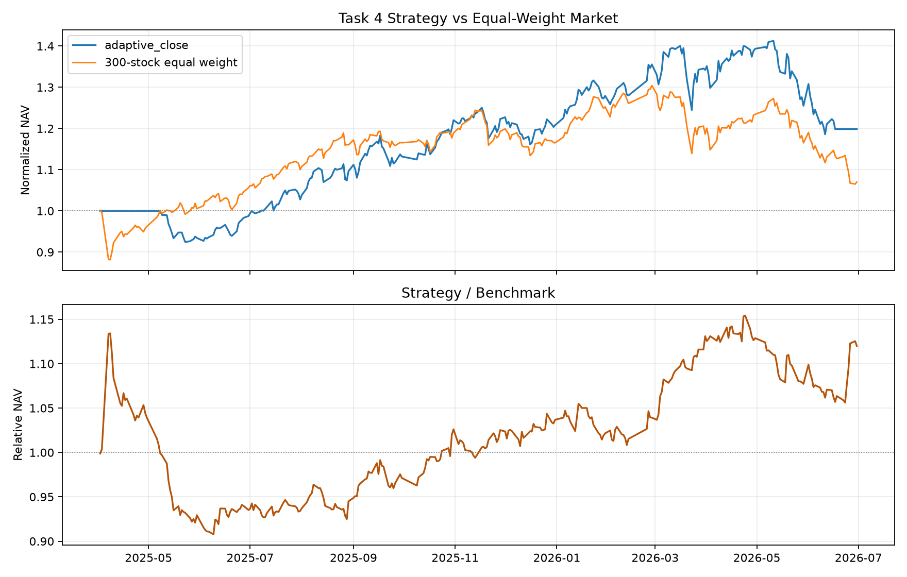


最后 45 日，两种市场基准均下跌约 12.7%，解释了策略绝对回撤的大部分。不过，close 和 open 策略仍分别落后市场 0.40 和 2.89 个百分点，对应几何超额 -0.45% 和 -3.32%。这表明市场环境恶化与因子选股能力衰减同时存在，不能把亏损完全归因于其中任何一方。

横截面 IC 对所有股票共同的市场收益平移并不敏感。市场普跌本身不会机械地令 IC 变号，但市场状态切换可能改变不同股票之间的相对收益结构，从而削弱原有因子的排序能力。

#### 5.5.1 扩展：超额收益显著性与滚动风险

累计收益为正还不能回答“跑赢市场是否可能只是少数日期造成”。本项目对策略与同执行价市场的同步日收益进行**成对圆形移动区块 Bootstrap**：区块长度 5 个交易日、5,000 次重采样，保留短期自相关；同时分别报告全期、首次实际持仓后和最后 45 日。该检验只诊断已冻结策略，不根据 Bootstrap 结果重新选择策略或参数。

| 因子集合与执行 | 首次持仓后几何超额 | 95% Bootstrap 区间 | 超额为正概率 | 日均超额单侧 p 值 |
|---|---:|---:|---:|---:|
| 正式4因子 close | +10.26% | -15.17% ～ +41.11% | 76.56% | 0.204 |
| **正式4因子 open** | **+42.45%** | **+6.04% ～ +91.26%** | **98.98%** | **0.008** |
| 扩展10因子 close | +0.51% | -19.54% ～ +26.13% | 52.08% | 0.498 |
| 扩展10因子 open | -2.28% | -22.85% ～ +24.31% | 43.18% | 0.592 |

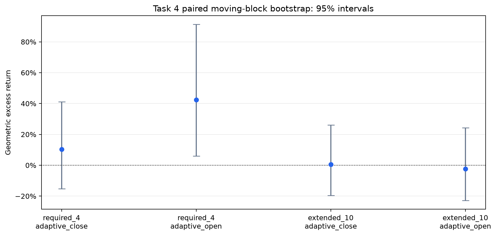

检验结果将“全期跑赢市场”细化为三档证据：正式 4 因子 open 在首次持仓后的区间下界仍为正，历史超额证据较强；close 的点估计为正但区间跨零；扩展 10 因子的两种执行均缺乏可靠超额。最后 45 日四条策略的区间也全部跨零，只能确认近期点估计跑输，尚不足以判断结构性失效。

进一步保存 60 日滚动几何超额、Beta、信息比率、相关性和跟踪误差。下图表明正式4因子的相对表现和市场暴露随时间明显变化，支持“市场环境和选股能力共同变化”的判断，而不是用单个全期收益概括整个样本。

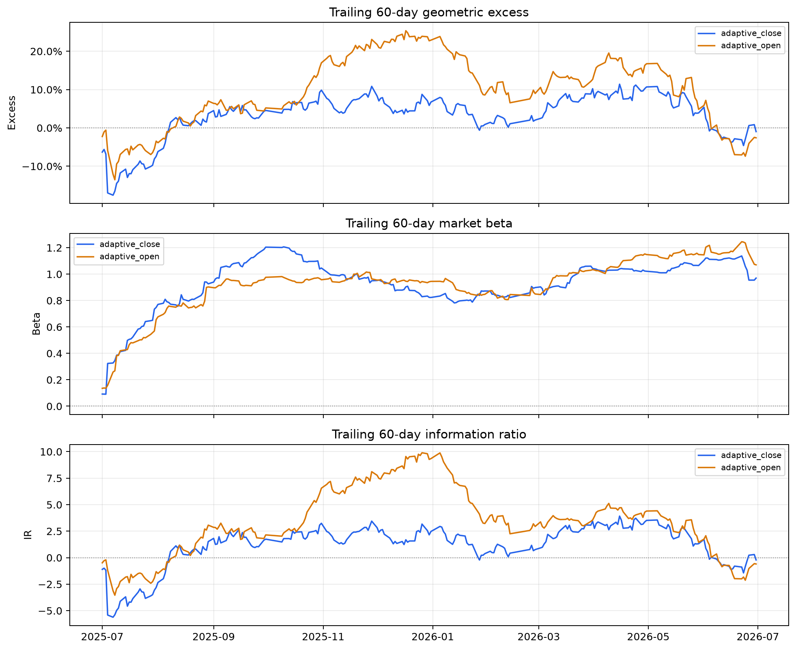

下图使用对数坐标对比严格策略与 Naive 泄漏策略。两者数量级差异说明为什么不能把使用未来 IC 的结果当作模型能力。


### 5.6 扩展：单因子策略能否跑赢市场

IC 显著不保证扣费后的组合能够跑赢市场。为把统计评价和经济评价分开，本项目对 10 个因子逐一调用与正式组合相同的严格时间线、真实现金/股数账本、停牌锁仓和卖出 5 bps 成本，然后从各自首次执行日起与 300 股等权市场精确对齐。

| 单因子严格策略 | 策略收益 | 同期市场 | 几何超额 | 信息比率 |
|---|---:|---:|---:|---:|
| volume_price_corr_20d | +16.95% | +4.97% | **+11.42%** | 0.812 |
| example_factor | +13.89% | +5.67% | **+7.79%** | 0.679 |
| momentum_20d | +4.52% | +4.48% | +0.04% | 0.056 |
| intraday_range | -2.12% | +8.69% | -9.95% | -0.597 |
| buy_sell_imbalance | -15.30% | +8.69% | -22.07% | -1.435 |
| momentum_5d | -29.67% | +6.98% | **-34.26%** | -2.456 |

结果表明各因子的作用不同：`volume_price_corr_20d` 和 `example_factor` 具有独立经济贡献，`momentum_20d` 大致跟随市场，其余若干因子单独交易会明显落后。正式 adaptive 组合仍保留弱因子，是因为它只使用历史已实现 IC 动态定向并在近期/长期符号冲突时关闭因子，而不是按全样本单因子收益事后筛选。

### 5.7 扩展：10因子的换手缓冲与成本压力

参考队友仓库“不要只看毛收益”的思路，但不采用其集合式等权持仓实现，本项目直接在现有现金＋股数账本上增加三项约束：Top 20 排名缓冲、每日最多替换 3 只、只允许过去 20 日成交额不处于底部 20%且波动率不处于顶部 10%的股票新建仓。停牌持仓继续以实际股数锁定，持仓价格变化造成的权重漂移会在下一次真实调仓时进入换手和费用。

| 方案 | 卖出成本 | 总收益 | 首次执行后几何超额 | 平均卖出换手 | 最大回撤 |
|---|---:|---:|---:|---:|---:|
| 原 adaptive Top10 | 5 bps | +9.25% | +0.51% | 37.42% | -16.35% |
| 缓冲与过滤版本 | 5 bps | **+11.33%** | **+2.43%** | **24.08%** | **-11.36%** |

缓冲版本并不是通过更频繁择时提高收益，而是减少排名边缘股票反复进出，使换手下降约 35%。固定规则的成本压力结果为：

| 卖出成本 | 原 Top10 | 缓冲版本 |
|---|---:|---:|
| 0 bps | +15.58% | +15.44% |
| 5 bps | +9.25% | +11.33% |
| 10 bps | +3.26% | +7.36% |
| 20 bps | -7.76% | -0.15% |

在零成本下，原 Top10 毛收益略高；成本上升后缓冲版本更稳健，说明其价值主要来自降低交易摩擦，而不是数据挖掘出新的高收益信号。正式主表仍保留原 adaptive 策略，缓冲版本作为可执行性增强与敏感性检验，避免在查看测试结果后替换主策略。

### 5.8 扩展：因子聚类精选与截面正交化

原始 10 个因子同时包含 5/10/20 日动量和 5/10/20 日波动率，直接做 IC 加权会重复计入相近信息。为避免全样本相关矩阵和测试收益参与选择，本轮以前 120 个交易日作为冻结区间，仅使用 2025-04-01 至 2025-09-22 的截面相关性和当时已实现的历史 IC。IC 仍滞后两个交易日；绝对 Spearman 相关性阈值固定为 0.60。策略于 2025-09-23 开始交易，绩效从 2025-09-24 起计算。

冻结区间形成 6 个相关性簇。三个动量因子归为一簇并选择 `momentum_10d`，三个波动率因子归为一簇并选择 `volatility_10d`；其余四个因子各自保留。簇内代表仅依据冻结时可见的绝对历史 ICIR 选择。另一条路线不删除因子，而是按同一历史 ICIR 顺序，将每日截面秩暴露进行 Gram-Schmidt 残差化。该变换只使用当日因子值，不接触当日或未来收益。

| 因子集合 | 因子数 | 后续最大绝对相关性 | 有效秩 | 策略收益 | 市场收益 | 几何超额 | Sharpe | 最大回撤 | 平均卖出换手 |
|---|---:|---:|---:|---:|---:|---:|---:|---:|---:|
| 原始因子 | 10 | 0.837 | 6.33 | +3.20% | -7.30% | +11.33% | 0.330 | -16.35% | 42.39% |
| **聚类精选** | **6** | **0.597** | 5.03 | **+12.60%** | -7.30% | **+21.46%** | **0.981** | **-14.10%** | 45.14% |
| 截面正交化 | 10 | **0.096** | **9.96** | +6.12% | -7.30% | +14.48% | 0.490 | -15.47% | 66.09% |


独立性指标说明处理确实有效：原始集合后续仍有 6 对相关性不低于 0.60，聚类精选和正交化后均为 0 对；正交化的有效秩接近理论上限 10。经济结果则表明“数学上最独立”不一定“交易上最好”：正交化会改变原始经济含义，并把平均卖出换手推高到 66.09%；聚类精选虽然没有降低换手，但保留原始因子语义，且本次后续区间的收益、超额、Sharpe 和回撤均优于原始集合。

本轮已从相关性诊断推进到实际去冗余和同区间回测，但仍只是一次 120 日冻结、181 日后续评价的探索。由于评价区间已经被查看，聚类组合不能直接升级为正式策略；更可靠的做法是在多个 walk-forward 折内预先固定阈值，并重复聚类、冻结和评价。匿名数据也未提供行业和真实市值暴露，因此未进行相应中性化，也不以成交额等代理变量冒充市值。

### 5.9 扩展：多参数、四折时间稳定性

为避免结论只依赖“60日回看＋Top10”这一组参数，本轮固定检查3个历史IC回看期（40/60/90日）、3个持仓数量（Top5/10/20）和close/open两种执行，共18组配置。每组从自身首次实际交易日起切成4个不重叠的连续时间折，报告各折相对同执行价市场的几何超额；这些结果只用于敏感性诊断，不据此挑选新正式参数。

| 配置 | 正超额折数 | 折中位数几何超额 | 最差折 |
|---|---:|---:|---:|
| 正式 close：60日、Top10 | **3/4** | +3.97% | -5.95% |
| 正式 open：60日、Top10 | **2/4** | +8.12% | -1.01% |
| close：40日、Top20 | 4/4 | +8.73% | +0.95% |
| open：40日、Top20 | 4/4 | +9.69% | +4.11% |

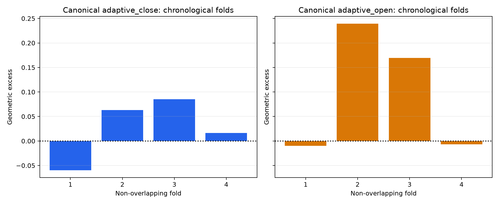

18 组配置中，2 组在 4 个时间折均取得正超额，12 组为 3/4，3 组为 2/4，1 组为 1/4，显示组合具有一定的跨参数稳健性。不过，正式 open 仅有 2 折正超额，全期优势主要集中在中间两折；正式 close 反而有 3 折正超额。因此，“open 全期最好”并不代表其各阶段都更好。40 日 Top 20 的 4/4 结果仅属敏感性分析，不据此更换正式参数。

### 5.10 Task4 的扩展结论与剩余限制

- 只收取卖出费，未建模冲击成本、滑点和买入费；
- 未完整模拟涨跌停、盘口容量和排队成交概率；
- 等权 Top 10 集中度较高；
- 成本压力只改变卖出费率，仍未计买入成本和期末强制清仓；
- 最后阶段市场与策略同步回撤，但策略仍产生小幅负超额收益；这与因子测试期排序能力衰减、普通 IC 受尾部收益影响变号一致。
- 因子聚类和正交化目前只有一次冻结后评价，尚未经过多折稳定性检验；

综上，Task 4 属于研究回测，不构成收益承诺。

---

## 6. 因子机器学习扩展

> **扩展定位**：本节不属于题目必答，也不替代 Task 4 的历史 IC 主策略。实验用于检验线性与非线性学习能否缓解因子方向时变；结果未显示改善，故作为模型边界保留。

为验证“主要因子直接预测收益”和“直接优化组合夏普”两条路线，项目实现了：

1. return_regression：用因子回归下一日收益，再对预测收益形成组合；
2. direct_sharpe：直接学习因子权重，使训练期扣费后的组合夏普最大。

固定 70%/15%/15% 切分结果：

| 模型 | Train Sharpe | Validation Sharpe | Test Sharpe |
|---|---:|---:|---:|
| return_regression | 10.04 | 8.28 | -3.12 |
| direct_sharpe | 11.91 | 6.99 | -3.47 |

120 日滚动训练结果：

| 模型 | 全滚动期 Sharpe | 最近 45 日 Sharpe |
|---|---:|---:|
| return_regression | 4.85 | -3.25 |
| direct_sharpe | 4.53 | -3.76 |


全期为正而最近阶段大幅为负，说明模型并没有解决因子方向突变，只是更充分地拟合了大部分历史时期。这也是最终报告不把因子学习模型作为 Task4 主策略的原因。

---

## 7. Task5：下一分钟 down/flat/up 预测

> **题目要求**：基于降采样分钟线设计端到端神经网络（如LSTM），预测下一分钟股价涨跌。  
> **本项目正式作答**：用过去60分钟因果序列预测下一分钟down/flat/up，保留平盘样本；模型训练、融合和置信阈值只使用train/validation，测试集保存5,900行逐样本结果。  
> **正式产物**：`output/lstm_ensemble/model.pt`、`test_predictions.csv`、`test_metrics.json`。第7.1–7.9节给出正式建模与基线；第7.10以后属于从分类指标到交易收益的扩展研究。

### 7.1 标签口径的演进

正式日期切分为：训练集2025-04-01至2026-05-31，验证集2026-06-01至2026-06-15，测试集2026-06-16至2026-06-30。所有特征标准化、模型训练和参数选择均不使用测试日期。

早期实现删除平盘样本，只在下一分钟真实发生价格变化时训练 down/up。该模型条件准确率约 68.10%，但合法测试窗口覆盖率只有 56.32%。由于预测时无法提前知道下一分钟是否平盘，这个 68.10% 不能作为可部署的整体准确率。

随后将平盘加入训练，定义：

```text
down = close(t+1) < close(t)
flat = close(t+1) = close(t)
up   = close(t+1) > close(t)
```

所有 5,900 个合法测试窗口均参与评价：down 1,735、flat 2,577、up 1,588；多数类 flat 基线为 43.68%。

### 7.2 直接三分类基线

直接三分类使用 11 个基础特征、60 分钟窗口、2 层 LSTM、hidden size 64、训练集标准化和平方根逆频率类别权重。

结果：

- Accuracy：45.56%；
- Balanced Accuracy：46.91%；
- Macro F1：45.56%；
- down/flat/up Recall：55.73% / 37.56% / 47.42%。

该模型对三类较均衡，但过度预测“发生涨跌”，平盘识别不足。

### 7.3 共享双头实验

第二版使用共享 LSTM 编码器，接两个任务头：

- movement head：flat/move；
- direction head：只在真实 move 样本上训练 down/up。

同时加入平盘比例、连续未变价时长、短期波动和时间位置特征。movement Balanced Accuracy 从 56.14% 提升到 57.26%，但最终三分类 Accuracy 降至 45.22%、Macro F1 降至 44.76%。

两个任务共享同一编码器会产生冲突：平盘识别有所改善，但方向表示受损。该模型作为失败实验保留，不作为最终主模型。

### 7.4 最终三组件独立模型

参考队友最终仓库的思路，将共享编码器拆成三个独立组件：

1. **direction**：只用非平盘训练样本预测 down/up；
2. **movement**：用全部样本预测 flat/move；
3. **joint**：用全部样本直接预测 down/flat/up。

基础 11 特征包括相对 OHLC、close 对数收益和 7 个 log1p 成交/量额特征。增强分支再加入 14 个特征：

- high/low 对数振幅、close 在分钟高低区间的位置；
- 主买主卖量失衡、金额失衡；
- 平均每笔成交量；
- volume/amount 对数变化；
- 3/5/10 分钟收益；
- 5 分钟收益波动；
- 是否有成交、交易时段进度、是否下午。

movement 和 joint 使用逐股票训练集标准化，并附加 5 维股票 one-hot，因此实际输入维度为 25+5=30；direction 使用 11 维基础特征和全局标准化。

模型共同设置：

| 参数 | 设置 |
|---|---|
| 股票 | 000012.SZ、000014.SZ、000019.SZ、000020.SZ、000027.SZ |
| 窗口 | 60 分钟 |
| LSTM | 2 层，hidden size 64，dropout 0.2 |
| 优化器 | AdamW，lr=1e-3，weight decay=1e-4 |
| Batch | 256 |
| 梯度裁剪 | 1.0 |
| 学习率调度 | ReduceLROnPlateau |
| 早停 | validation accuracy，patience=5 |
| Train | 2025-04-01–2026-05-31，165,790 个窗口 |
| Validation | 2026-06-01–2026-06-15，6,490 个窗口 |
| Test | 2026-06-16–2026-06-30，5,900 个窗口 |

joint 模型增加“最近一分钟特征残差支路”，避免 LSTM 长序列压缩完全淹没最后一分钟的盘口状态。

### 7.5 概率融合

设 movement 预测发生变动的概率为 m，direction 条件上涨概率为 q，则两阶段概率为：

```text
P_stage(down) = m × (1-q)
P_stage(flat) = 1-m
P_stage(up)   = m × q
```

movement 概率先在 logit 空间应用验证集选择的 bias。最终概率为：

```text
P_final = joint_weight × P_joint
        + (1-joint_weight) × P_stage
```

seed 42 在验证集得到：

- move_bias = -0.30；
- joint_weight = 0.30；
- two_stage_weight = 0.70；
- validation Accuracy = 47.69%；
- validation Macro F1 = 47.26%。

我们进一步把 bias 网格从 [-0.30, 0.30] 扩展到 [-0.80, 0.30]，将步长从 0.05 加密到 0.025，共检查 1,845 个候选。验证集仍然选回 -0.30/0.30，说明正式参数不是原搜索边界造成的假最优。

### 7.6 正式 seed 42 测试结果

| 指标 | 结果 |
|---|---:|
| Accuracy | **46.46%** |
| Balanced Accuracy | 46.18% |
| Macro Precision | 45.85% |
| Macro Recall | 46.18% |
| Macro F1 | **45.93%** |
| Majority baseline | 43.68% |

逐类别结果：

| 类别 | Precision | Recall | F1 | Support |
|---|---:|---:|---:|---:|
| down | 43.73% | 49.28% | 46.34% | 1,735 |
| flat | 51.26% | 47.38% | 49.24% | 2,577 |
| up | 42.55% | 41.88% | 42.21% | 1,588 |

三个组件单独结果：

- direction：真实非平盘样本条件准确率 67.74%；
- movement：flat/move Accuracy 59.27%；
- joint：全窗口 Accuracy 46.05%；
- 融合后：全窗口 Accuracy 46.46%。

方向模型的 67.74% 仍然只能称为“真实非平盘条件方向准确率”，不能单独部署；movement 组件负责估计是否应该进入方向判断。


评价面板显示：

- down/flat/up Recall 分别为 49.3%、47.4%、41.9%，up 仍然最弱；
- 置信度越高，实际准确率越高，选择性预测排序有效；
- 000012.SZ 和 000014.SZ 准确率低于总体多数类基线，股票间异质性明显；
- 单日准确率从 42.37% 到 51.69% 波动，6 月 22 日表现最弱。

### 7.7 选择性预测

置信度阈值只根据验证集最大类别概率的分位数确定：

| 档位 | 验证阈值 | 测试样本 | 测试覆盖率 | 测试准确率 |
|---|---:|---:|---:|---:|
| 全窗口 | 无 | 5,900 | 100.00% | 46.46% |
| balanced | 0.5175 | 1,800 | 30.51% | 54.44% |
| strict | 0.5791 | 577 | 9.78% | 62.56% |

按测试集实现结果观察，最高置信度前 5% 的 295 个样本准确率为 66.10%，前 10% 的 590 个样本为 62.20%。这条曲线仅用于诊断，不用于反向选择阈值。

### 7.8 三随机种子稳健性

| Seed | Accuracy | Balanced Accuracy | Macro F1 | strict Accuracy | strict Coverage | joint weight |
|---:|---:|---:|---:|---:|---:|---:|
| 42 | 46.46% | 46.18% | 45.93% | 62.56% | 9.78% | 0.30 |
| 43 | 46.81% | 44.99% | 45.14% | 63.32% | 8.78% | 0.95 |
| 44 | 47.34% | 45.81% | 45.96% | 63.30% | 9.24% | 0.85 |
| 均值±标准差 | **46.87%±0.44%** | 45.66%±0.61% | **45.68%±0.47%** | **63.06%±0.43%** | 9.27%±0.50% | — |


相较直接三分类：

- 三组件平均 Accuracy 提高约 1.31 个百分点；
- Macro F1 平均只提高约 0.12 个百分点；
- Balanced Accuracy 反而下降约 1.25 个百分点。

三组件的主要优势在于总体命中率和高置信度排序，并非三个类别都全面提高。融合权重在不同 seed 间变化较大，也表明组件之间的最优组合不够稳定。

正式目录仍保留预先固定的 seed 42，而不是事后选择测试准确率最高的 seed 44，避免形成“看完测试结果再挑随机种子”的隐性偏差。

### 7.9 强基线与概率质量

参考队友仓库“LSTM 必须和强非时序模型比较”的方法，本项目使用同一 60 分钟历史窗口构造固定统计摘要：最后值、均值、标准差、最小值、最大值、窗口首尾变化和股票 one-hot。所有标准化只拟合训练集；Logistic 与 HistGradientBoosting 的超参数按验证集 Macro F1、再按 Accuracy 选择并冻结，之后才首次打开测试集。

| 模型 | Accuracy | Macro F1 | Brier | NLL | Top-label ECE |
|---|---:|---:|---:|---:|---:|
| 三组件 LSTM | **46.46%** | **45.93%** | **0.6096** | **0.9999** | 2.71% |
| LSTM + temperature scaling | 46.46% | 45.93% | **0.6093** | **0.9994** | **0.91%** |
| 线性 Logistic-SGD | 45.34% | 43.82% | 0.6423 | 1.0634 | 8.56% |
| HistGradientBoosting | 42.66% | 42.09% | 0.6321 | 1.0331 | 6.10% |
| 上一分钟涨跌规则 | 33.08% | 30.37% | — | — | — |
| 永远预测 flat | 43.68% | 20.27% | — | — | — |

在统一样本上，LSTM 同时领先简单规则、线性模型和树模型，表明序列表示包含一定增量信息。不过，其准确率仅比 Logistic 高 1.12 个百分点。验证集选择的温度为 1.30；校准不改变预测类别和准确率，只将 ECE 从 2.71% 降至 0.91%。若概率用于仓位，应采用校准结果，而不能把最大类别概率直接当作真实胜率。

### 7.10 扩展：从分类准确率到策略收益

分类正确并不等于可以在对应价格成交。当前标签比较 `close[t+1]` 与 `close[t]`；模型必须等分钟 t 完整结束后才能获得 `close[t]` 及该分钟全部特征，因此按同一个 `close[t]` 成交属于不可实现的同柱假设。

本节同时保留三种口径：

1. **标签收益上限**：`close[t]→close[t+1]`，只用于确认分类信号与标签收益是否一致，不作为可交易结果；
2. **价格时点代理**：分钟 t 结束后形成信号，在 `open[t+1]` 买入、`close[t+1]` 卖出。它检验信号发布后的剩余收益，但因当日买卖不满足 A 股 T+1，不能称为完整可交易回测；
3. **T+1 小样本诊断**：在 `open[t+1]` 买入、下一交易日同一分钟开盘退出。把每天 118 个信号时点视为等资金“袖套”，无信号袖套持有现金，避免同一资金被分钟信号重复使用。

固定使用验证集已经冻结的 balanced/strict 置信度档，不根据测试收益重新选择阈值。价格时点代理的 long/cash 结果为：

| 上涨策略 | 活跃分钟覆盖 | 零成本收益 | 卖出费 5 bp 后 | 相对同期市场 |
|---|---:|---:|---:|---:|
| all_up | 76.10% | -1.12% | -36.89% | -39.97% |
| balanced_up | 32.20% | +4.60% | -13.50% | -17.72% |
| strict_up | 10.00% | +0.75% | -5.03% | -9.65% |
| 5股票等权市场 | 100.00% | +5.12% | 未扣成本 | — |


同收盘标签口径下，all/balanced/strict 上涨信号的零成本累计收益分别为 62.19%、38.22% 和 12.95%，说明模型确实学到了当前收盘到下一收盘的方向关系。但切换到下一分钟开盘后，该优势大幅消失；一分钟独立调仓的 5 bp 卖出费又进一步吞噬收益。

满足 T+1 的诊断因 2026-06-30 已是数据末日，只能结算前 9 个测试信号日。扣除每次卖出 5 bp 后：

| T+1 上涨策略 | 信号时点覆盖 | 策略收益 | 全仓5股市场 | 同覆盖市场 | 策略－同覆盖市场（百分点） | 几何超额 |
|---|---:|---:|---:|---:|---:|---:|
| all_up | 76.65% | -9.58% | -12.27% | -9.67% | **+0.09** | **+0.11%** |
| balanced_up | 32.02% | -4.27% | -12.27% | -4.61% | **+0.34** | **+0.36%** |
| strict_up | 10.26% | -1.68% | -12.27% | -1.56% | **-0.12** | **-0.13%** |

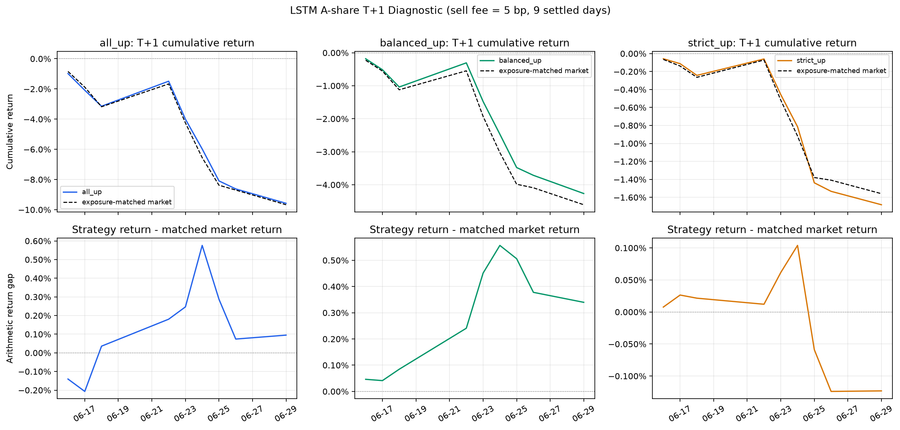

由于大量持有现金，三个策略都跑赢了同期全仓市场；balanced 相对全仓市场的几何超额为 9.12%。改用同覆盖市场后，balanced 的累计收益率差仅为 +0.34 个百分点、几何超额为 +0.36%；strict 则分别为 -0.12 个百分点和 -0.13%。可见，全仓基准下的优势主要来自较低市场暴露，模型选股的增量很小。该诊断只有 9 个结算日，且未计买入费用、滑点、冲击和容量约束，结果仍偏乐观。

为检验“分类更准是否真的更赚钱”，再把 LSTM、Logistic 和 HistGradientBoosting 的测试预测严格对齐到相同 5,900 个股票—分钟键。每个模型分别使用自身验证集置信度的前 30%/前 10%阈值，不根据测试收益调参，并统一采用 long/cash、卖出 5 bps 和同一个 T+1 袖套引擎：

| 模型与档位 | T+1 策略收益 | 同覆盖市场 | 几何超额 |
|---|---:|---:|---:|
| LSTM balanced | -4.27% | -4.61% | +0.36% |
| HistGB balanced | -4.23% | -4.96% | **+0.77%** |
| Logistic balanced | -4.65% | -4.38% | -0.28% |
| LSTM strict | -1.68% | -1.56% | -0.13% |
| HistGB strict | -1.47% | -1.94% | **+0.48%** |
| Logistic strict | -2.19% | -2.03% | -0.16% |

表中出现了一个反例：HistGB 的 Accuracy 和 Macro F1 均低于 LSTM，但在 9 个结算日内，balanced 和 strict 的同覆盖超额略高。Accuracy 对所有样本等权，策略却更关心上涨信号的排序、收益幅度、覆盖率和成本。因此模型评价应同时包含分类、概率和经济三层指标，不能只按 Accuracy 排名。受样本长度限制，该比较仅作诊断，不用于更换主模型。

Task 5 的结论可归纳为：**模型含有有限的统计预测信息，置信度排序也有效；但 T+1 balanced 在 9 个结算日内只略微跑赢同覆盖市场，尚不足以证明稳定的扣成本超额收益。** 下一步应直接预测可持有至次交易日的收益或扣成本收益，并在更长的新样本外区间检验。

#### 7.10.1 扩展：分类指标与T+1超额的不确定性

逐分钟窗口高度相关，不能把 5,900 行视为 5,900 个独立样本。本轮以交易日为单位，对 10 个测试日期进行 5,000 次有放回重采样；T+1 策略只有 9 个结算日，因而采用 2 日移动区块以保留短期相关性。

| 指标 | 点估计 | 95%区间 |
|---|---:|---:|
| Accuracy | 46.46% | **44.81%–48.25%** |
| Balanced Accuracy | 46.18% | 45.13%–47.32% |
| Macro F1 | 45.93% | 44.66%–47.21% |
| balanced T+1几何超额 | +0.36% | **-0.37%–+1.13%** |
| strict T+1几何超额 | -0.13% | -0.55%–+0.20% |

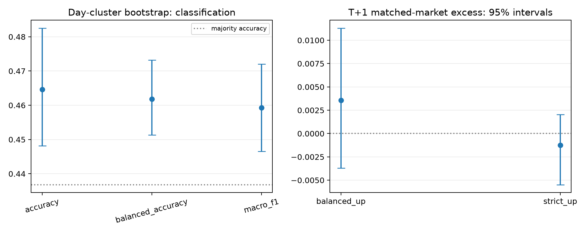

Accuracy 区间下界仍高于 43.68% 的多数类基线，且 5,000 次重采样均高于该基线，支持“总体命中率存在有限增量”。但 balanced 和 strict 的 T+1 超额区间都跨 0；balanced 超额为正的重采样比例为 81.02%，样本也只有 9 日。分类层的改进尚未转化为稳健的经济 Alpha。

### 7.11 扩展：把“涨跌多少”加入 LSTM

三分类只回答方向，会把上涨 0.01% 和上涨 1% 视为同一种正确预测。为检验收益幅度是否能改善策略，本轮保留正式三组件模型不变，另建一个探索性多任务模型：同一个增强特征 LSTM 编码器连接三分类头和 signed-return 回归头。分类头仍保留全部平盘样本；回归目标为 `close[t]→close[t+1]` 的实际基点收益，只用训练集估计缩放和 99.5% 稳健截尾。回归损失对大波动赋予更高但有上限的权重，使平盘不会被错误删除，也避免极端收益主导梯度。

训练、验证和测试日期与正式模型一致。checkpoint 仅按验证集收益 Spearman IC 选择，Accuracy 只在 IC 相同时作为次级标准；收益排序的 70%/90% 阈值也在验证集冻结，随后才加载测试数据。由于该测试区间此前已经被研究，本实验仍属于探索性诊断。

| 指标 | 正式三组件 LSTM | 涨跌幅多任务 LSTM |
|---|---:|---:|
| 测试 Accuracy | 46.46% | 46.47% |
| 测试 Macro F1 | **45.93%** | 44.77% |
| 测试收益 Pearson IC | — | 0.322 |
| 测试收益 Spearman IC | — | **0.335** |
| 非平盘样本收益符号准确率 | 67.74%（方向组件） | 68.25%（回归头符号） |

三分类 Accuracy 基本不变，Macro F1 下降 1.16 个百分点；但收益回归头取得 0.335 的排序 IC，说明它确实识别出不同涨跌样本的幅度差异。进一步在完全相同的测试键、下一分钟 `open→close` 价格代理和卖出费口径下比较：

| 方法与档位 | 活跃分钟覆盖 | 零成本毛收益 | 扣 5 bp 后 | T+1 同覆盖超额 |
|---|---:|---:|---:|---:|
| 正式方向分类 strict | 10.00% | +0.75% | -5.03% | -0.13% |
| 多任务方向分类 strict | 2.97% | -0.09% | -1.83% | -0.07% |
| **多任务预测收益 strict** | 43.31% | **+6.58%** | **-17.45%** | **-0.20%** |

收益排序组的毛收益明显高于原模型，说明“涨跌多少”有助于选股排序。但该策略经常在五只股票中至少选中一只，分钟覆盖率和换手过高，5 bp 成本完全吞噬了毛收益；满足 T+1 的 9 个结算日也未取得正的同覆盖超额。换言之，**幅度目标增加了经济信息，但一分钟标签仍不可直接持有。要改善净收益，目标必须对应可成交、可持有且扣成本后的收益。**

### 7.12 扩展：可交易收益期限、低频 Top-K 与 T+1 LSTM

为进一步回答“预测涨跌多少是否有助于收益”，本轮不再把不可直接成交的 `close[t]→close[t+1]` 当作最终目标，而是构造五种可执行收益标签：在 `open[t+1]` 买入，分别在下一根、5、15、30 分钟后的收盘价卖出；以及在下一交易日相同分钟的开盘价卖出。盘中持有期不会跨越午休，T+1 标签会删除切分区间最后一天，避免借用下一数据分区价格。

每个期限均使用同一段 60 分钟因果历史特征，比较线性 Ridge 与非线性 HistGradientBoostingRegressor。回归参数、预测阈值、Top-K（1 或 2）和交易间隔全部根据验证集几何同覆盖超额冻结，程序之后才加载测试数据。策略只做多或持有现金，卖出成本按 5 bp 计；市场基准按策略实际持仓覆盖率构造，因此不会把大量空仓造成的低市场暴露误判为选股能力。

| 可交易期限 | Ridge 测试 Rank IC | HistGB 测试 Rank IC | 测试期策略观察 |
|---|---:|---:|---|
| 1 分钟 | 0.075 | **0.085** | Ridge 扣费后 +0.48%，但同覆盖超额 -1.75% |
| 5 分钟 | **0.074** | -0.003 | 两模型同覆盖超额均为负 |
| 15 分钟 | **0.094** | -0.057 | 两模型同覆盖超额均为负 |
| 30 分钟 | **0.080** | -0.061 | HistGB 同覆盖超额 +0.27% |
| T+1 同分钟开盘 | 0.037 | **0.104** | Ridge 同覆盖超额 +0.69% |


Rank IC 表明部分期限存在弱排序信息，但 10 个“期限×模型”组合的 MAE 均劣于直接预测零收益的基线，说明它们更像粗略排序器，而不是精确收益预测器。验证集最终推荐的是 T+1 Ridge、预测收益门槛 57.47 bp、Top 1、每 60 分钟一次信号。该配置在验证期扣费后 -1.02%，市场 -6.31%，同覆盖几何超额 +5.64%；冻结到测试期后只有 9 个结算日，结果如下：

| T+1 模型 | 策略扣 5 bp 后 | 同覆盖市场 | 几何超额 |
|---|---:|---:|---:|
| Ridge | -10.68% | -11.30% | **+0.69%** |
| HistGBRegressor | -0.83% | -0.16% | -0.67% |
| 紧凑多任务 LSTM | -19.14% | -12.03% | **-8.08%** |

紧凑 LSTM 使用共享编码器同时学习 T+1 方向和收益，checkpoint 仅按验证集收益 Rank IC 选择；其测试分类 Accuracy 为 45.89%、Macro F1 为 44.38%，收益 Rank IC 为 -0.017。表内不同模型的同覆盖市场收益略有差异，是因为验证集冻结后各自的阈值和实际持仓覆盖不同，应以几何超额作为横向比较主口径。

该扩展表明，**加入涨跌幅具有研究价值，但标签、成交时点和持有期必须同时可执行。** 在当前短测试期内，复杂 LSTM 未提供增量，简单 Ridge 的相对表现反而更好。不过，Ridge 仍为绝对亏损，同覆盖优势仅 0.69%，且样本只有 9 日。本节因此只用于比较经济价值与模型复杂度，不调整正式三组件分类模型。

#### 7.12.1 扩展：直接预测 T+1 市场超额收益

考虑到老师强调“跑赢市场即可”，本项目进一步检验是否应让模型直接学习相对市场的目标。在完全相同的 5 只股票、60 分钟因果特征和 train/validation/test 日期下，对照两种标签：个股原始 T+1 收益，以及个股 T+1 收益减去同期 5 股等权市场收益。Ridge/HistGB 的参数、预测门槛、Top-K 和交易间隔均只在验证集冻结；测试策略仍用个股原始可实现收益记账，并与相同持仓覆盖的市场比较。

| 目标与模型 | 测试 Rank IC | 策略扣5 bp后 | 同覆盖市场 | 直接收益率差 | 几何超额 |
|---|---:|---:|---:|---:|---:|
| 原始收益 Ridge | +0.037 | -10.68% | -11.30% | +0.62个百分点 | **+0.69%** |
| 原始收益 HistGB | **+0.104** | -0.83% | -0.16% | -0.67个百分点 | -0.67% |
| 市场超额 Ridge | -0.097 | -12.52% | -12.23% | -0.29个百分点 | -0.33% |
| 市场超额 HistGB | -0.084 | -11.60% | -12.03% | +0.43个百分点 | +0.49% |

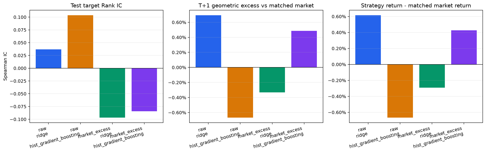

直接超额标签将零预测 MAE 从 217.32 bp 降至 119.75 bp，说明共同市场波动已被部分剔除；但两个模型的测试 Rank IC 均转为负，最好几何超额 +0.49%，也低于原始收益 Ridge 的 +0.69%。由于样本只有 5 只股票，同分钟等权市场较为噪声化，且包含被预测股票，减法可能同时去除了可预测的共同成分。该负结果说明：**策略评价必须比较市场，但训练标签未必适合直接减去市场收益。**

### 7.13 扩展：Task5 输入特征去冗余与组件互补性

Task 4 表明，重复暴露会造成重复计权；Task 5 的 25 个增强特征也存在类似风险。分钟序列不宜直接套用日频因子的截面正交化，因为强制残差化可能破坏价格、成交和时间特征的含义。

本轮改用训练集聚类精选：对每个 60 分钟窗口计算末值、均值、标准差和首尾变化四类因果摘要，并在训练集中确定性抽取 40,000 行。四张 Spearman 矩阵的平均绝对相关性达到 0.85 时，特征归入同一连通簇；簇内代表仅按训练期 T+1 收益的最大绝对 Rank IC 选择。验证集和测试集均不参与特征删除。

25 个特征最终形成 19 个簇。被合并的重复信息主要是：`volume/trade_count/amount` 保留 `amount`，主买量/额保留主买额，主卖量/额保留主卖额，量/额失衡保留量失衡，`volume_log_change/amount_log_change` 保留前者。最大摘要相关性由接近 1 降到 0.834，均值由 0.291 降到 0.262；有效秩由 9.61 提高到 9.94，因子数归一化后的有效秩比例由 38.4% 提高到 52.3%。


随后保持 T+1 标签、紧凑共享双头结构、seed、训练轮数、验证 checkpoint 和策略选择规则完全一致，只把输入从 25 维改为冻结的 19 维：

| T+1 紧凑 LSTM | 25 个特征 | 聚类精选 19 个特征 |
|---|---:|---:|
| 测试 Accuracy | 45.89% | **46.14%** |
| 测试 Macro F1 | 44.38% | **45.72%** |
| 收益 Rank IC | -0.017 | **+0.065** |
| 策略扣 5 bp 后 | -19.14% | **-9.11%** |
| 同覆盖市场 | -12.03% | -8.50% |
| 几何超额 | -8.08% | **-0.67%** |

去冗余后，分类指标小幅改善，收益排序和经济结果改善更明显。验证集选择也从零门槛、每 60 分钟 Top 1，变为预测收益至少 52.06 bp、每 30 分钟 Top 2，表明重复的成交量额特征确实干扰了原模型。不过，新模型仍亏损 9.11%，同覆盖超额仍为负，也未超过 T+1 Ridge 的 +0.69%。因此，这是一项明显修复，而不是可交易 Alpha 的证明。

组件互补性分析直接使用正式模型保存的逐样本概率，不重新训练或调整权重。验证集上，joint 与 staged 的预测一致率为 81.96%，分歧率为 18.04%；在分歧样本中，joint、staged 和冻结融合的准确率分别为 39.03%、40.65% 和 43.89%，显示融合存在增量。

测试集一致率为 80.68%，但 staged 的 Accuracy 为 46.58%，略高于融合的 46.46%，说明该优势未在短测试期稳定延续。下一步应使用多折 OOF 分歧样本冻结融合结构。

本节只说明输入去冗余有帮助。由于固定测试日期此前已被查看，19 特征模型仅作为下一轮新数据的候选方案。

### 7.14 扩展：原题四字段最小基线

原题并没有列出“四个 Task5 因子”，但逐笔数据表明确只有 `Time、Price、Volume、BSFlag` 四个原始字段。为检验后来构造的特征是否反而伤害模型，本轮建立一组最小且可部署的映射，每个原始字段只保留一个平稳因果特征：

| 原题字段 | LSTM 输入 | 含义 |
|---|---|---|
| Time | `session_progress` | 当前分钟在半日交易时段中的进度 |
| Price | `close_log_return` | 当前分钟收盘相对上一分钟的对数收益 |
| Volume | `log1p_volume` | 当前分钟成交量的对数变换 |
| BSFlag | `buy_volume_imbalance` | 主买量与主卖量的标准化差异 |

四特征版本与 25/19 特征版本使用相同的股票、日期、60 分钟窗口、模型结构、seed、T+1 收益头、验证 checkpoint、阈值、Top-K、交易间隔和 5 bp 卖出成本；唯一变化是输入维度，因此可以直接比较特征集合的影响：

| T+1 双头 LSTM | 原25特征 | 聚类精选19特征 | 原题四字段映射 |
|---|---:|---:|---:|
| 下一分钟 Accuracy | 45.89% | **46.14%** | 45.54% |
| 下一分钟 Macro F1 | 44.38% | **45.72%** | 39.64% |
| T+1 收益 Rank IC | -0.017 | **+0.065** | -0.121 |
| 策略扣5 bp后 | -19.14% | **-9.11%** | -12.65% |
| 同覆盖市场 | -12.03% | -8.50% | -10.50% |
| 几何超额 | -8.08% | **-0.67%** | -2.40% |

四字段版本的绝对和相对收益优于未去冗余的 25 特征版本，但收益排序、Macro F1 和策略超额均明显弱于 19 特征版本。由此可见，25 个特征同时输入确有负面影响，原因主要是量额信息高度重复，而不是新增信息整体无效；仅使用四项原始信息又会欠拟合。训练集冻结的 19 个代表特征在三者中最为均衡，但仍略逊于 Ridge 的 +0.69% 同覆盖超额，且三个 LSTM 策略均为绝对亏损。

---

## 8. 可复现性与质量控制

正式主线只保留题目要求、必要基线、泄漏对照和能支撑结论的扩展实验。所有运行入口集中在 `scripts/`，正式结果集中在 `output/`；Task4 的 close/open 和 Task5 的 T+1 市场对照均保存逐期收益、累计收益率差、几何超额和图表，不依赖报告手工计算。

### 8.1 防止测试集泄漏

正式三组件训练按以下顺序执行：

1. 只读取 train/validation 日期训练 direction；
2. 只读取 train/validation 日期训练 movement 和 joint；
3. 在 validation 上搜索融合参数；
4. 在 validation 上冻结 balanced/strict 置信度阈值；
5. 记录冻结时间；
6. 最后才首次加载 test 日期并输出结果。

代码流程没有使用测试标签调参，但测试日期在此前研究中已被多次查看，故本报告将其视为统一口径的样本外诊断，而非全新盲测。相关影响集中在第 9.4 节说明。

### 8.2 模型重放与审计

模型文件同时保存：

- 三个组件的严格 state dict；
- 输入维度、模型版本、类别语义；
- 股票顺序、日期切分、特征顺序；
- 每个组件的训练集标准化均值/方差；
- 融合参数和置信度阈值；
- Python、PyTorch、NumPy、pandas、设备和运行时间。

`test_predictions.csv` 保存 5,900 行逐样本结果，包括 stock、window_end、target_time、真实/预测标签、最终三类概率，以及 direction、movement、joint、staged 的组件概率。

严格重放验收从原始分钟表重新构造全部窗口并加载权重：

- 5,900 行元数据完全一致；
- 标签完全一致；
- 最终预测类别完全一致；
- GPU 批大小变化下最大概率误差为 3.9×10⁻⁵，小于 10⁻⁴ 容差；
- Accuracy、Macro F1 和混淆矩阵一致。

### 8.3 自动测试与总体验收

当前共有 49 个独立单元测试，覆盖以下五类关键风险：

1. **数据与标签**：完整滚动窗口、午休重置、三分类平盘保留、时间戳和多期限标签对齐；
2. **无泄漏**：历史 IC 两日实现滞后、训练集标准化、验证集阈值冻结、训练期相关性聚类和代表选择；
3. **模型正确性**：概率归一化、checkpoint 严格重载、分类/收益双头反向传播、温度校准和组件消融；
4. **组合记账**：停牌锁仓、缓冲换手、费用、T+1 资金袖套、空仓和同覆盖市场；
5. **结果可复核**：Q1–Q5 逐日收益、复合净值、累计收益率直接差、几何超额和全部正式图表。

最终 `validation_report.json` 同时验收 Task1–5、数据质量抽样审计、因子bootstrap/市场状态/多期限、因子聚类/正交化、Task4市场基准/超额显著性/滚动风险/多参数四折与成本压力、Task5强基线/概率校准/不确定性区间、涨跌幅多任务、五种可交易期限、直接市场超额标签、分钟特征去冗余、原题四字段基线和三组件互补性，全部返回passed。

---

## 9. 主要问题与诚实结论

### 9.0 对题目五项要求的最终回答

1. **降采样已经完成并验收**：11个指定字段、302个交易日、日频与242行分钟频格式均符合要求，OHLC完成复权与缺失填充。
2. **因子构建与评价已经完成**：示例因子和3个自建因子数量严格符合要求；全部指定IC/IR/ICIR/Rank指标和Q1–Q5五条净值曲线均已给出。
3. **Task4两种回测已经完成**：1,000万元、Top 10、收盘/次日开盘、卖出万5、买入免费、净值/波动/回撤/夏普均已报告。
4. **原Task4问题已经明确修正**：当日因子与次日收益的IC在决策时不可知，原写法存在前视偏差；正式方案只使用截至决策日已完全实现的历史IC。
5. **分钟LSTM已经完成**：正式模型对全部合法窗口预测down/flat/up；总体Accuracy为46.46%，并明确区分条件方向准确率、高置信度准确率和真实策略收益。

下述限制不会否定题目完成情况，但决定了结果不能直接被解释为稳定实盘Alpha。

### 9.1 因子问题仍是项目最核心限制

负 IC 本身并非问题，核心限制在于多数因子的测试期能力明显衰减，且 Pearson IC 会受尾部收益影响而变号。五分组结果显示，正式 4 因子中只有示例因子和量价相关严格单调，另外两个主要依赖极端组。聚类精选将 10 个因子压缩为 6 个，正交化把最大后续相关性降至 0.096，解决了部分信息重复，却无法消除关系时变。

区块 Bootstrap 显示，首次持仓后的 open 超额区间下界为正，close 与扩展 10 因子的区间则跨 0；最后 45 日 close/open 的几何超额为 -0.45%/-3.32%，相应短区间也不显著。综合滚动超额与 Beta，市场状态和选股能力变化是更合理的共同解释。

### 9.2 Task5 的信号依然较弱

三组件模型的平均 Accuracy 比多数类基线高约 3.19 个百分点，比直接模型高约 1.31 个百分点，改进真实但有限。涨跌幅多任务将收益 Rank IC 提高到 0.335，却因高换手在 5 bp 成本后录得 -17.45%，说明当前瓶颈更接近信号周期与交易频率。

T+1 balanced 策略在 9 个结算日扣费后为 -4.27%，仅比同覆盖市场高 0.34 个百分点（几何超额 +0.36%）。可交易 T+1 Ridge 的同覆盖超额为 +0.69%；25、19、4 特征 LSTM 分别为 -8.08%、-0.67%、-2.40%。直接市场超额标签也未改善结果。由此可见，Accuracy、Rank IC 和标签形式都不能单独保证组合收益。

### 9.3 高置信度有效，但覆盖率低

strict 档约 63% 准确率在三个 seed 中较稳定，但只覆盖约 9%。如果用于交易，还必须同时考虑：

- 信号是否集中在少数股票和少数日期；
- 预测方向对应的实际收益幅度是否足够覆盖成本；
- 高置信度是否经过概率校准；
- 连续分钟信号造成的高换手。

### 9.4 当前测试集不再是严格盲测

2026-06-16 至 2026-06-30 已在研究过程中多次查看。虽然最终代码遵守验证集调参、测试集后加载的流程，但研究人员已经了解该阶段表现。更可信的确认方式包括：

- 2026-06-30 之后的新数据；或
- 预先锁定、不再修改规则的多折 walk-forward；或
- 将所有模型选择限制在更早区间，留下从未查看的最终 holdout。

---

## 10. 下一阶段建议

按优先级建议：

1. **新增真正未见日期**：这是比继续调网络参数更重要的工作。
2. **扩展可交易标签的样本外验证**：首轮已完成 1/5/15/30 分钟、T+1 和直接市场超额标签对照；下一步应加入更新日期、多折验证，并尝试不含自身股票的市场/行业残差或直接预测扣成本后收益。
3. **按股票或流动性分组建模**：当前股票间表现差异大，可尝试共享主干+股票适配层，或只交易验证期稳定的股票。
4. **多折 walk-forward**：当前已完成多种 seed、强基线和概率校准，下一步应按预先锁定的日期折逐折重训并汇总真正不重叠的 OOS 预测。
5. **多折因子去冗余**：固定 0.60 阈值，在每个 walk-forward 训练折重新冻结聚类和正交顺序，验证 6 因子精选的优势是否稳定。
6. **多折验证 Task5 精选特征**：当前 25→19 特征明显改善 T+1 LSTM，但应在每个训练折重新冻结聚类，确认不是单次切分偶然。
7. **稳定融合**：joint/staged 在约 18% 验证分歧样本上存在融合增量，应使用多折 OOF 分歧概率确定固定融合权重，而不是每个 seed 独立选择。
8. **Task4 风险控制**：当前已完成缓冲选股和换手压力；下一步加入市场中性、行业/风格约束、单股权重上限和波动目标。
9. **因子状态识别**：当前市场状态检验仍以解释为主；若用于交易，regime detector 必须滚动训练并只使用当时可见状态。

中期汇报的核心表述可归纳为：

> 题目要求已逐项完成，扩展研究另行列示。正式 4 因子均生成 Q1–Q5 净值曲线；Task 4 close/open 全期分别领先同口径市场 12.84/44.14 个百分点。首次持仓后，open 超额的 Bootstrap 95% 区间为 6.04%–91.26%，close 区间则跨 0；最近 45 日两者均略微跑输。
>
> 扩展 10 因子没有优于正式 4 因子。Task 5 三组件准确率约为 46.5%–47.3%，T+1 balanced 仅领先同覆盖市场 0.34 个百分点，直接预测市场超额也未超过原始收益 Ridge。下一阶段应以全新样本外数据和多折验证为重点。

---

## 11. 复现命令

在 `project/quant_downsampler` 执行：

```powershell
# 自动测试
py -3 -m unittest discover -v

# Task1 烟雾测试
py -3 scripts\smoke_test.py

# 因子评价（含正式4因子、扩展10因子和Q1–Q5五条净值曲线）
py -3 scripts\run_factor_eval.py --save
py -3 -m scripts.run_factor_robustness --iterations 2000 --block-length 5

# 因子聚类精选、截面正交化和冻结后同区间回测
py -3 -m scripts.run_factor_independence --calibration-days 120 --correlation-threshold 0.60

# 数据质量、正式因子多期限、Task4多参数四折稳定性
py -3 -m scripts.run_comprehensive_extensions --sections data factor task4

# 严格 Task4：先正式4因子，再扩展10因子
py -3 scripts\run_task4_strict.py --factor-set required --out ..\output\backtest_required
py -3 scripts\run_task4_strict.py --factor-set extended --out ..\output\backtest_strict
py -3 -m scripts.run_task4_robustness

# Task4 同执行价格市场基准、累计收益率差与几何超额；默认同时重建 close/open
py -3 -m scripts.run_strategy_analysis --task4-only --task4-dir backtest_required --task4-strategy both --recent-days 45
py -3 -m scripts.run_strategy_analysis --task4-only --task4-dir backtest_strict --task4-strategy both --recent-days 45
py -3 -m scripts.run_task4_excess_significance --iterations 5000 --block-length 5 --rolling-window 60

# Task5 策略收益诊断
py -3 -m scripts.run_strategy_analysis --task5-only --sell-fee-bps 5

# 正式 Task5 三组件模型
py -3 -m scripts.run_lstm_ensemble --stocks 5 --epochs 12 --seq-len 60 --device cuda --out-dir ..\output\lstm_ensemble --overwrite

# 因果强基线、概率校准和冻结选择
py -3 -m scripts.run_lstm_baselines

# 方向分类＋实际涨跌幅回归的探索性多任务 LSTM
py -3 -m scripts.run_lstm_magnitude --epochs 12 --return-loss-weight 0.25 --sell-fee-bps 5 --device cpu --overwrite

# 1/5/15/30 分钟与 T+1 可交易收益、低频 Top-K 策略
py -3 -m scripts.run_tradable_return_research

# T+1 原始收益与直接市场超额标签对照
py -3 -m scripts.run_t1_excess_return_research --sell-fee-bps 5

# 验证集筛选期限后的紧凑 T+1 LSTM 对照
py -3 -m scripts.run_tradable_lstm

# Task5 训练集特征聚类、组件互补性与19特征 T+1 LSTM
py -3 -m scripts.run_lstm_feature_independence --correlation-threshold 0.85 --epochs 8 --device cpu

# 原题 Time/Price/Volume/BSFlag 四字段映射的最小基线
py -3 -m scripts.run_lstm_minimal_four --epochs 8 --sell-fee-bps 5 --device cpu

# Task5分类与T+1经济指标的不确定性区间
py -3 -m scripts.run_comprehensive_extensions --sections task5

# 严格重放
py -3 -m scripts.validate_lstm_ensemble --run-dir ..\output\lstm_ensemble --data-dir ..\output\minute --device cuda

# 融合参数网格审计
py -3 -m scripts.analyze_lstm_fusion_grid --run-dir ..\output\lstm_ensemble

# 三随机种子汇总
py -3 -m scripts.summarize_lstm_runs

# Task1–5 总体验收
py -3 -m scripts.validate_project_outputs
```

---

## 12. 主要产物索引

- `output/validation_report.json`：全项目验收结果；
- `output/evaluation/factor_summary.csv`：10 个因子评价；
- `output/evaluation/required_factor_summary.csv`：题目正式4因子的 IC/IR/ICIR/Rank 指标；
- `output/evaluation/factor_layer_daily_returns.csv`：所有因子的 Q1–Q5 逐日收益；
- `output/evaluation/factor_layer_nav.csv`：所有因子的 Q1–Q5 累计净值；
- `output/evaluation/factor_layer_monotonicity.csv`：分层 Spearman、相邻违例和 Q1−Q5 显著性；
- `output/evaluation/required_factor_layering_nav.png`：题目正式4因子的五分组净值曲线；
- `output/evaluation/factor_stability.csv`：时间切分稳定性；
- `output/factor_robustness/`：区块 bootstrap、滚动/分期 IC、市场状态和单因子相对收益；
- `output/data_quality_extension/`：全量日频和24个均匀抽样分钟日的结构、数值边界与跨频一致性审计；
- `output/factor_horizon_extension/horizon_metrics.csv`：正式4因子对1/2/5/10日收益的IC、Rank IC和Q1−Q5；
- `output/factor_horizon_extension/factor_horizon_decay.png`：正式4因子的多期限关系图；
- `output/factor_independence/clusters.csv`：冻结期相关簇、历史 ICIR 和代表因子；
- `output/factor_independence/independence_metrics.csv`：三套因子集合的相关性、有效秩和条件数；
- `output/factor_independence/backtest_metrics.csv`：统一冻结后区间的收益、市场、超额、换手与回撤；
- `output/factor_independence/comparison.png`：三套策略净值及相对市场净值；
- `output/backtest_required/metrics.csv`：题目正式4因子的 Task4 十组策略指标；
- `output/backtest_required/benchmark_metrics_adaptive_close.json`：收盘策略与收盘等权市场；
- `output/backtest_required/benchmark_metrics_adaptive_open.json`：开盘策略与开盘等权市场；
- `output/backtest_required/benchmark_comparison_adaptive_close_daily.csv`、`benchmark_comparison_adaptive_open_daily.csv`：策略、市场、累计收益率差和几何超额的逐日路径；
- `output/backtest_required/benchmark_comparison_adaptive_close.png`、`benchmark_comparison_adaptive_open.png`：累计收益、直接收益率差与几何超额三面板；
- `output/task4_excess_significance/bootstrap_summary.csv`：正式4因子/扩展10因子、close/open、三个区间的成对区块 Bootstrap；
- `output/task4_excess_significance/bootstrap_excess_ci.png`：首次持仓后几何超额及95%区间；
- `output/task4_excess_significance/required_rolling_excess_and_beta.png`：正式4因子的60日滚动超额与Beta；
- `output/task4_chronological_extension/fold_metrics.csv`：18组固定配置各4个不重叠时间折的收益、超额、IR、Sharpe和回撤；
- `output/task4_chronological_extension/configuration_summary.csv`：各配置正超额折数、中位数和最差折；
- `output/task4_chronological_extension/canonical_fold_excess.png`：正式60日Top10 close/open的四折超额；
- `output/backtest_strict/metrics.csv`：扩展10因子的 Task4 十组策略指标；
- `output/backtest_strict/*_daily.csv`：每日净值、收益和换手；
- `output/backtest_strict/benchmark_metrics_adaptive_close.json`、`benchmark_metrics_adaptive_open.json`：扩展10因子 close/open 市场基准与分阶段双口径超额指标；
- `output/backtest_strict/benchmark_comparison_adaptive_close.png`、`benchmark_comparison_adaptive_open.png`：扩展10因子的策略、市场、直接收益率差与几何超额；
- `output/backtest_robustness/cost_stress.csv`：原 Top10 与缓冲策略的成本压力；
- `output/factor_models_aligned/results.json`：固定切分因子模型；
- `output/factor_models_rolling_aligned/results.json`：滚动因子模型；
- `output/lstm_next_minute/test_metrics.json`：直接三分类基线；
- `output/lstm_next_minute_hierarchical/test_metrics.json`：共享双头实验；
- `output/lstm_ensemble/model.pt`：正式三组件 checkpoint；
- `output/lstm_ensemble/test_predictions.csv`：正式逐样本预测；
- `output/lstm_ensemble/test_metrics.json`：正式 Task5 指标；
- `output/lstm_ensemble/seed_robustness.json`：三种子稳健性；
- `output/lstm_ensemble/replay_validation.json`：严格重放结果。
- `output/lstm_ensemble/strategy_metrics.csv`：标签收益和下一分钟价格时点代理结果；
- `output/lstm_ensemble/strategy_nav.png`：不满足 T+1 的价格时点代理净值对比；
- `output/lstm_ensemble/t1_strategy_metrics.csv`：T+1 策略、全仓市场和同覆盖市场对比；
- `output/lstm_ensemble/t1_strategy_returns.csv`：T+1 逐信号日收益；
- `output/lstm_ensemble/t1_strategy_comparison_daily.csv`：T+1 策略、全仓/同覆盖市场及累计收益率差逐日路径；
- `output/lstm_ensemble/t1_strategy_nav_and_return_gap.png`：真正 T+1 的策略—同覆盖市场累计收益与直接差值；
- `output/lstm_ensemble/STRATEGY_README.md`：标签、价格时点与 T+1 三种收益口径说明。
- `output/lstm_baselines/test_metrics.csv`：LSTM、Logistic、HistGB、规则和多数类的统一概率指标；
- `output/lstm_baselines/strategy_comparison.csv`：相同测试键、验证阈值和 T+1 引擎下的模型策略比较；
- `output/lstm_baselines/selection_frozen_before_test.json`：强基线和温度参数的测试前冻结记录。
- `output/lstm_magnitude/metrics.json`：多任务分类、收益 IC 和策略结果；
- `output/lstm_magnitude/test_predictions.csv`：逐样本三类概率、真实/预测收益基点；
- `output/lstm_magnitude/strategy_comparison.csv`：正式方向模型、多任务方向头与收益头的同键毛/净/T+1 对比。
- `output/tradable_return_research/test_return_metrics.csv`：五种可交易期限下 Ridge/HistGB 的收益误差与 Rank IC；
- `output/tradable_return_research/test_strategy_metrics.csv`：验证集冻结参数后的测试期净收益、同覆盖市场和几何超额；
- `output/tradable_return_research/selection_frozen_before_test.json`：模型、阈值、Top-K、交易间隔及测试前冻结记录；
- `output/tradable_return_research/horizon_strategy_summary.png`：期限收益排序与策略超额汇总图；
- `output/t1_excess_return_research/test_target_metrics.csv`：原始T+1收益与直接市场超额标签的误差、Pearson/Rank IC；
- `output/t1_excess_return_research/test_strategy_metrics.csv`：验证冻结参数后的净收益、同覆盖市场、直接差和几何超额；
- `output/t1_excess_return_research/target_and_strategy_comparison.png`：两种标签的预测与策略结果对照；
- `output/task5_uncertainty_extension/classification_day_cluster_bootstrap.csv`：按交易日整块重采样的分类指标区间；
- `output/task5_uncertainty_extension/t1_strategy_bootstrap.csv`：balanced/strict T+1同覆盖超额区间；
- `output/task5_uncertainty_extension/task5_uncertainty.png`：分类与经济指标不确定性图；
- `output/tradable_lstm/summary.json`：紧凑 T+1 LSTM 的分类、收益和策略指标；
- `output/tradable_lstm/strategy_comparison.csv`：T+1 Ridge、HistGB 与紧凑 LSTM 的同口径比较。
- `output/lstm_feature_independence/feature_clusters.csv`：25 个分钟输入的训练集相关簇与19个代表特征；
- `output/lstm_feature_independence/feature_independence_metrics.csv`：完整/精选输入的相关性与有效秩；
- `output/lstm_feature_independence/component_ablation_metrics.csv`：joint、staged、冻结融合的验证/测试概率指标；
- `output/lstm_feature_independence/component_complementarity.csv`：组件一致率、分歧率和分歧样本准确率；
- `output/lstm_feature_independence/full_vs_pruned_lstm.csv`：25特征与19特征 T+1 LSTM 的同口径比较。
- `output/lstm_minimal_four/minimal_four_summary.json`：原题四字段映射、分类、收益排序和策略指标；
- `output/lstm_minimal_four/model_comparison.csv`：4/19/25特征 T+1 LSTM 的统一比较。

---

## 13. 完整结果附录

本附录遵循“只要方法口径有效且能够复核，就保留结果”的原则，把正文中为了可读性仅概括呈现的结果集中列出。Naive 前视策略只保留作泄漏对照；旧版二分类的 68.10% 仅保留为条件准确率说明；临时调试输出、重复文件和被严格实现替代的中间版本不作为研究证据。

### 13.1 扩展10因子的完整评价

下表与正式4因子使用完全相同的下一日收益、交易状态过滤和年化口径。所有因子平均 IC 均为负，表示高因子值对应较低的后续收益，实际使用时应由历史 IC 自动决定方向，而不是把负号解释成计算失败。

| 因子 | IC | IC t值 | IR | Rank IC | Rank IR | Q1−Q5日均 | Q1−Q5 t值 | 分层Spearman | 严格单调 |
|---|---:|---:|---:|---:|---:|---:|---:|---:|---|
| example_factor | -0.0781 | -9.19 | -8.692 | -0.1076 | -11.664 | +0.5018% | 8.43 | -1.0 | 是 |
| momentum_5d | -0.0281 | -2.94 | -2.715 | -0.0557 | -6.394 | +0.1441% | 2.66 | -0.3 | 否 |
| momentum_10d | -0.0329 | -3.44 | -3.201 | -0.0522 | -6.030 | +0.1339% | 2.44 | -0.1 | 否 |
| momentum_20d | -0.0364 | -4.18 | -3.962 | -0.0667 | -8.114 | +0.2001% | 3.85 | -0.7 | 否 |
| volatility_5d | -0.0548 | -6.67 | -6.125 | -0.0727 | -7.837 | +0.1776% | 3.38 | -0.4 | 否 |
| volatility_10d | -0.0475 | -5.73 | -5.284 | -0.0761 | -7.514 | +0.1966% | 3.47 | -0.6 | 否 |
| volatility_20d | -0.0356 | -4.30 | -4.006 | -0.0675 | -6.299 | +0.1503% | 2.54 | -0.7 | 否 |
| buy_sell_imbalance | -0.0480 | -7.58 | -6.940 | -0.0198 | -2.978 | +0.1235% | 2.96 | -0.7 | 否 |
| intraday_range | -0.0747 | -8.48 | -7.757 | -0.0844 | -8.277 | +0.2681% | 4.37 | -0.1 | 否 |
| volume_price_corr_20d | -0.0243 | -4.59 | -4.271 | -0.0578 | -8.949 | +0.1893% | 4.98 | -1.0 | 是 |

5日循环区块 Bootstrap 的 Pearson IC 95%区间如下，10个因子均未跨0；这支持“全样本平均关系存在”，但不否认2026Q2多数因子方向发生变化。

| 因子 | Bootstrap均值 | 95%区间 | 双侧p值 |
|---|---:|---:|---:|
| example_factor | -0.0781 | [-0.0961, -0.0583] | 0.0005 |
| momentum_5d | -0.0281 | [-0.0452, -0.0102] | 0.0030 |
| momentum_10d | -0.0329 | [-0.0517, -0.0144] | 0.0010 |
| momentum_20d | -0.0364 | [-0.0539, -0.0183] | 0.0005 |
| volatility_5d | -0.0548 | [-0.0725, -0.0348] | 0.0005 |
| volatility_10d | -0.0475 | [-0.0650, -0.0294] | 0.0005 |
| volatility_20d | -0.0356 | [-0.0512, -0.0195] | 0.0005 |
| buy_sell_imbalance | -0.0480 | [-0.0626, -0.0339] | 0.0005 |
| intraday_range | -0.0747 | [-0.0936, -0.0566] | 0.0005 |
| volume_price_corr_20d | -0.0243 | [-0.0347, -0.0137] | 0.0005 |

除正文的正式4因子合并图外，10个因子各自的Q1–Q5净值图也全部保留：

| | |
|---|---|
| 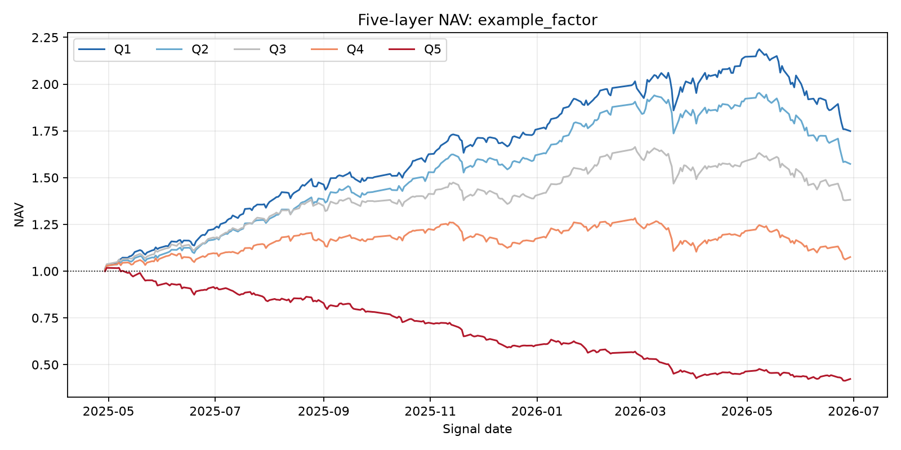 | 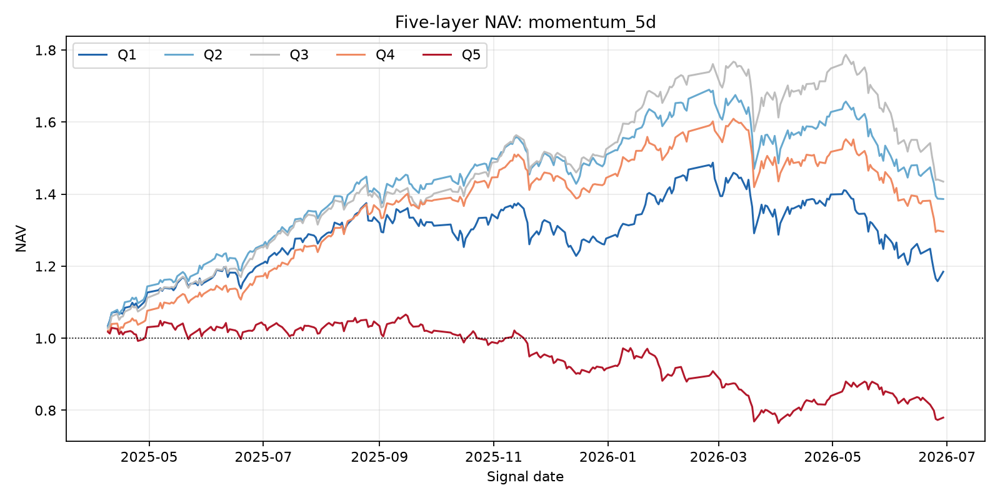 |
| 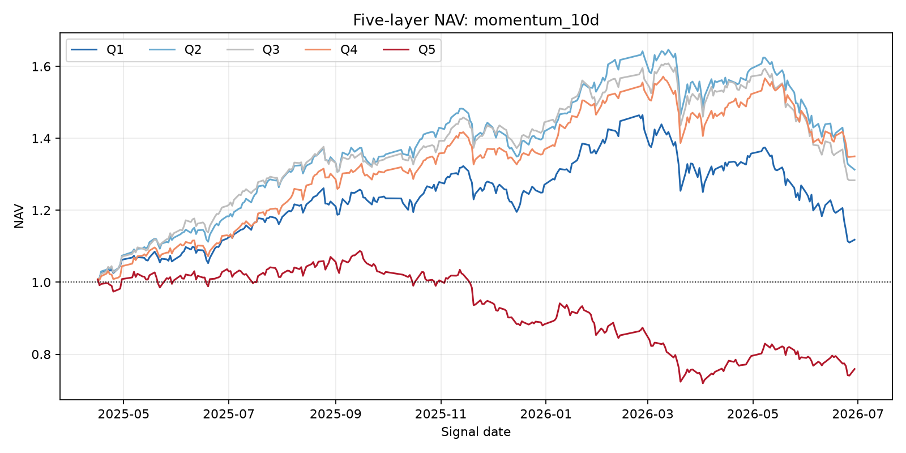 | 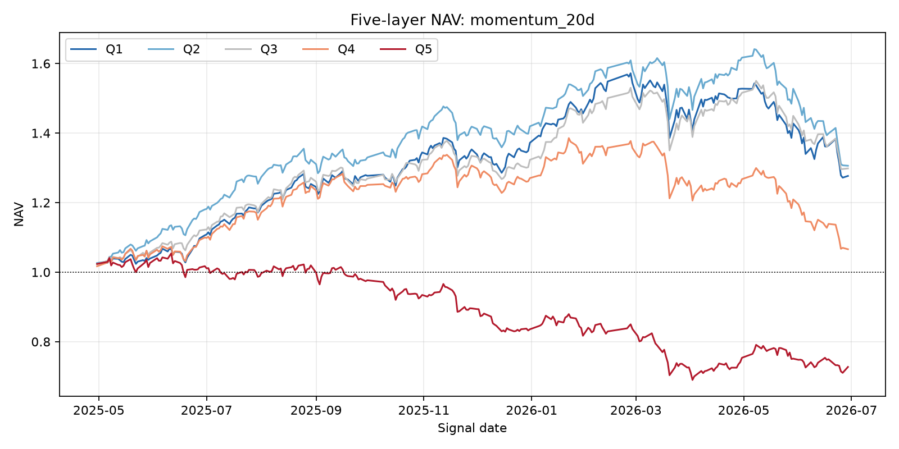 |
| 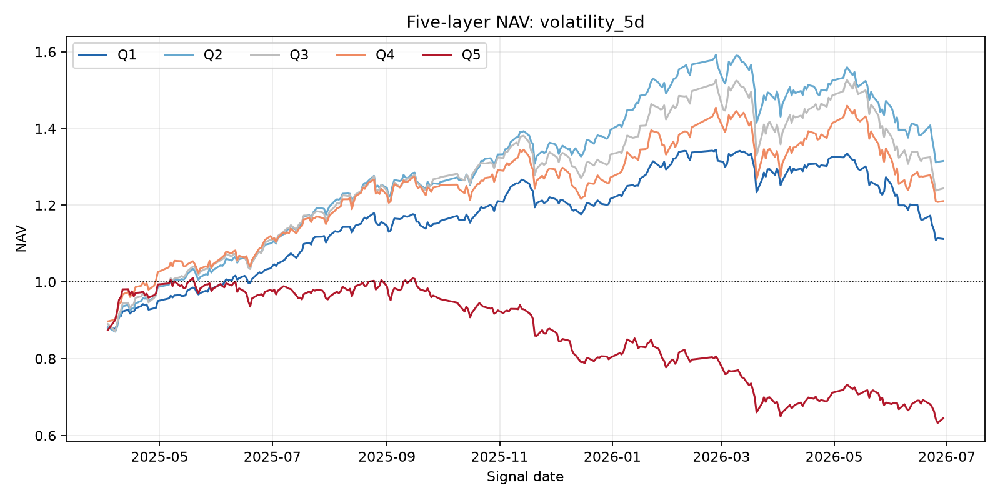 | 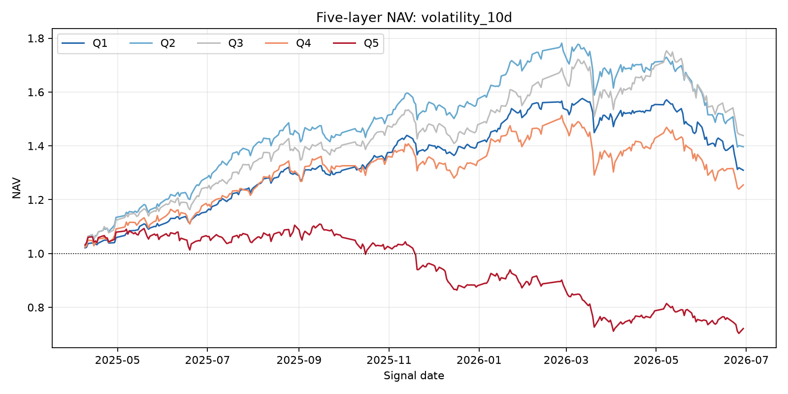 |
| 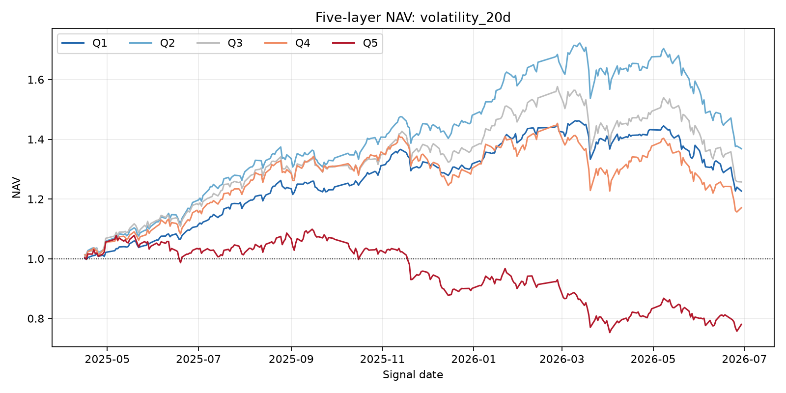 | 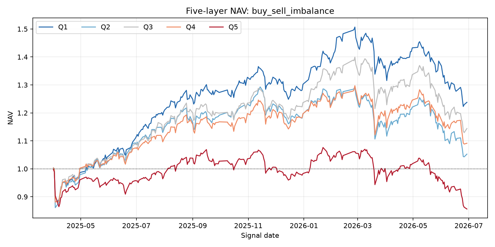 |
| 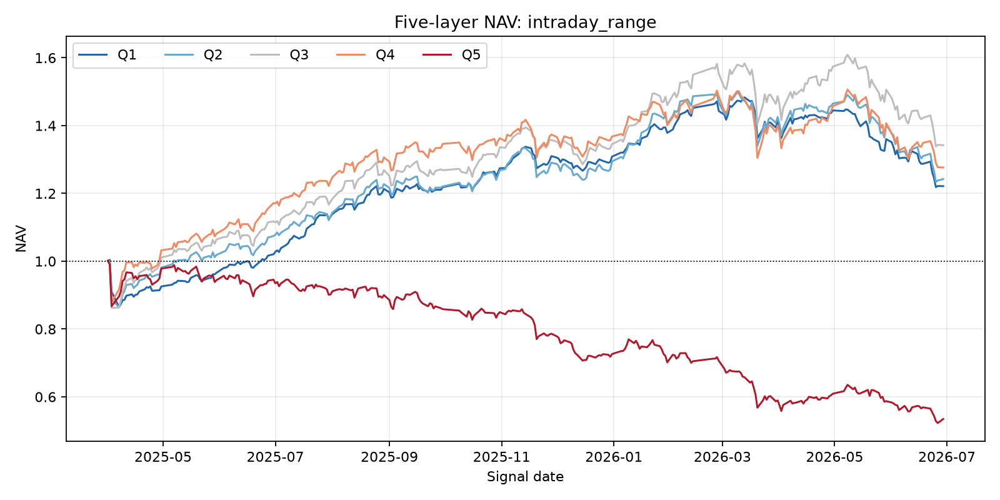 | 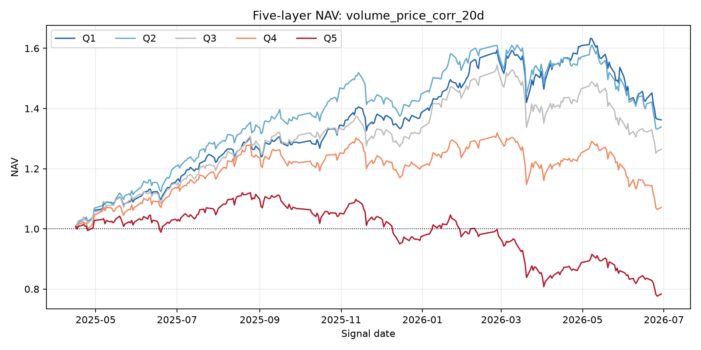 |

### 13.2 Task4完整策略与敏感性结果

正式4因子八个严格策略的指标已在第5.4节完整给出。下面补充扩展10因子八个严格策略，便于直接看出“因子更多并不自动更好”。

| 扩展10因子策略 | CAGR | 年化波动 | Sharpe | 最大回撤 | 总收益 |
|---|---:|---:|---:|---:|---:|
| rolling_close | +0.55% | 16.73% | 0.116 | -23.79% | +0.66% |
| expanding_close | +6.53% | 16.49% | 0.466 | -18.93% | +7.85% |
| hybrid_close | +8.13% | 16.66% | 0.552 | -18.55% | +9.78% |
| adaptive_close | +7.68% | 15.60% | 0.552 | **-16.35%** | +9.25% |
| rolling_open | -0.19% | 15.96% | 0.068 | -26.41% | -0.22% |
| expanding_open | +6.02% | 15.96% | 0.446 | -21.75% | +7.24% |
| hybrid_open | +6.71% | 16.32% | 0.479 | -22.02% | +8.06% |
| adaptive_open | +6.93% | **15.46%** | 0.511 | -19.69% | +8.34% |

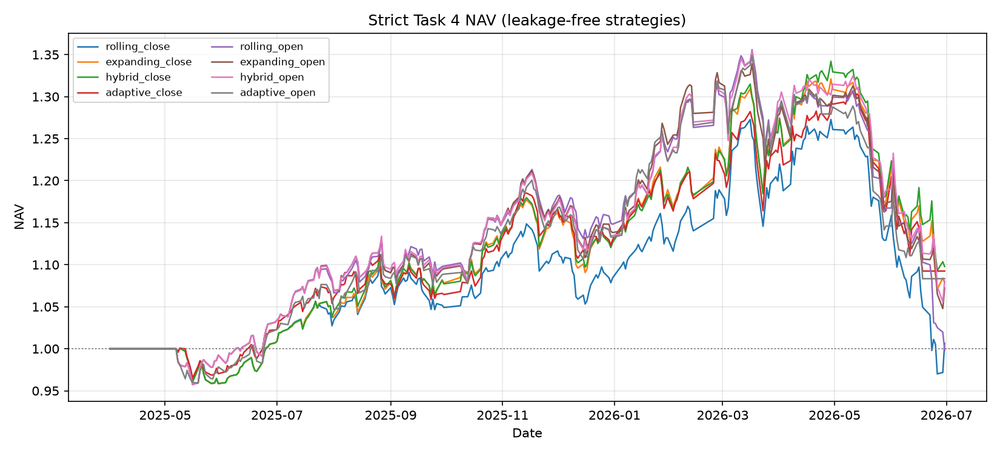

扩展10因子的close/open市场对照也完整保留。它们与正式4因子图使用相同的“策略—市场—累计收益率差—几何超额”口径：

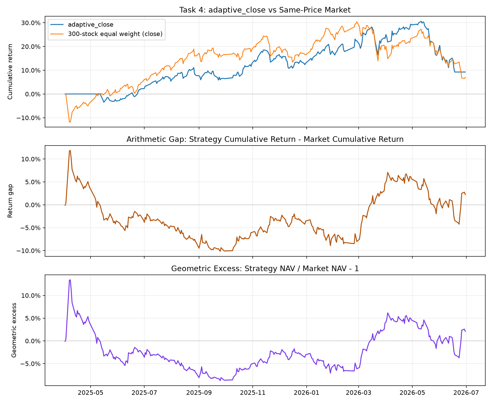

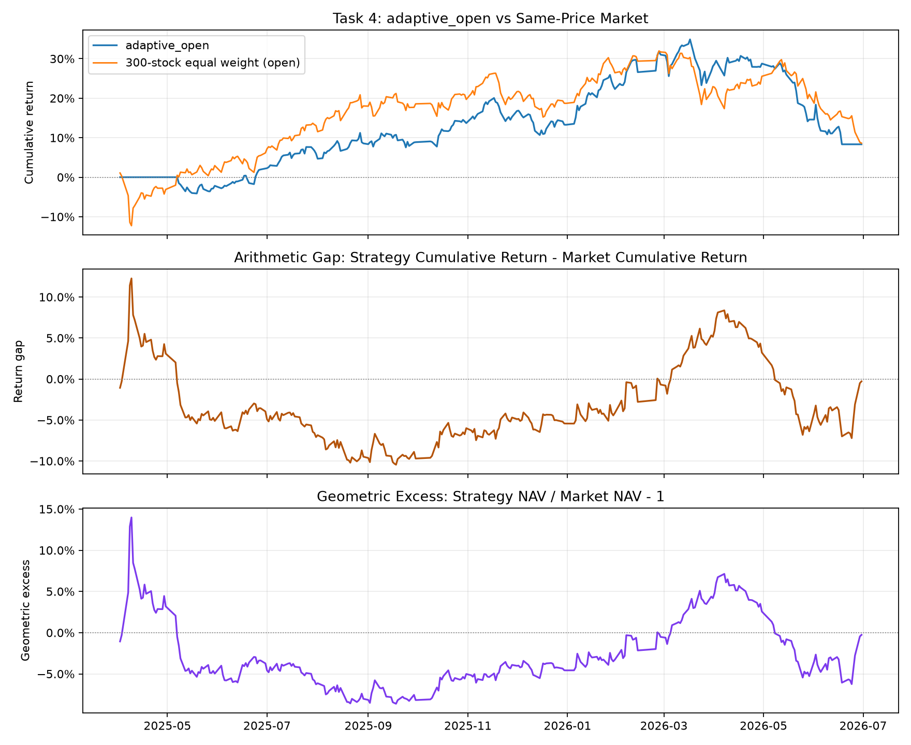

18组参数的四折摘要如下。表中40日Top20虽然是唯一两组4/4折均为正的配置，但属于已查看样本上的敏感性结果，不替代60日Top10正式参数。

| 执行 | 回看/Top N | 正超额折数 | 折中位数超额 | 最差折 | 折中位Sharpe |
|---|---|---:|---:|---:|---:|
| close | 40/5 | 2/4 | +2.10% | -11.24% | 0.713 |
| close | 40/10 | 3/4 | +6.01% | -7.43% | 2.030 |
| close | 40/20 | **4/4** | +8.73% | **+0.95%** | 2.709 |
| close | 60/5 | 2/4 | -1.92% | -14.23% | 0.779 |
| close | 60/10 | 3/4 | +3.97% | -5.95% | 2.026 |
| close | 60/20 | 3/4 | +5.14% | -0.20% | 2.575 |
| close | 90/5 | 1/4 | -3.16% | -13.35% | 1.166 |
| close | 90/10 | 3/4 | +3.89% | -8.80% | 1.970 |
| close | 90/20 | 3/4 | +4.93% | -2.64% | 1.790 |
| open | 40/5 | 3/4 | +3.81% | -1.29% | 2.613 |
| open | 40/10 | 3/4 | +9.44% | -1.48% | 3.347 |
| open | 40/20 | **4/4** | +9.69% | **+4.11%** | 3.738 |
| open | 60/5 | 3/4 | +7.21% | -5.53% | 3.134 |
| open | 60/10 | 2/4 | +8.12% | -1.01% | 3.551 |
| open | 60/20 | 3/4 | +9.48% | -0.38% | 3.678 |
| open | 90/5 | 3/4 | +5.78% | -11.18% | 2.700 |
| open | 90/10 | 3/4 | +9.34% | -9.21% | 3.585 |
| open | 90/20 | 3/4 | +10.16% | -7.41% | 3.431 |

成本压力、聚类精选、正交化、单因子收益和 Bootstrap 显著性已在第 5.5–5.9 节列出，此处不再重复。对应逐日路径、72 个时间折和全部指标见第 12 节索引中的 CSV。

### 13.3 Task 5 组件消融与策略明细

第 7.9 节已经完整比较 LSTM、Logistic、HistGB、上一分钟规则和多数类基线，因此附录不再重复该表。这里仅补充正文未完整展开的组件消融和策略明细。

三组件消融表明，融合并非在每个短样本上都占优：验证集 blend 最好；测试集 staged 的 Accuracy 和 Macro F1 略高，而 blend 的概率损失更低。

| 数据段 | 概率来源 | Accuracy | Macro F1 | Brier | NLL | ECE |
|---|---|---:|---:|---:|---:|---:|
| 验证 | joint | 46.81% | 46.26% | 0.6163 | 1.0192 | 2.45% |
| 验证 | staged | 47.10% | 46.72% | 0.6104 | **1.0064** | 2.45% |
| 验证 | blend | **47.69%** | **47.26%** | **0.6104** | 1.0068 | **2.08%** |
| 测试 | joint | 46.05% | 45.23% | 0.6124 | 1.0059 | **2.49%** |
| 测试 | staged | **46.58%** | **46.04%** | 0.6114 | 1.0026 | 2.50% |
| 测试 | blend | 46.46% | 45.93% | **0.6096** | **0.9999** | 2.71% |

下一分钟价格时点代理的模型与档位对照如下。部分组合的毛收益为正，但计入每次活跃 5 bp 的卖出费后全部为负，显示高频换手是主要瓶颈。

| 模型 | 档位 | 多头覆盖 | 毛收益 | 5 bp净收益 |
|---|---|---:|---:|---:|
| LSTM | all | 76.10% | -1.12% | -36.89% |
| LSTM | balanced | 32.20% | +4.60% | -13.50% |
| LSTM | strict | 10.00% | +0.75% | -5.03% |
| HistGB | all | 89.15% | +5.14% | -37.87% |
| HistGB | balanced | 38.56% | +5.92% | -15.64% |
| HistGB | strict | 12.88% | +3.51% | **-4.06%** |
| Logistic | all | 72.12% | -0.10% | -34.73% |
| Logistic | balanced | 34.07% | +1.61% | -16.90% |
| Logistic | strict | 15.76% | +3.55% | -5.64% |

加入“涨跌多少”的多任务模型在同一代理口径下，预测收益strict组毛收益最高，但覆盖高达43.31%，净收益仍为-17.45%；方向头strict只覆盖2.97%，净收益-1.83%。这再次说明收益排序信息不能脱离换手与可成交时点解释。

| 多任务方法 | 档位 | 覆盖 | 毛收益 | 5 bp净收益 |
|---|---|---:|---:|---:|
| 方向分类头 | all | 63.31% | +2.88% | -29.19% |
| 方向分类头 | balanced | 16.36% | +1.73% | -7.63% |
| 方向分类头 | strict | 2.97% | -0.09% | **-1.83%** |
| 预测收益头 | all | 94.75% | +0.23% | -42.70% |
| 预测收益头 | balanced | 82.03% | +3.94% | -35.94% |
| 预测收益头 | strict | 43.31% | **+6.58%** | -17.45% |

### 13.4 可交易期限与T+1完整结果

验证集冻结参数后的10个“期限×模型”测试策略如下。除30分钟HistGB和T+1 Ridge外，其余同覆盖几何超额均为负；即使为正，幅度也不足以在9日T+1样本上证明稳定Alpha。

| 期限 | 模型 | 测试Rank IC | 覆盖 | 5 bp净收益 | 同覆盖市场 | 几何超额 |
|---|---|---:|---:|---:|---:|---:|
| 1分钟 | Ridge | +0.075 | 34.00% | +0.48% | +2.26% | -1.75% |
| 1分钟 | HistGB | +0.085 | 34.44% | -0.68% | +0.54% | -1.21% |
| 5分钟 | Ridge | +0.074 | 67.50% | -0.88% | +0.75% | -1.62% |
| 5分钟 | HistGB | -0.003 | 23.04% | -2.46% | +0.13% | -2.58% |
| 15分钟 | Ridge | +0.094 | 75.00% | -1.10% | +0.03% | -1.13% |
| 15分钟 | HistGB | -0.057 | 47.14% | -2.26% | -0.51% | -1.77% |
| 30分钟 | Ridge | +0.080 | 70.00% | -3.41% | -1.90% | -1.54% |
| 30分钟 | HistGB | -0.061 | 90.00% | -1.04% | -1.31% | **+0.27%** |
| T+1 | Ridge | +0.037 | 96.30% | -10.68% | -11.30% | **+0.69%** |
| T+1 | HistGB | **+0.104** | 17.78% | -0.83% | -0.16% | -0.67% |

T+1模型与输入特征的最终同口径比较：

| 模型/输入 | 分类Accuracy | Macro F1 | 收益Rank IC | 净收益 | 同覆盖市场 | 几何超额 |
|---|---:|---:|---:|---:|---:|---:|
| 原始收益Ridge | — | — | +0.037 | -10.68% | -11.30% | **+0.69%** |
| 原始收益HistGB | — | — | +0.104 | -0.83% | -0.16% | -0.67% |
| 25特征紧凑LSTM | 45.89% | 44.38% | -0.017 | -19.14% | -12.03% | -8.08% |
| 19特征精选LSTM | **46.14%** | **45.72%** | **+0.065** | **-9.11%** | -8.50% | **-0.67%** |
| 原题四字段LSTM | 45.54% | 39.64% | -0.121 | -12.65% | -10.50% | -2.40% |

### 13.5 不确定性、负结果与最终证据等级

| 结论 | 点估计 | 不确定性/反证 | 当前证据等级 |
|---|---|---|---|
| LSTM整体分类优于多数类 | Accuracy 46.46% vs 43.68% | 按10个测试日Bootstrap区间44.81%–48.25%，高于多数类概率100% | 中等；存在增量但幅度有限 |
| 高置信度预测更准 | strict约63%，覆盖约9% | 三seed稳定，但不等于平仓胜率 | 中等；适合选择性预测，不足以证明收益 |
| 正式Task4 open跑赢市场 | 首次持仓后几何超额+42.45% | 95%区间+6.04%–+91.26%，但四折仅2/4为正且近期跑输 | 中等偏强的历史证据，非全新盲测 |
| 正式Task4 close跑赢市场 | 首次持仓后+10.26% | 区间跨0，四折3/4为正 | 中等偏弱 |
| balanced T+1 LSTM跑赢同覆盖市场 | +0.36% | 95%区间-0.37%–+1.13%，正超额概率81.02% | 弱；不能排除0 |
| strict T+1 LSTM跑赢同覆盖市场 | -0.13% | 95%区间-0.55%–+0.20% | 不支持 |
| 直接预测市场超额更好 | 最好+0.49% | Rank IC转负且弱于原始收益Ridge的+0.69% | 不支持 |
| 更复杂LSTM优于简单收益模型 | 25特征LSTM超额-8.08% | Ridge +0.69%，19特征修复后仍为-0.67% | 不支持 |

本报告同时保留显著结果、区间跨 0 的结果、失败实验和口径限制，以区分题目完成度、历史回测表现、统计证据与可交易证据。附录数字均直接取自第 12 节索引中的 CSV/JSON，未根据叙事重新挑选样本。
