# 兆信基金量化研究项目中期报告（最终整理版）

> 项目周期：2025-04-01 至 2026-06-30  
> 数据范围：300 只匿名股票、302 个交易日的逐笔成交数据  
> 报告更新日期：2026-08-10  
> 本报告对应代码目录：`project/quant_downsampler`  
> 正式结果目录：`project/output`

---

## 摘要

本项目完成了从逐笔成交数据到日频/分钟频数据、因子研究、历史 IC 组合回测、因子机器学习以及分钟级 LSTM 预测的完整研究链路。

本次最终整理重点解决了十二类问题：

1. 修正本机与队友代码之间的绝对路径差异，所有路径改为相对项目自动解析。
2. 确认 `adjfactor.pkl` 与 300 只匿名股票能够完整映射，并对 OHLC 进行一致复权。
3. 修复 Task4 中“用未来收益计算当日 IC 权重”的前视偏差，建立严格历史 IC 回测。
4. 将 Task5 从“删除平盘后判断涨跌”改为覆盖全部合法窗口的 down/flat/up 三分类，并进一步实现三个独立 LSTM 的概率融合。
5. 增加因子区块 bootstrap、市场状态、单因子相对收益，以及真实股数账本上的换手缓冲和成本压力。
6. 增加 Logistic/HistGB 强基线、Brier/NLL/ECE、验证集温度校准，并把所有模型接入相同的价格时点和 T+1 收益引擎。
7. 增加“方向分类＋实际涨跌幅回归”双头 LSTM，在相同 5,900 个测试键上同时评价收益 Rank IC、价格时点毛/净收益和 T+1 相对收益。
8. 把预测目标扩展到 1/5/15/30 分钟和 T+1 五种可成交收益，所有模型、阈值、Top-K 和交易间隔均只在验证集选择，并用紧凑 T+1 LSTM 检验复杂模型是否真正增加收益价值。
9. 增加因子独立性处理：只用前 120 日冻结相关性聚类、代表因子和正交顺序，再在统一的后续区间比较原始、聚类精选和逐日截面正交化三套严格 Task4。
10. 将独立性检验延伸到 Task5：只用训练集聚类 25 个分钟输入并精选 19 个代表特征，同时量化 direction、movement、joint 三组件的预测一致性和分歧样本增量。
11. 增加原题四字段最小基线：把 `Time、Price、Volume、BSFlag` 各映射为一个平稳因果特征，独立训练相同 T+1 双头 LSTM，检验后加特征究竟带来信息还是噪声。
12. 回到题目 README 重建正式答题口径：示例因子的 5/10/20 日均值必须满足完整窗口；Task2–3 正式限定为“示例＋3个自建因子”；Task3 保存 Q1–Q5 五条累计净值曲线；Task4 单独保存正式 4 因子和扩展 10 因子的结果。

最终主要结果如下：

| 模块 | 最终结果 | 结论 |
|---|---:|---|
| Task1 | 日频 11 张 302×300 表；分钟频 11×302 张 242×300 表 | 数据降采样和复权验收通过 |
| Task2–3 正式要求 | 示例因子＋3个自建因子；每个因子均有 Q1–Q5 五条净值曲线 | 示例因子和量价相关严格单调，其余正式因子主要体现尾部效应 |
| Task2–3 扩展 | 共 10 个因子；全样本 IC bootstrap 均显著为负，2026Q2 有 9 个转正 | 市场状态会改变因子强度，但不能单独解释近期反转 |
| Task4 正式4因子 | adaptive_close 总收益 19.85%、同口径超额 12.00%；adaptive_open 52.76%、超额 40.64% | 全期跑赢市场，但最近45日分别落后0.45%和3.32%，且不是盲测 |
| Task4 扩展10因子 | adaptive_close 总收益 9.25%；缓冲版本 11.33%，最大回撤 -11.36% | 多加因子没有改善结果；降低换手后成本稳健性有所改善 |
| 因子独立性 | 聚类精选 10→6 个因子，最大相关性 0.837→0.597；正交化后 0.096 | 重复暴露已实质降低；冻结后聚类组合超额 +21.46%，但仍需多折确认 |
| 因子学习 | 滚动全期 Sharpe 4.84/4.53，最近 45 日 -3.25/-3.76 | 全期结果被近期因子失效削弱，不能只看全期均值 |
| Task5 正式 seed 42 | Accuracy 46.46%，Balanced Accuracy 46.18%，Macro F1 45.93% | 高于 43.68% 多数类基线，但优势有限 |
| Task5 三种子均值 | Accuracy 46.87%±0.44%，Macro F1 45.68%±0.47% | 准确率提升较稳定，类别均衡提升不稳定 |
| Task5 strict 档均值 | Accuracy 63.06%±0.43%，覆盖率 9.27%±0.50% | 高置信度样本更可预测，但必须同时披露低覆盖率 |
| Task5 强基线/校准 | LSTM 46.46%，Logistic 45.34%，HistGB 42.66%；校准后 ECE 0.91% | LSTM 分类层领先，但优势有限；概率校准明显改善 |
| Task5 涨跌幅多任务 | Accuracy 46.47%，收益 Rank IC 0.335；严格收益组价格代理毛收益 +6.58%、扣 5 bp 后 -17.45% | 涨跌幅头学到额外收益排序，但高换手使其尚未转化为可执行净收益 |
| Task5 T+1 策略诊断 | balanced 扣 5 bp 后 -4.27%，同期市场 -12.27% | 跑赢全仓市场 9.12%，但相对同覆盖市场仅 +0.36%，且只有 9 个结算日 |
| Task5 可交易期限 | T+1 Ridge 同覆盖超额 +0.69%；紧凑 T+1 LSTM -8.08% | 简单模型优于复杂 LSTM，但测试仅 9 个结算日，仍属探索性证据 |
| Task5 特征去冗余 | 25→19 特征；T+1 Rank IC -0.017→+0.065，同覆盖超额 -8.08%→-0.67% | 明显修复 LSTM 的重复输入问题，但仍未跑赢市场或 Ridge |
| Task5 原题四字段 | Accuracy 45.54%，T+1 Rank IC -0.121，同覆盖超额 -2.40% | 四项原始信息不足；19个精选特征优于4项和25项两端 |

项目当前适合作为“完整、口径严格、能解释问题的中期研究成果”，但不能把分类准确率或历史回测解释成可直接交易的确定性收益。

---

## 1. 题目理解与总体研究路线

题目包含五部分：

1. 将逐笔成交数据降采样为日频和分钟频数据，并计算 11 个基础字段。
2. 按题目给出的逻辑构建示例因子。
3. 自主构建 1–3 个因子并进行 IC、IR、ICIR、Rank IC 和分层评价。
4. 使用当日因子和 IC 加权构建 Top 10 组合，分别按次日收盘价和开盘价调仓，并讨论原方法的问题及修正方案。
5. 使用分钟数据构建端到端神经网络，预测下一分钟股价涨跌。

正式答案与扩展研究严格分开：Task2–3 的必答集合只含题目示例因子和 3 个自建因子，10 因子研究另列为扩展；Task4 先用正式 4 因子完成收盘/开盘回测，再用 10 因子做敏感性对照；Task5 将“涨跌”完善为 down/flat/up 三类，避免删除平盘样本产生不可部署的条件准确率。

整体流程为：

```text
逐笔成交 + adjfactor
        ↓
日频/分钟频 11 字段
        ↓
日频因子 → IC/Rank IC/分层/bootstrap/市场状态
        ↓
严格历史 IC 加权 → 真实持仓账本 → 市场/换手/成本检验
        ↓
因子收益率回归 / 直接夏普优化
        ↓
分钟序列特征 → LSTM/强基线 → 概率校准 → T+1 收益评价
```

---

## 2. 数据、路径与复权处理

### 2.1 数据结构

原始数据覆盖 2025-04-01 至 2026-06-30，共 302 个交易日、300 只匿名股票。逐笔数据中的价格字段为整数，真实价格为：

```text
raw_price = Price / 100
```

每笔数据还包含成交量和已经预处理好的 `BSFlag`：

- `BSFlag=0`：主动买成交；
- `BSFlag=1`：主动卖成交；
- `BSFlag=2`：集合竞价成交。

### 2.2 路径整理

队友版本中存在其他电脑的绝对路径。最终代码统一由 `qd/config.py` 基于文件位置推导：

- 原始数据：工作区 `data/TRADE`；
- 复权因子：工作区 `adjfactor.pkl`；
- 正式输出：`project/output`。

如更换电脑，可通过 `QD_DATA_DIR`、`QD_ADJFACTOR_PATH` 和 `QD_OUTPUT_DIR` 覆盖，不需要修改源代码。

### 2.3 复权因子处理

`adjfactor.pkl` 是 302×300 的 DataFrame，列名为带 `.SH/.SZ` 后缀的完整证券代码；逐笔文件名为六位匿名代码。去掉市场后缀后，双方 300 个代码一一对应，无缺失、无重复。

最终价格复权公式为：

```text
adjusted_price(date)
= raw_price(date)
× adjfactor(date)
/ adjfactor(first_valid_date)
```

归一化到首个有效因子可以让首日价格保持原始量级，同时消除后续分红配股造成的非交易性跳变。复权只作用于 OHLC；成交量、成交笔数、成交额、主买/主卖量额保留真实交易口径。

---

## 3. Task1：逐笔数据降采样

### 3.1 日频字段

每只股票、每个交易日计算：

- `open`：当日第一笔成交价；
- `high` / `low`：最高/最低成交价；
- `close`：当日最后一笔成交价；
- `volume`：成交量总和；
- `trade_count`：成交笔数；
- `amount`：逐笔 `raw_price × volume` 后求和；
- `buy_volume` / `sell_volume`：按 BSFlag 拆分；
- `buy_amount` / `sell_amount`：主动买卖成交额。

日频 OHLC 包含开盘和收盘集合竞价。停牌日价格字段使用上一交易日收盘价延续，成交类字段填 0。

### 3.2 分钟频字段

每个交易日输出 242 行：

- 上午 09:30–11:30，共 121 行；
- 下午 13:00–15:00，共 121 行。

连续竞价阶段无成交分钟的 OHLC 使用前一分钟 close 填充；成交类字段填 0。14:57–14:59 是收盘集合竞价等待行，价格保留 NaN、成交字段为 0；最终撮合成交记录在 15:00。

Task5 不使用全部 242 行，而只使用连续竞价区间：上午 09:30–11:30、下午 13:00–14:56，避免把集合竞价等待行当成普通一分钟。

### 3.3 验收结果

统一验收脚本确认：

- 11 张日频表全部为 302×300；
- 每个分钟字段均有 302 个 CSV；
- 抽查首日和末日，每张分钟表均为 242×300；
- 300 个匿名代码均能映射到复权因子完整代码；
- BSFlag 主买/主卖拆分、开盘集合竞价排除和 15:00 收盘撮合规则通过烟雾测试。

---

## 4. Task2–3：因子构建与评价

### 4.1 正式因子与扩展因子

题目要求为“示例因子＋另构建 1 至 3 个因子”。因此正式答题集合严格限定为 4 个：

| 因子 | 定义 | 信息类型 |
|---|---|---|
| example_factor | `log(std(MA1(amount), MA5, MA10, MA20))` | 题目指定 |
| momentum_20d | `close_t / close_(t-20) - 1` | 价格趋势 |
| buy_sell_imbalance | `(buy_volume-sell_volume)/(buy_volume+sell_volume)` | 主动买卖订单流 |
| volume_price_corr_20d | 过去 20 日成交量变化率与价格收益率滚动相关 | 量价关系 |

示例因子的 MA5/MA10/MA20 必须分别积累满 5/10/20 个观测才有效，前 19 日不再用短窗口冒充“20 日均值”。以下 6 个因子不属于必答数量，只作为扩展敏感性研究：`momentum_5d/10d`、`volatility_5d/10d/20d`、`intraday_range`。完整研究集合仍为 10 个：

| 因子 | 定义 |
|---|---|
| example_factor | `log(std(MA1(amount), MA5, MA10, MA20))`，完整窗口 |
| momentum_5d/10d/20d | `close_t / close_(t-N) - 1` |
| volatility_5d/10d/20d | 日收益率过去 N 日标准差 |
| buy_sell_imbalance | `(buy_volume-sell_volume)/(buy_volume+sell_volume)` |
| intraday_range | `(high-low)/close` |
| volume_price_corr_20d | 过去 20 日成交量变化率与价格收益率滚动相关 |

前向标签为次日复权收盘收益：

```text
forward_return_1d(t) = close(t+1) / close(t) - 1
```

### 4.2 评价口径修正

最终版明确区分 IR 和 ICIR：

```text
ICIR = mean(daily_IC) / std(daily_IC)
IR   = sqrt(252) × ICIR
```

Rank ICIR 与 Rank IR 同理。此前代码把 IR 和 ICIR 输出为同一个数，本次已经修正并增加自动测试。

### 4.3 全样本结果

| 因子 | IC | 年化 IR | ICIR | Rank IC | Rank ICIR |
|---|---:|---:|---:|---:|---:|
| momentum_5d | -0.0281 | -2.715 | -0.171 | -0.0557 | -0.403 |
| momentum_10d | -0.0329 | -3.201 | -0.202 | -0.0522 | -0.380 |
| momentum_20d | -0.0364 | -3.962 | -0.250 | -0.0667 | -0.511 |
| volatility_20d | -0.0356 | -4.006 | -0.252 | -0.0675 | -0.397 |
| volume_price_corr_20d | -0.0243 | -4.271 | -0.269 | -0.0578 | -0.564 |
| volatility_10d | -0.0475 | -5.284 | -0.333 | -0.0761 | -0.473 |
| volatility_5d | -0.0548 | -6.125 | -0.386 | -0.0727 | -0.494 |
| buy_sell_imbalance | -0.0480 | -6.940 | -0.437 | -0.0198 | -0.188 |
| intraday_range | -0.0747 | -7.757 | -0.489 | -0.0844 | -0.521 |
| example_factor | -0.0781 | -8.692 | -0.548 | -0.1076 | -0.735 |

负 IC 不是计算错误。它表示因子值越大，下一日收益通常越低，因此因子可以反向使用。例如严格完整窗口下，example_factor 的 Q1 平均次日收益为 +0.2058%，Q5 为 -0.2960%，Q5-Q1 约 -0.5018%，方向与负 IC 一致。

### 4.4 因子分层检验

为检验 IC 是否对应稳定的截面收益排序，每个交易日将约 300 只股票按照当日因子值从低到高排序，并尽量等量划分为 Q1–Q5 五组；随后计算各组下一交易日的等权平均收益，再在全部有效交易日上取时间均值。Q1 表示因子值最低的 20% 股票，Q5 表示因子值最高的 20% 股票。由于本项目各因子的全样本 IC 均为负，因此同时报告反向多空价差 Q1−Q5；该值为正，表示“买入低因子组、卖出高因子组”的方向与负 IC 一致。

下表单位均为单日平均收益率（%），尚未扣除手续费、滑点和冲击成本。

| 因子 | Q1 | Q2 | Q3 | Q4 | Q5 | Q1−Q5 |
|---|---:|---:|---:|---:|---:|---:|
| example_factor | +0.2058 | +0.1677 | +0.1216 | +0.0324 | -0.2960 | **+0.5018** |
| momentum_5d | +0.0665 | +0.1188 | +0.1277 | +0.0944 | -0.0776 | +0.1441 |
| momentum_10d | +0.0467 | +0.1007 | +0.0923 | +0.1094 | -0.0874 | +0.1341 |
| momentum_20d | +0.0945 | +0.1023 | +0.0999 | +0.0295 | -0.1056 | +0.2001 |
| volatility_5d | +0.0426 | +0.1008 | +0.0831 | +0.0741 | -0.1350 | +0.1776 |
| volatility_10d | +0.0953 | +0.1197 | +0.1306 | +0.0850 | -0.1012 | +0.1965 |
| volatility_20d | +0.0743 | +0.1147 | +0.0864 | +0.0621 | -0.0759 | +0.1502 |
| buy_sell_imbalance | +0.0796 | +0.0281 | +0.0548 | +0.0387 | -0.0439 | +0.1235 |
| intraday_range | +0.0726 | +0.0808 | +0.1089 | +0.0918 | -0.1955 | **+0.2681** |
| volume_price_corr_20d | +0.1125 | +0.1073 | +0.0874 | +0.0307 | -0.0768 | **+0.1893** |

五个平均值只反映全期均值，不能代替分层回测。因此本次同时保存每个信号日的 Q1–Q5 收益，并按 `(1+r).cumprod()` 生成五条累计净值曲线：

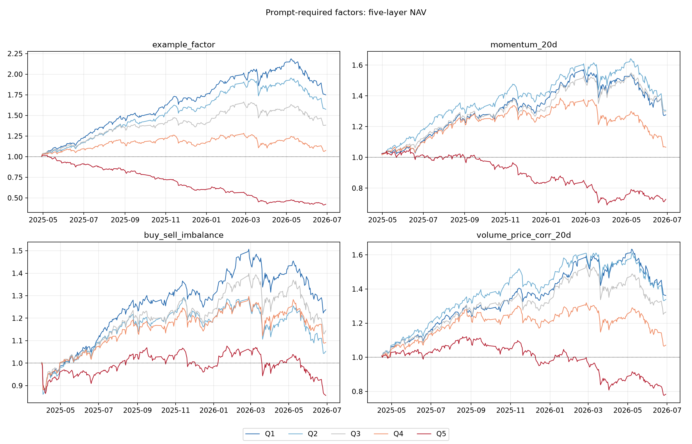

正式 4 因子的单调性指标如下。`layer_spearman=-1` 且相邻下降数为 4/4 才是严格单调；Q1−Q5 t 值来自逐日多空收益序列。

| 因子 | 分层 Spearman | 相邻下降数 | Q1−Q5 日均 | t 值 | 严格单调 |
|---|---:|---:|---:|---:|---|
| example_factor | -1.0 | 4/4 | +0.5018% | 8.43 | 是 |
| momentum_20d | -0.7 | 3/4 | +0.2001% | 3.85 | 否 |
| buy_sell_imbalance | -0.7 | 3/4 | +0.1235% | 2.96 | 否 |
| volume_price_corr_20d | -1.0 | 4/4 | +0.1893% | 4.98 | 是 |

分层结果给出四点信息：

1. 10 个因子的 Q1−Q5 均为正，与全样本负 IC 的方向一致，并非因子符号计算错误；
2. `example_factor` 的反向分层价差最大，且 Q1 到 Q5 基本单调下降；`volume_price_corr_20d` 也呈现较清晰的单调下降关系；
3. `intraday_range`、动量和波动率因子的收益差异更多集中在 Q5 极端组，中间层并不完全单调，说明其关系具有尾部效应，不能简单理解为线性预测；
4. 五条曲线仍使用全样本标签，只用于 Task3 的描述性因子评价。它不能用于事后确定 Task4 权重，且曲线未扣手续费、滑点和冲击成本。因子的时间稳定性仍应结合下一节的训练、验证、测试分段结果判断。

完整结果分别保存在 `required_factor_summary.csv`、`required_factor_layering.csv`、`factor_layer_daily_returns.csv`、`factor_layer_nav.csv`、`factor_layer_metrics.csv` 和 `factor_layer_monotonicity.csv`；10 因子逐层均值仍保存在 `factor_layering.csv`。

### 4.5 主要问题：因子时变

按时间 70%/15%/15% 切分后，多数因子的普通 Pearson IC 在训练和验证阶段为负，但在最后测试阶段转为正：

| 因子 | Train IC | Validation IC | Test IC |
|---|---:|---:|---:|
| example_factor | -0.1007 | -0.0918 | +0.0323 |
| intraday_range | -0.0890 | -0.1012 | +0.0191 |
| momentum_10d | -0.0492 | -0.0365 | +0.0434 |
| momentum_20d | -0.0492 | -0.0659 | +0.0474 |
| buy_sell_imbalance | -0.0568 | -0.0271 | -0.0276 |

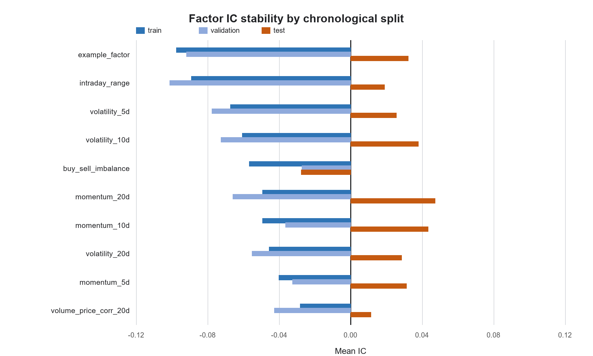

上表和图使用普通 Pearson IC。进一步检查 Rank IC 后，测试期 10 个因子中有 8 个仍为负；例如 `example_factor`、`intraday_range` 和 `buy_sell_imbalance` 的测试期 Rank IC 分别为 -0.0182、-0.0368 和 -0.0179。只有 `momentum_10d`、`momentum_20d` 略微变正，分别为 +0.0116、+0.0108，且统计显著性不足。因此，更准确的结论不是“全部排序方向反转”，而是多数因子的排序能力在近期明显衰减，普通 IC 又受到尾部极端收益影响而发生变号。买卖失衡的方向相对稳定，但绝对强度也不高。

### 4.6 区块 Bootstrap 与市场状态检验

参考队友仓库的稳健性框架，本项目新增月度、季度、半年和 60 日滚动 IC、5 日循环区块 bootstrap、因子平均截面 Spearman 相关矩阵，以及市场状态条件检验。bootstrap 保留日序列的短期相关性；`p` 值通过对 IC 去均值后在零假设下重采样计算，不把简单的符号概率误当显著性检验。

在当前 301 个交易日样本中，10 个因子的全样本 Pearson IC 区块 bootstrap 95% 区间均未跨 0，说明“全样本平均 IC 为负”并非少数日期偶然造成；但 2026Q2 有 9/10 个因子的平均 Pearson IC 转正，唯一仍为负的是 `buy_sell_imbalance`（-0.0320）。这同时说明统计显著与方向永久稳定是两件不同的事。

为直接回应“最后反转是否只是市场整体出问题”，进一步使用两种状态：

- `target_market_direction`：下一日 300 股等权市场上涨/下跌，只用于事后诊断；
- `known_market_trend`：截至信号日可见的过去 20 日市场累计收益，划分 bull/bear，可用于因果状态分析。

代表性结果如下：

| 因子 | 市场下一日上涨时 IC | 市场下一日下跌时 IC | bull 趋势 IC | bear 趋势 IC |
|---|---:|---:|---:|---:|
| example_factor | -0.0239 | -0.0468 | -0.0365 | -0.0303 |
| momentum_5d | -0.0573 | +0.0100 | -0.0220 | -0.0369 |
| buy_sell_imbalance | -0.0532 | -0.0412 | -0.0590 | -0.0301 |
| intraday_range | -0.0395 | -0.1161 | -0.0875 | -0.0513 |
| volume_price_corr_20d | -0.0128 | -0.0384 | -0.0173 | -0.0362 |

市场状态确实改变了因子强度，尤其 `momentum_5d` 在市场下跌日出现方向差异；但大多数代表因子在 bull/bear 两种已知趋势中仍保持负 IC。因此不能把近期 IC 反转简单归因于“市场整体下跌”。更合理的解释是市场状态切换、尾部股票收益和因子自身时变共同作用。完整结果位于 `output/factor_robustness/`。

---

## 5. Task4：历史 IC 加权组合回测

### 5.1 原题方法的前视偏差

如果在交易日 t 使用“因子 t 与次日收益”的 IC 作为 t 的权重，就需要提前知道未来价格。Naive 方法因此存在直接前视偏差。其年化收益超过 1200%、夏普约 11，明显不属于可交易结果，仅用于展示泄漏会产生多夸张的假象。

### 5.2 严格时间线

最终严格版本的信号和收益时间线为：

```text
close(t) 得到因子值并形成决策
       ↓
在 t+1 的 open 或 close 执行
       ↓
持有至 t+2 同一执行价
       ↓
到 t+2 才完整知道 signal(t) 对应的 IC 标签
```

因此决策日 t 可用的最新原始 IC 是 t-2，对 IC 序列执行 `shift(2)` 后再计算历史权重。该两日信息滞后已加入自动测试。

### 5.3 四种严格权重

- rolling：过去 60 个已实现 IC 的均值；
- expanding：全部已实现历史 IC 的扩展均值；
- hybrid：`0.7 × expanding + 0.3 × rolling`；
- adaptive：hybrid 再除以滚动 IC 波动，并关闭近期/长期方向冲突或绝对 IC 小于 0.01 的因子；
- naive：故意不滞后，只用于泄漏对照。

每日对各因子做稳健截面 z-score，使用带符号历史 IC 权重合成信号，选择 Top 10 等权持有。卖出费率为 0.05%，买入不收费；执行日无成交股票不能买卖，已有停牌持仓继续锁定在账面中。

### 5.4 题目正式4因子的严格结果

本节只使用 Task2–3 的正式 4 因子，不让扩展因子混入题目主答案。

| 策略 | CAGR | 年化波动 | Sharpe | 最大回撤 | 总收益 |
|---|---:|---:|---:|---:|---:|
| rolling_close | 11.03% | 21.41% | 0.595 | -23.47% | 13.31% |
| expanding_close | 8.56% | 21.17% | 0.493 | -21.14% | 10.30% |
| hybrid_close | 13.00% | 20.85% | 0.691 | -19.53% | 15.72% |
| adaptive_close | **16.37%** | 20.34% | **0.847** | **-16.06%** | **19.85%** |
| rolling_open | 19.39% | 21.35% | 0.937 | -31.16% | 23.58% |
| expanding_open | 30.09% | 20.81% | 1.368 | -23.79% | 36.92% |
| hybrid_open | 28.88% | 20.91% | 1.318 | -23.59% | 35.40% |
| adaptive_open | **42.58%** | 20.37% | **1.844** | **-18.19%** | **52.76%** |

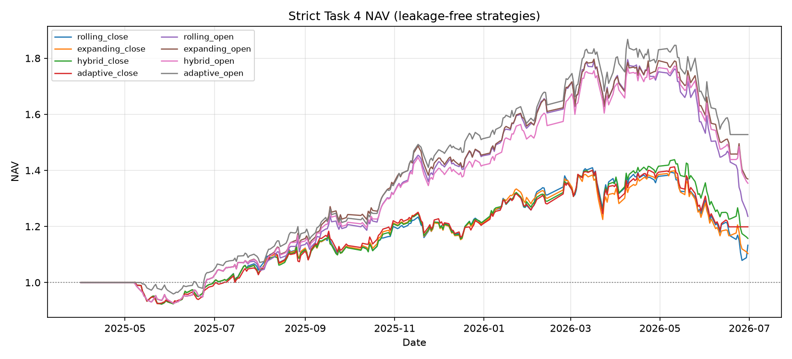

正式 4 因子中，adaptive 在收盘和开盘两种执行口径下都优于其他历史权重方法；开盘执行全期更强。但 10 因子扩展版并未复现这一优势，因此不能把“开盘一定更好”当作普遍结论。两套执行结果都应按题目完整报告。

### 5.5 市场基准与超额收益

为区分“策略自身失效”和“市场整体下跌”，分别使用复权收盘价和复权开盘价构造 300 只股票每日等权基准，使基准收益区间与策略执行价严格一致。停牌股票的前向填充价格产生 0 收益；基准每日恢复等权，不计自身换手成本，因此它是一个相对严格的比较对象。

| 执行口径与区间 | 策略 | 同口径等权市场 | 几何超额 | 信息比率 |
|---|---:|---:|---:|---:|
| close：全部 301 日 | +19.85% | +7.01% | **+12.00%** | 0.562 |
| close：首次执行后 280 日 | +19.85% | +8.69% | **+10.26%** | 0.761 |
| close：最后 45 日 | -13.05% | -12.66% | **-0.45%** | -0.088 |
| open：全部 301 日 | +52.76% | +8.62% | **+40.64%** | 1.773 |
| open：首次执行后 277 日 | +52.76% | +7.24% | **+42.45%** | 2.563 |
| open：最后 45 日 | -15.68% | -12.79% | **-3.32%** | -1.073 |

全样本开头包含滚动窗口预热期，策略当时持有现金。分别从首次实际执行日起比较后，两套策略仍为正超额，说明结果不完全来自预热期空仓。不过这些参数和因子集合都已在当前样本上被反复查看，因此只能称为历史回测，不能称为全新盲测。

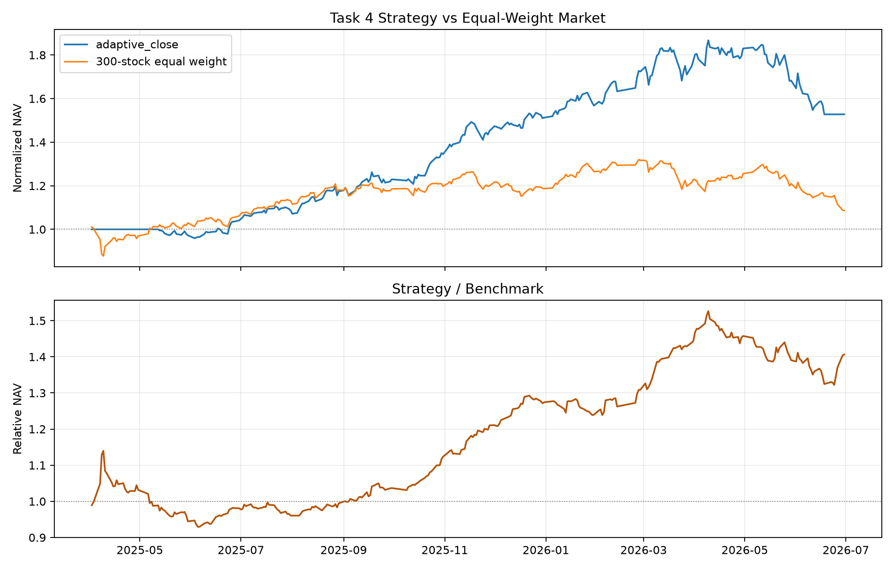

最后 45 日两种市场口径都下跌约 12.7%，解释了策略绝对回撤的大部分；但 close 和 open 策略仍分别额外落后 0.45% 和 3.32%。因此更准确的判断是：**市场环境恶化与因子选股能力衰减同时存在**，不能把全部亏损归因于策略，也不能把全部亏损归因于市场。

横截面 IC 对所有股票共同的市场收益平移并不敏感。市场普跌本身不会机械地令 IC 变号，但市场状态切换可能改变不同股票之间的相对收益结构，从而削弱原有因子的排序能力。

下图使用对数坐标对比严格策略与 Naive 泄漏策略。两者数量级差异说明为什么不能把使用未来 IC 的结果当作模型能力。

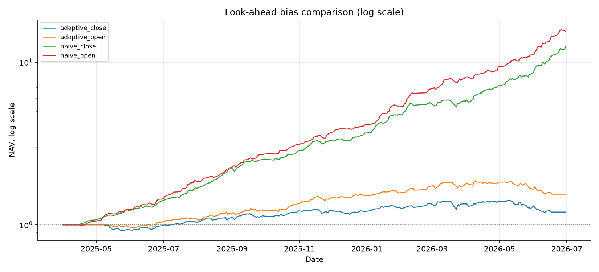

### 5.6 单因子策略能否跑赢市场

IC 显著不保证扣费后的组合能够跑赢市场。为把统计评价和经济评价分开，本项目对 10 个因子逐一调用与正式组合相同的严格时间线、真实现金/股数账本、停牌锁仓和卖出 5 bps 成本，然后从各自首次执行日起与 300 股等权市场精确对齐。

| 单因子严格策略 | 策略收益 | 同期市场 | 几何超额 | 信息比率 |
|---|---:|---:|---:|---:|
| volume_price_corr_20d | +16.95% | +4.97% | **+11.42%** | 0.812 |
| example_factor | +13.89% | +5.67% | **+7.79%** | 0.679 |
| momentum_20d | +4.52% | +4.48% | +0.04% | 0.056 |
| intraday_range | -2.12% | +8.69% | -9.95% | -0.597 |
| buy_sell_imbalance | -15.30% | +8.69% | -22.07% | -1.435 |
| momentum_5d | -29.67% | +6.98% | **-34.26%** | -2.456 |

结果表明各因子的作用不同：`volume_price_corr_20d` 和 `example_factor` 具有独立经济贡献，`momentum_20d` 大致跟随市场，其余若干因子单独交易会明显落后。正式 adaptive 组合仍保留弱因子，是因为它只使用历史已实现 IC 动态定向并在近期/长期符号冲突时关闭因子，而不是按全样本单因子收益事后筛选。

### 5.7 扩展10因子的换手缓冲与成本压力

参考队友仓库“不要只看毛收益”的思路，但不采用其集合式等权持仓实现，本项目直接在现有现金＋股数账本上增加三项约束：Top 20 排名缓冲、每日最多替换 3 只、只允许过去 20 日成交额不处于底部 20%且波动率不处于顶部 10%的股票新建仓。停牌持仓继续以实际股数锁定，持仓价格变化造成的权重漂移会在下一次真实调仓时进入换手和费用。

| 方案 | 卖出成本 | 总收益 | 首次执行后几何超额 | 平均卖出换手 | 最大回撤 |
|---|---:|---:|---:|---:|---:|
| 原 adaptive Top10 | 5 bps | +9.25% | +0.51% | 37.42% | -16.35% |
| 缓冲与过滤版本 | 5 bps | **+11.33%** | **+2.43%** | **24.08%** | **-11.36%** |

缓冲版本并不是通过更频繁择时提高收益，而是减少排名边缘股票反复进出，使换手下降约 35%。固定规则的成本压力结果为：

| 卖出成本 | 原 Top10 | 缓冲版本 |
|---|---:|---:|
| 0 bps | +15.58% | +15.44% |
| 5 bps | +9.25% | +11.33% |
| 10 bps | +3.26% | +7.36% |
| 20 bps | -7.76% | -0.15% |

在零成本下，原 Top10 毛收益略高；成本上升后缓冲版本更稳健，说明其价值主要来自降低交易摩擦，而不是数据挖掘出新的高收益信号。正式主表仍保留原 adaptive 策略，缓冲版本作为可执行性增强与敏感性检验，避免在查看测试结果后替换主策略。

### 5.8 因子聚类精选与截面正交化

原始 10 个因子中同时包含 5/10/20 日动量和 5/10/20 日波动率，直接进行 IC 加权会让同一种经济信息重复进入组合。为避免全样本相关矩阵和测试收益参与选择，本轮使用前 120 个交易日作为冻结区间：只用 2025-04-01 至 2025-09-22 的因子截面相关性，以及在冻结日已经完整实现的历史 IC。IC 仍执行两交易日信息滞后；相关性阈值固定为绝对 Spearman 0.60，2025-09-23 才开始交易，绩效从下一日 2025-09-24 起计算。

冻结区间形成 6 个相关性簇：三个动量因子归为一簇并选择 `momentum_10d`，三个波动率因子归为一簇并选择 `volatility_10d`；`example_factor`、`buy_sell_imbalance`、`intraday_range` 和 `volume_price_corr_20d` 各自保留。簇内代表只按冻结时可见的绝对历史 ICIR 选择。另一条路线不删除因子，而是按同一历史 ICIR 冻结顺序，把每日因子转为截面秩暴露后进行 Gram-Schmidt 残差化；该变换只使用当日因子值，不使用当日或未来收益。

| 因子集合 | 因子数 | 后续最大绝对相关性 | 有效秩 | 策略收益 | 市场收益 | 几何超额 | Sharpe | 最大回撤 | 平均卖出换手 |
|---|---:|---:|---:|---:|---:|---:|---:|---:|---:|
| 原始因子 | 10 | 0.837 | 6.33 | +3.20% | -7.30% | +11.33% | 0.330 | -16.35% | 42.39% |
| **聚类精选** | **6** | **0.597** | 5.03 | **+12.60%** | -7.30% | **+21.46%** | **0.981** | **-14.10%** | 45.14% |
| 截面正交化 | 10 | **0.096** | **9.96** | +6.12% | -7.30% | +14.48% | 0.490 | -15.47% | 66.09% |

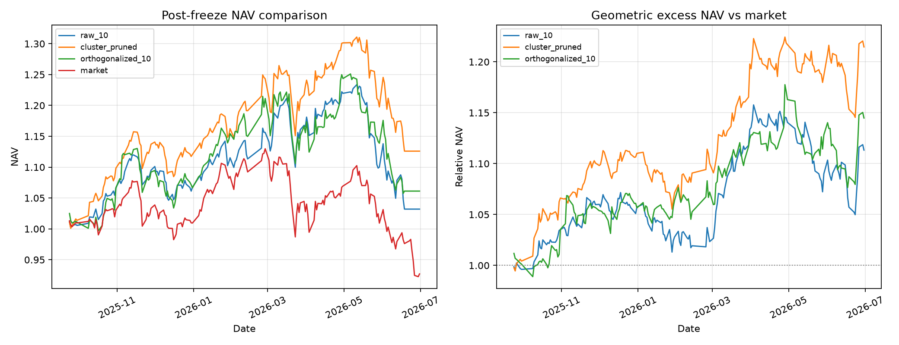

独立性指标说明处理确实有效：原始集合后续仍有 6 对相关性不低于 0.60，聚类精选和正交化后均为 0 对；正交化的有效秩接近理论上限 10。经济结果则表明“数学上最独立”不一定“交易上最好”：正交化会改变原始经济含义，并把平均卖出换手推高到 66.09%；聚类精选虽然没有降低换手，但保留原始因子语义，且本次后续区间的收益、超额、Sharpe 和回撤均优于原始集合。

因此，因子独立性问题已经从“只看相关矩阵”推进到“实际去冗余并做同区间回测”。但这仍是一组单次 120 日冻结、181 日后续评价的探索结果；后续区间现已被查看，不能据此把聚类组合直接替换为新的正式策略。更可靠的结论需要预先固定阈值，在多个 walk-forward 折内重复聚类、冻结和评价。行业与真实市值中性化仍未执行，因为匿名数据没有相应暴露表，本项目不使用成交额等代理变量冒充真实市值。

### 5.9 Task4 的剩余限制

- 只收取卖出费，未建模冲击成本、滑点和买入费；
- 未完整模拟涨跌停、盘口容量和排队成交概率；
- 等权 Top 10 集中度较高；
- 成本压力只改变卖出费率，仍未计买入成本和期末强制清仓；
- 最后阶段市场与策略同步回撤，但策略仍产生小幅负超额收益；这与因子测试期排序能力衰减、普通 IC 受尾部收益影响变号一致。
- 因子聚类和正交化目前只有一次冻结后评价，尚未经过多折稳定性检验；

因此 Task4 是研究回测，不是收益承诺。

---

## 6. 因子机器学习扩展

为验证“主要因子直接预测收益”和“直接优化组合夏普”两条路线，项目实现了：

1. return_regression：用因子回归下一日收益，再对预测收益形成组合；
2. direct_sharpe：直接学习因子权重，使训练期扣费后的组合夏普最大。

固定 70%/15%/15% 切分结果：

| 模型 | Train Sharpe | Validation Sharpe | Test Sharpe |
|---|---:|---:|---:|
| return_regression | 10.04 | 8.28 | -3.12 |
| direct_sharpe | 11.91 | 6.99 | -3.47 |

120 日滚动训练结果：

| 模型 | 全滚动期 Sharpe | 最近 45 日 Sharpe |
|---|---:|---:|
| return_regression | 4.85 | -3.25 |
| direct_sharpe | 4.53 | -3.76 |

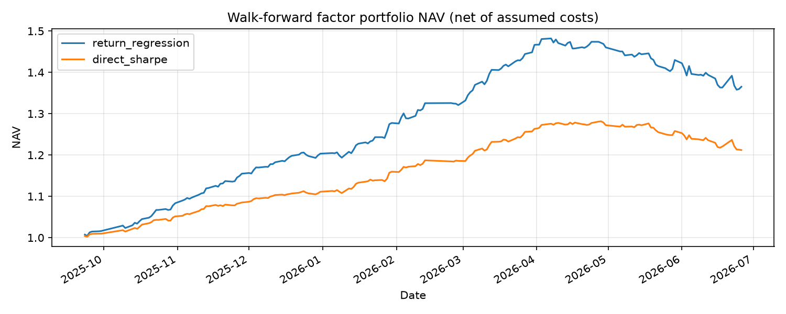

全期为正而最近阶段大幅为负，说明模型并没有解决因子方向突变，只是更充分地拟合了大部分历史时期。这也是最终报告不把因子学习模型作为 Task4 主策略的原因。

---

## 7. Task5：下一分钟 down/flat/up 预测

### 7.1 标签口径的演进

早期实现删除平盘样本，只在下一分钟真实发生价格变化时训练 down/up。该模型条件准确率约 68.10%，但合法测试窗口覆盖率只有 56.32%。由于预测时无法提前知道下一分钟是否平盘，这个 68.10% 不能作为可部署的整体准确率。

随后将平盘加入训练，定义：

```text
down = close(t+1) < close(t)
flat = close(t+1) = close(t)
up   = close(t+1) > close(t)
```

所有 5,900 个合法测试窗口均参与评价：down 1,735、flat 2,577、up 1,588；多数类 flat 基线为 43.68%。

### 7.2 直接三分类基线

直接三分类使用 11 个基础特征、60 分钟窗口、2 层 LSTM、hidden size 64、训练集标准化和平方根逆频率类别权重。

结果：

- Accuracy：45.56%；
- Balanced Accuracy：46.91%；
- Macro F1：45.56%；
- down/flat/up Recall：55.73% / 37.56% / 47.42%。

该模型对三类较均衡，但过度预测“发生涨跌”，平盘识别不足。

### 7.3 共享双头实验

第二版使用共享 LSTM 编码器，接两个任务头：

- movement head：flat/move；
- direction head：只在真实 move 样本上训练 down/up。

同时加入平盘比例、连续未变价时长、短期波动和时间位置特征。movement Balanced Accuracy 从 56.14% 提升到 57.26%，但最终三分类 Accuracy 降至 45.22%、Macro F1 降至 44.76%。

结论是两个任务共享同一编码器会产生任务冲突：平盘识别改善，但方向表示被损害。因此该模型保留为失败实验，不作为最终主模型。

### 7.4 最终三组件独立模型

参考队友最终仓库的思路，将共享编码器拆成三个独立组件：

1. **direction**：只用非平盘训练样本预测 down/up；
2. **movement**：用全部样本预测 flat/move；
3. **joint**：用全部样本直接预测 down/flat/up。

基础 11 特征包括相对 OHLC、close 对数收益和 7 个 log1p 成交/量额特征。增强分支再加入 14 个特征：

- high/low 对数振幅、close 在分钟高低区间的位置；
- 主买主卖量失衡、金额失衡；
- 平均每笔成交量；
- volume/amount 对数变化；
- 3/5/10 分钟收益；
- 5 分钟收益波动；
- 是否有成交、交易时段进度、是否下午。

movement 和 joint 使用逐股票训练集标准化，并附加 5 维股票 one-hot，因此实际输入维度为 25+5=30；direction 使用 11 维基础特征和全局标准化。

模型共同设置：

| 参数 | 设置 |
|---|---|
| 股票 | 000012.SZ、000014.SZ、000019.SZ、000020.SZ、000027.SZ |
| 窗口 | 60 分钟 |
| LSTM | 2 层，hidden size 64，dropout 0.2 |
| 优化器 | AdamW，lr=1e-3，weight decay=1e-4 |
| Batch | 256 |
| 梯度裁剪 | 1.0 |
| 学习率调度 | ReduceLROnPlateau |
| 早停 | validation accuracy，patience=5 |
| Train | 2025-04-01–2026-05-31，165,790 个窗口 |
| Validation | 2026-06-01–2026-06-15，6,490 个窗口 |
| Test | 2026-06-16–2026-06-30，5,900 个窗口 |

joint 模型增加“最近一分钟特征残差支路”，避免 LSTM 长序列压缩完全淹没最后一分钟的盘口状态。

### 7.5 概率融合

设 movement 预测发生变动的概率为 m，direction 条件上涨概率为 q，则两阶段概率为：

```text
P_stage(down) = m × (1-q)
P_stage(flat) = 1-m
P_stage(up)   = m × q
```

movement 概率先在 logit 空间应用验证集选择的 bias。最终概率为：

```text
P_final = joint_weight × P_joint
        + (1-joint_weight) × P_stage
```

seed 42 在验证集得到：

- move_bias = -0.30；
- joint_weight = 0.30；
- two_stage_weight = 0.70；
- validation Accuracy = 47.69%；
- validation Macro F1 = 47.26%。

我们进一步把 bias 网格从 [-0.30, 0.30] 扩展到 [-0.80, 0.30]，将步长从 0.05 加密到 0.025，共检查 1,845 个候选。验证集仍然选回 -0.30/0.30，说明正式参数不是原搜索边界造成的假最优。

### 7.6 正式 seed 42 测试结果

| 指标 | 结果 |
|---|---:|
| Accuracy | **46.46%** |
| Balanced Accuracy | 46.18% |
| Macro Precision | 45.85% |
| Macro Recall | 46.18% |
| Macro F1 | **45.93%** |
| Majority baseline | 43.68% |

逐类别结果：

| 类别 | Precision | Recall | F1 | Support |
|---|---:|---:|---:|---:|
| down | 43.73% | 49.28% | 46.34% | 1,735 |
| flat | 51.26% | 47.38% | 49.24% | 2,577 |
| up | 42.55% | 41.88% | 42.21% | 1,588 |

三个组件单独结果：

- direction：真实非平盘样本条件准确率 67.74%；
- movement：flat/move Accuracy 59.27%；
- joint：全窗口 Accuracy 46.05%；
- 融合后：全窗口 Accuracy 46.46%。

方向模型的 67.74% 仍然只能称为“真实非平盘条件方向准确率”，不能单独部署；movement 组件负责估计是否应该进入方向判断。

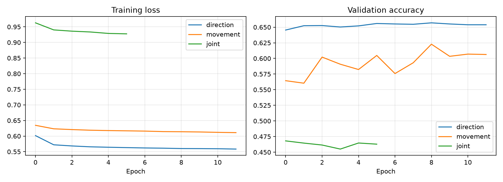

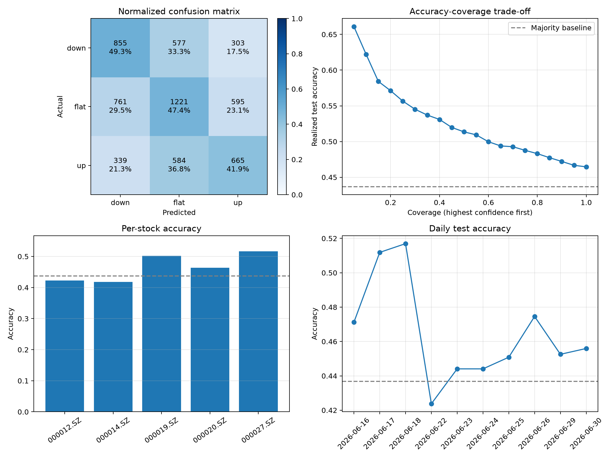

评价面板显示：

- down/flat/up Recall 分别为 49.3%、47.4%、41.9%，up 仍然最弱；
- 置信度越高，实际准确率越高，选择性预测排序有效；
- 000012.SZ 和 000014.SZ 准确率低于总体多数类基线，股票间异质性明显；
- 单日准确率从 42.37% 到 51.69% 波动，6 月 22 日表现最弱。

### 7.7 选择性预测

置信度阈值只根据验证集最大类别概率的分位数确定：

| 档位 | 验证阈值 | 测试样本 | 测试覆盖率 | 测试准确率 |
|---|---:|---:|---:|---:|
| 全窗口 | 无 | 5,900 | 100.00% | 46.46% |
| balanced | 0.5175 | 1,800 | 30.51% | 54.44% |
| strict | 0.5791 | 577 | 9.78% | 62.56% |

按测试集实现结果观察，最高置信度前 5% 的 295 个样本准确率为 66.10%，前 10% 的 590 个样本为 62.20%。这条曲线仅用于诊断，不用于反向选择阈值。

### 7.8 三随机种子稳健性

| Seed | Accuracy | Balanced Accuracy | Macro F1 | strict Accuracy | strict Coverage | joint weight |
|---:|---:|---:|---:|---:|---:|---:|
| 42 | 46.46% | 46.18% | 45.93% | 62.56% | 9.78% | 0.30 |
| 43 | 46.81% | 44.99% | 45.14% | 63.32% | 8.78% | 0.95 |
| 44 | 47.34% | 45.81% | 45.96% | 63.30% | 9.24% | 0.85 |
| 均值±标准差 | **46.87%±0.44%** | 45.66%±0.61% | **45.68%±0.47%** | **63.06%±0.43%** | 9.27%±0.50% | — |

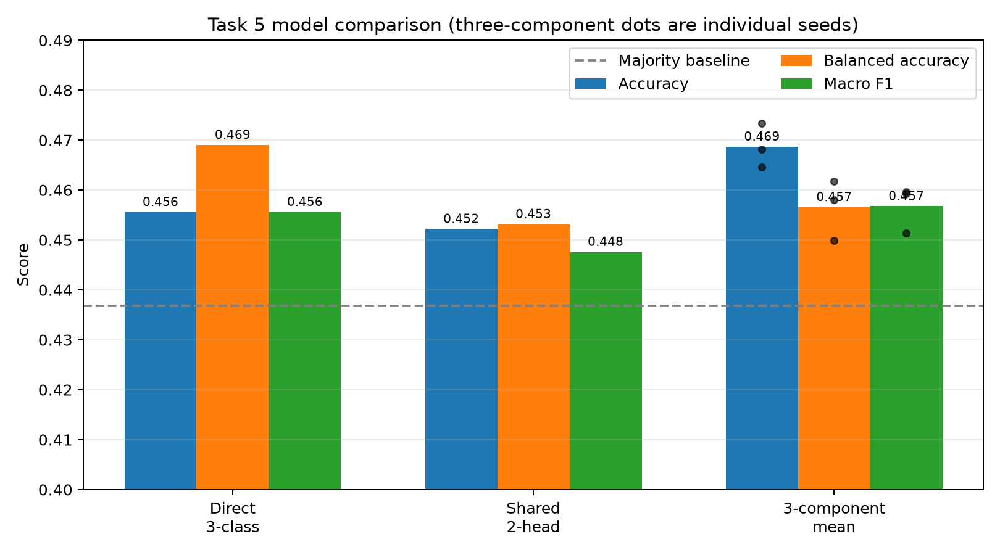

相较直接三分类：

- 三组件平均 Accuracy 提高约 1.31 个百分点；
- Macro F1 平均只提高约 0.12 个百分点；
- Balanced Accuracy 反而下降约 1.25 个百分点。

因此三组件的主要优势是总体命中率和高置信度排序，不是三类无差别地全面提高。融合权重在不同 seed 间变化较大，也说明三个组件之间的最优组合不够稳定。

正式目录仍保留预先固定的 seed 42，而不是事后选择测试准确率最高的 seed 44，避免形成“看完测试结果再挑随机种子”的隐性偏差。

### 7.9 强基线与概率质量

参考队友仓库“LSTM 必须和强非时序模型比较”的方法，本项目使用同一 60 分钟历史窗口构造固定统计摘要：最后值、均值、标准差、最小值、最大值、窗口首尾变化和股票 one-hot。所有标准化只拟合训练集；Logistic 与 HistGradientBoosting 的超参数按验证集 Macro F1、再按 Accuracy 选择并冻结，之后才首次打开测试集。

| 模型 | Accuracy | Macro F1 | Brier | NLL | Top-label ECE |
|---|---:|---:|---:|---:|---:|
| 三组件 LSTM | **46.46%** | **45.93%** | **0.6096** | **0.9999** | 2.71% |
| LSTM + temperature scaling | 46.46% | 45.93% | **0.6093** | **0.9994** | **0.91%** |
| 线性 Logistic-SGD | 45.34% | 43.82% | 0.6423 | 1.0634 | 8.56% |
| HistGradientBoosting | 42.66% | 42.09% | 0.6321 | 1.0331 | 6.10% |
| 上一分钟涨跌规则 | 33.08% | 30.37% | — | — | — |
| 永远预测 flat | 43.68% | 20.27% | — | — | — |

LSTM 在这组统一样本上同时领先简单规则、线性模型和树模型，因此其序列表示具有一定增量信息；但领先 Logistic 只有 1.12 个百分点 Accuracy，仍不属于数量级优势。验证集选择的温度为 1.30，校准后不改变类别和准确率，只降低过度置信，使 ECE 从 2.71% 降至 0.91%。因此策略仓位更适合使用校准后的概率，而不是把最大概率直接解释为真实胜率。

### 7.10 从分类准确率到策略收益

分类正确并不等于可以在对应价格成交。当前标签比较 `close[t+1]` 与 `close[t]`；模型必须等分钟 t 完整结束后才能获得 `close[t]` 及该分钟全部特征，因此按同一个 `close[t]` 成交属于不可实现的同柱假设。

本节同时保留三种口径：

1. **标签收益上限**：`close[t]→close[t+1]`，只用于确认分类信号与标签收益是否一致，不作为可交易结果；
2. **价格时点代理**：分钟 t 结束后形成信号，在 `open[t+1]` 买入、`close[t+1]` 卖出。它检验信号发布后的剩余收益，但因当日买卖不满足 A 股 T+1，不能称为完整可交易回测；
3. **T+1 小样本诊断**：在 `open[t+1]` 买入、下一交易日同一分钟开盘退出。把每天 118 个信号时点视为等资金“袖套”，无信号袖套持有现金，避免同一资金被分钟信号重复使用。

固定使用验证集已经冻结的 balanced/strict 置信度档，不根据测试收益重新选择阈值。价格时点代理的 long/cash 结果为：

| 上涨策略 | 活跃分钟覆盖 | 零成本收益 | 卖出费 5 bp 后 | 相对同期市场 |
|---|---:|---:|---:|---:|
| all_up | 76.10% | -1.12% | -36.89% | -39.97% |
| balanced_up | 32.20% | +4.60% | -13.50% | -17.72% |
| strict_up | 10.00% | +0.75% | -5.03% | -9.65% |
| 5股票等权市场 | 100.00% | +5.12% | 未扣成本 | — |

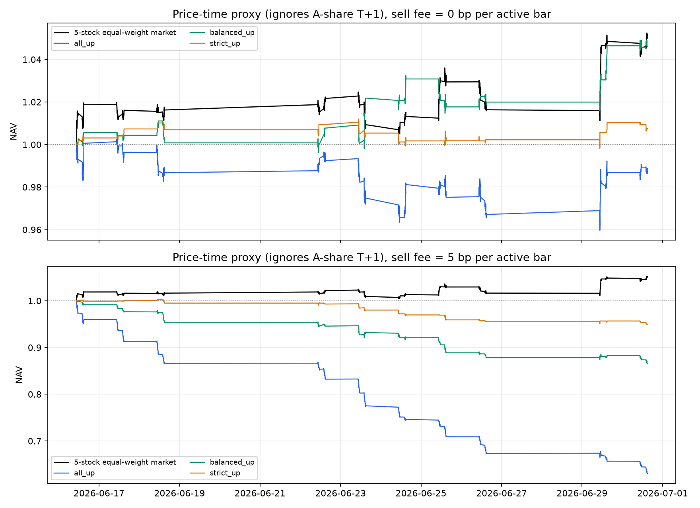

同收盘标签口径下，all/balanced/strict 上涨信号的零成本累计收益分别为 62.19%、38.22% 和 12.95%，说明模型确实学到了当前收盘到下一收盘的方向关系。但切换到下一分钟开盘后，该优势大幅消失；一分钟独立调仓的 5 bp 卖出费又进一步吞噬收益。

满足 T+1 的诊断因 2026-06-30 已是数据末日，只能结算前 9 个测试信号日。扣除每次卖出 5 bp 后：

| T+1 上涨策略 | 信号时点覆盖 | 策略收益 | 全仓5股市场 | 同覆盖市场 | 相对同覆盖市场 |
|---|---:|---:|---:|---:|---:|
| all_up | 76.65% | -9.58% | -12.27% | -9.67% | **+0.11%** |
| balanced_up | 32.02% | -4.27% | -12.27% | -4.61% | **+0.36%** |
| strict_up | 10.26% | -1.68% | -12.27% | -1.56% | **-0.13%** |

三个策略都因大量持有现金而跑赢同期全仓市场，其中 balanced 相对市场的几何超额为 9.12%；但和相同持仓覆盖率的市场比较后，balanced 超额只剩 0.36%，strict 反而落后 0.13%。这说明“跑赢市场”主要来自低市场暴露，模型选股的增量证据很小，而且 9 个结算日不足以作显著性判断。该诊断还未计买入费用、滑点、冲击和容量约束，结果仍偏乐观。

为检验“分类更准是否真的更赚钱”，再把 LSTM、Logistic 和 HistGradientBoosting 的测试预测严格对齐到相同 5,900 个股票—分钟键。每个模型分别使用自身验证集置信度的前 30%/前 10%阈值，不根据测试收益调参，并统一采用 long/cash、卖出 5 bps 和同一个 T+1 袖套引擎：

| 模型与档位 | T+1 策略收益 | 同覆盖市场 | 几何超额 |
|---|---:|---:|---:|
| LSTM balanced | -4.27% | -4.61% | +0.36% |
| HistGB balanced | -4.23% | -4.96% | **+0.77%** |
| Logistic balanced | -4.65% | -4.38% | -0.28% |
| LSTM strict | -1.68% | -1.56% | -0.13% |
| HistGB strict | -1.47% | -1.94% | **+0.48%** |
| Logistic strict | -2.19% | -2.03% | -0.16% |

这张表给出一个重要反例：HistGB 的 Accuracy 和 Macro F1 都低于 LSTM，但在这 9 个结算日的 balanced/strict 同覆盖超额略高。原因是 Accuracy 对所有样本等权，而策略更关心上涨信号的排序、收益幅度、覆盖和成本。因此模型评价必须同时保留分类层、概率层和经济层，不能只按 Accuracy 排名。由于测试期极短，表中差异只作统一口径诊断，不能据此把主模型改为 HistGB。

因此 Task5 的正式结论由“准确率高于多数类基线”扩展为：**模型存在统计预测信息和有效的置信度排序；T+1 balanced 在这 9 个结算日略微跑赢同覆盖市场，但证据太短、优势太小，尚不能认定形成稳健的扣成本超额收益。** 下一版应直接预测可持有至次交易日的收益或扣成本收益，并用更长的新样本外区间检验。

### 7.11 把“涨跌多少”加入 LSTM

三分类只回答方向，会把上涨 0.01% 和上涨 1% 视为同一种正确预测。为检验收益幅度是否能改善策略，本轮保留正式三组件模型不变，另建一个探索性多任务模型：同一个增强特征 LSTM 编码器连接三分类头和 signed-return 回归头。分类头仍保留全部平盘样本；回归目标为 `close[t]→close[t+1]` 的实际基点收益，只用训练集估计缩放和 99.5% 稳健截尾。回归损失对大波动赋予更高但有上限的权重，使平盘不会被错误删除，也避免极端收益主导梯度。

训练、验证、测试日期与正式模型一致。checkpoint 只按验证集收益 Spearman IC 选择，Accuracy 仅在 IC 相同时作为次级标准；收益排序的 70%/90% 阈值也在验证集冻结，之后才由程序加载测试日期。本次默认测试区间此前已经被研究过，所以仍将其标为探索性诊断，不把它替换为新的正式模型。

| 指标 | 正式三组件 LSTM | 涨跌幅多任务 LSTM |
|---|---:|---:|
| 测试 Accuracy | 46.46% | 46.47% |
| 测试 Macro F1 | **45.93%** | 44.77% |
| 测试收益 Pearson IC | — | 0.322 |
| 测试收益 Spearman IC | — | **0.335** |
| 非平盘样本收益符号准确率 | 67.74%（方向组件） | 68.25%（回归头符号） |

三分类 Accuracy 基本不变，Macro F1 下降 1.16 个百分点；但收益回归头取得 0.335 的排序 IC，说明它确实识别出不同涨跌样本的幅度差异。进一步在完全相同的测试键、下一分钟 `open→close` 价格代理和卖出费口径下比较：

| 方法与档位 | 活跃分钟覆盖 | 零成本毛收益 | 扣 5 bp 后 | T+1 同覆盖超额 |
|---|---:|---:|---:|---:|
| 正式方向分类 strict | 10.00% | +0.75% | -5.03% | -0.13% |
| 多任务方向分类 strict | 2.97% | -0.09% | -1.83% | -0.07% |
| **多任务预测收益 strict** | 43.31% | **+6.58%** | **-17.45%** | **-0.20%** |

收益排序组的毛收益明显高于原模型，证明“涨跌多少”对选股排序有帮助；但它在五只股票中经常至少选中一只，分钟覆盖和换手仍然过高，5 bp 成本完全吞噬毛收益。满足 T+1 的 9 个结算日也没有出现正的同覆盖超额。因此当前答案不是“没有用”，而是：**幅度目标增加了经济信息，但预测的仍是不可直接持有的一分钟标签；必须把目标改成可成交、可持有且扣成本后的收益，才能真正帮助净收益策略。**

### 7.12 可交易收益期限、低频 Top-K 与 T+1 LSTM

为进一步回答“预测涨跌多少是否有助于收益”，本轮不再把不可直接成交的 `close[t]→close[t+1]` 当作最终目标，而是构造五种可执行收益标签：在 `open[t+1]` 买入，分别在下一根、5、15、30 分钟后的收盘价卖出；以及在下一交易日相同分钟的开盘价卖出。盘中持有期不会跨越午休，T+1 标签会删除切分区间最后一天，避免借用下一数据分区价格。

每个期限均使用同一段 60 分钟因果历史特征，比较线性 Ridge 与非线性 HistGradientBoostingRegressor。回归参数、预测阈值、Top-K（1 或 2）和交易间隔全部根据验证集几何同覆盖超额冻结，程序之后才加载测试数据。策略只做多或持有现金，卖出成本按 5 bp 计；市场基准按策略实际持仓覆盖率构造，因此不会把大量空仓造成的低市场暴露误判为选股能力。

| 可交易期限 | Ridge 测试 Rank IC | HistGB 测试 Rank IC | 测试期策略观察 |
|---|---:|---:|---|
| 1 分钟 | 0.075 | **0.085** | Ridge 扣费后 +0.48%，但同覆盖超额 -1.75% |
| 5 分钟 | **0.074** | -0.003 | 两模型同覆盖超额均为负 |
| 15 分钟 | **0.094** | -0.057 | 两模型同覆盖超额均为负 |
| 30 分钟 | **0.080** | -0.061 | HistGB 同覆盖超额 +0.27% |
| T+1 同分钟开盘 | 0.037 | **0.104** | Ridge 同覆盖超额 +0.69% |

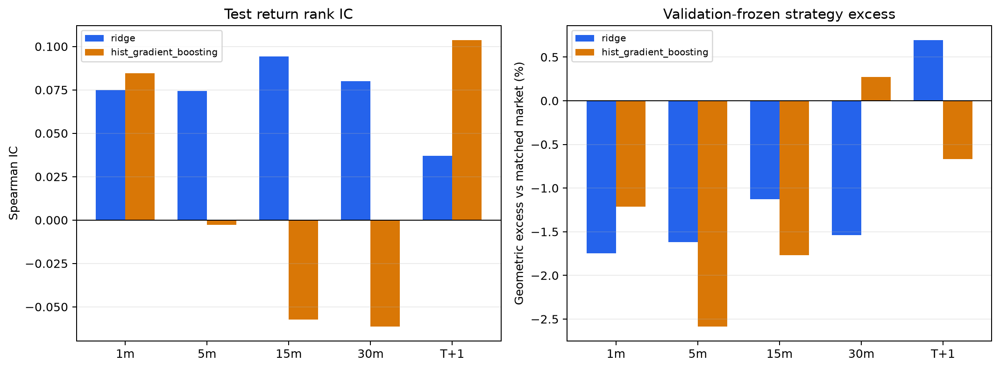

Rank IC 表明部分期限存在弱排序信息，但 10 个“期限×模型”组合的 MAE 均劣于直接预测零收益的基线，说明它们更像粗略排序器，而不是精确收益预测器。验证集最终推荐的是 T+1 Ridge、预测收益门槛 57.47 bp、Top 1、每 60 分钟一次信号。该配置在验证期扣费后 -1.02%，市场 -6.31%，同覆盖几何超额 +5.64%；冻结到测试期后只有 9 个结算日，结果如下：

| T+1 模型 | 策略扣 5 bp 后 | 同覆盖市场 | 几何超额 |
|---|---:|---:|---:|
| Ridge | -10.68% | -11.30% | **+0.69%** |
| HistGBRegressor | -0.83% | -0.16% | -0.67% |
| 紧凑多任务 LSTM | -19.14% | -12.03% | **-8.08%** |

紧凑 LSTM 使用共享编码器同时学习 T+1 方向和收益，checkpoint 仅按验证集收益 Rank IC 选择；其测试分类 Accuracy 为 45.89%、Macro F1 为 44.38%，收益 Rank IC 为 -0.017。表内不同模型的同覆盖市场收益略有差异，是因为验证集冻结后各自的阈值和实际持仓覆盖不同，应以几何超额作为横向比较主口径。

这一扩展带来的结论很清楚：**“加入涨跌幅”这个方向有研究价值，但只有在标签、成交时点和持有期都可执行时才有意义；在当前短测试期内，复杂 LSTM 没有提供增量，简单 Ridge 的相对收益反而更好。** 同时，Ridge 本身仍然绝对亏损、优势只有 0.69% 且样本仅 9 日，不能据此宣称获得稳健 Alpha。正式三组件分类模型保持不变，这一节只作为经济价值与模型复杂度的探索性检验。

### 7.13 Task5 输入特征去冗余与组件互补性

Task4 的结果说明重复暴露会使组合重复计权，Task5 的 25 个增强特征也存在相同风险。但分钟序列不能直接套用日频因子的横截面正交化，因为强制残差化可能破坏价格、成交和时间特征的原始含义。因此本轮采用训练集聚类精选：对每个 60 分钟窗口计算末值、均值、标准差和首尾变化四种因果摘要，在训练集中确定性抽取 40,000 行，取四张 Spearman 矩阵的平均绝对值；绝对相关性达到 0.85 的特征归为同一连通簇，簇内仅按训练期 T+1 收益最大绝对 Rank IC 选择代表。验证和测试均不参与删特征。

25 个特征最终形成 19 个簇。被合并的重复信息主要是：`volume/trade_count/amount` 保留 `amount`，主买量/额保留主买额，主卖量/额保留主卖额，量/额失衡保留量失衡，`volume_log_change/amount_log_change` 保留前者。最大摘要相关性由接近 1 降到 0.834，均值由 0.291 降到 0.262；有效秩由 9.61 提高到 9.94，因子数归一化后的有效秩比例由 38.4% 提高到 52.3%。

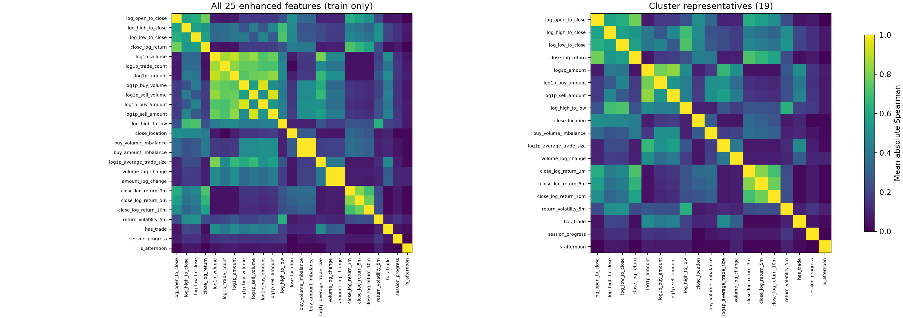

随后保持 T+1 标签、紧凑共享双头结构、seed、训练轮数、验证 checkpoint 和策略选择规则完全一致，只把输入从 25 维改为冻结的 19 维：

| T+1 紧凑 LSTM | 25 个特征 | 聚类精选 19 个特征 |
|---|---:|---:|
| 测试 Accuracy | 45.89% | **46.14%** |
| 测试 Macro F1 | 44.38% | **45.72%** |
| 收益 Rank IC | -0.017 | **+0.065** |
| 策略扣 5 bp 后 | -19.14% | **-9.11%** |
| 同覆盖市场 | -12.03% | -8.50% |
| 几何超额 | -8.08% | **-0.67%** |

去冗余后分类指标小幅改善，收益排序和经济结果改善更明显；验证集选择也从零门槛、每 60 分钟 Top 1，变为预测收益至少 52.06 bp、每 30 分钟 Top 2。说明重复的成交量额特征确实干扰了原模型。但新模型仍然绝对亏损 9.11%、同覆盖超额为负，而且没有超过 T+1 Ridge 的 +0.69%，所以结论应是“明显修复”，而不是“已经形成可交易 Alpha”。

三组件互补性使用正式模型已经保存的逐样本概率检查，不重新训练或调整融合权重。验证集 joint 与 staged 的预测类别一致率为 81.96%，分歧率为 18.04%；在分歧样本中，joint、staged 和冻结融合的准确率分别为 39.03%、40.65% 和 43.89%，说明融合在验证期确有增量。测试集一致率为 80.68%，但 staged 单独 Accuracy 为 46.58%，略高于冻结融合的 46.46%，表明互补优势并没有在短测试期稳定延续。由此不能删除三组件，也不能宣称融合必然优于单组件；更稳妥的下一步是用多折 OOF 分歧样本来冻结融合结构。

本节仍是探索性结果：固定测试日期此前已被查看，19 特征模型不能替换正式三组件分类模型；它提供的是“输入去冗余有帮助”的证据，并为下一次真正未见数据预先固定候选方案。

### 7.14 原题四字段最小基线

原题并没有列出“四个 Task5 因子”，但逐笔数据表明确只有 `Time、Price、Volume、BSFlag` 四个原始字段。为检验后来构造的特征是否反而伤害模型，本轮建立一组最小且可部署的映射，每个原始字段只保留一个平稳因果特征：

| 原题字段 | LSTM 输入 | 含义 |
|---|---|---|
| Time | `session_progress` | 当前分钟在半日交易时段中的进度 |
| Price | `close_log_return` | 当前分钟收盘相对上一分钟的对数收益 |
| Volume | `log1p_volume` | 当前分钟成交量的对数变换 |
| BSFlag | `buy_volume_imbalance` | 主买量与主卖量的标准化差异 |

四特征版本使用与25/19特征版本相同的股票、日期、60分钟窗口、模型结构、seed、T+1 收益头、验证 checkpoint、阈值、Top-K、交易间隔和5 bp卖出成本。唯一变化是输入维度，因此可以直接判断特征集合的影响：

| T+1 双头 LSTM | 原25特征 | 聚类精选19特征 | 原题四字段映射 |
|---|---:|---:|---:|
| 下一分钟 Accuracy | 45.89% | **46.14%** | 45.54% |
| 下一分钟 Macro F1 | 44.38% | **45.72%** | 39.64% |
| T+1 收益 Rank IC | -0.017 | **+0.065** | -0.121 |
| 策略扣5 bp后 | -19.14% | **-9.11%** | -12.65% |
| 同覆盖市场 | -12.03% | -8.50% | -10.50% |
| 几何超额 | -8.08% | **-0.67%** | -2.40% |

四字段版本的绝对与相对收益好于未去冗余的25特征版本，但收益排序、Macro F1和策略超额均明显弱于19特征版本。这回答了“后加特征是否有负面影响”：**全部25个一起输入确实存在负面影响，但不是因为新增信息整体无用，而是其中夹杂了高度重复的量额特征；只用四项原始信息又会欠拟合。当前最好的平衡点是训练集冻结的19个代表特征。** 三个 LSTM 策略仍然绝对亏损，且19特征仍略逊于 Ridge 的 +0.69% 同覆盖超额，因此这个结论只说明输入设计改善，不等于策略已经成功。

---

## 8. 本轮最终整理的具体修改过程

### 8.1 代码整合

- 保留原直接三分类和共享双头实验，不覆盖已有权重；
- 新增独立的 `lstm_components.py`、`lstm_ensemble.py` 和 `lstm_ensemble_training.py`；
- 新增正式训练、重载评价、融合网格审计、三种子汇总和全项目验收入口；
- 新增 `strategy_analysis.py` 和统一策略分析入口，保存 Task4 市场基准及 Task5 执行时点收益；
- 新增 `factor_robustness.py`：滚动/分期 IC、区块 bootstrap、市场状态和单因子相对收益；
- 新增 `factor_independence.py`：冻结期相关性聚类、历史 ICIR 代表选择、逐日截面正交化、有效秩和三套同区间严格回测；
- 新增 `task4_robustness.py`：在真实股数账本上实现缓冲选股、换手约束与成本压力；
- 新增 `lstm_baselines.py`：训练集因果摘要、Logistic/HistGB 强基线、Brier/NLL/ECE 和 temperature scaling；
- 新增 `lstm_magnitude.py`：共享编码器上的方向分类与 signed-return 回归、训练集稳健缩放、验证集收益 IC 选模及同键策略比较；
- 新增 `tradable_return_research.py`：构造 1/5/15/30 分钟与 T+1 可成交标签，比较 Ridge/HistGB，并在验证集冻结阈值、Top-K 和交易间隔；
- 新增 `tradable_lstm.py`：对验证筛选出的 T+1 期限训练紧凑方向＋收益 LSTM，与简单模型执行同口径比较；
- 新增 `lstm_feature_independence.py`：训练集分钟特征聚类、T+1 Rank IC 代表选择、三组件互补性审计和精选输入 LSTM 对照；
- 新增 `lstm_minimal_four.py`：将原题 Time/Price/Volume/BSFlag 映射为四个平稳特征，并与25/19特征 T+1 LSTM 同口径比较；
- 新增同一 5,900 个股票—分钟键上的模型策略比较，并继续以 T+1 long/cash 为主口径；
- 将正式输出放到 `output/lstm_ensemble`，seed 43/44 放到独立目录；
- 更新 `run_all.bat --with-lstm`，使其可运行基线、三组件和严格重放。

### 8.2 防止测试集泄漏

正式三组件训练按以下顺序执行：

1. 只读取 train/validation 日期训练 direction；
2. 只读取 train/validation 日期训练 movement 和 joint；
3. 在 validation 上搜索融合参数；
4. 在 validation 上冻结 balanced/strict 置信度阈值；
5. 记录冻结时间；
6. 最后才首次加载 test 日期并输出结果。

需要强调：代码流程本次没有用测试标签调参，但默认测试日期在之前的研究过程中已被多次查看，因此仍不能称为真正的新盲测。

### 8.3 可复现与审计

模型文件同时保存：

- 三个组件的严格 state dict；
- 输入维度、模型版本、类别语义；
- 股票顺序、日期切分、特征顺序；
- 每个组件的训练集标准化均值/方差；
- 融合参数和置信度阈值；
- Python、PyTorch、NumPy、pandas、设备和运行时间。

`test_predictions.csv` 保存 5,900 行逐样本结果，包括 stock、window_end、target_time、真实/预测标签、最终三类概率，以及 direction、movement、joint、staged 的组件概率。

严格重放验收从原始分钟表重新构造全部窗口并加载权重：

- 5,900 行元数据完全一致；
- 标签完全一致；
- 最终预测类别完全一致；
- GPU 批大小变化下最大概率误差为 3.9×10⁻⁵，小于 10⁻⁴ 容差；
- Accuracy、Macro F1 和混淆矩阵一致。

### 8.4 自动测试与总体验收

当前共有 39 个独立单元测试；除原有检查外，本轮新增了完整窗口、正式因子数量和五分组逐日收益三项核心审计：

1. 增强特征维度和午休收益重置；
2. 非平盘方向任务排除 flat；
3. 三分类保留 flat 并核对时间戳；
4. 两阶段概率和融合概率归一化；
5. 三组件 checkpoint 严格重载；
6. IR 等于 `sqrt(252) × ICIR`；
7. Task4 历史 IC 权重具有两交易日信息滞后。
8. 复合收益指标按净值连乘计算；
9. 策略与市场使用几何超额收益；
10. LSTM 策略只在实际持仓分钟收取费用；
11. long-short 诊断按预测方向正确设置正负仓位。
12. T+1 策略按分钟资金袖套处理空仓、费用和同覆盖市场。
13. 区块 bootstrap、市场状态切分和强 IC 显著性；
14. Task4 缓冲区保留停牌持仓并限制每日替换数；
15. LSTM 经典基线的序列摘要只使用固定历史窗口；
16. 温度缩放保持概率归一化且不改变类别顺序。
17. 多任务 LSTM 的分类头与收益头逐样本对齐；
18. 收益目标只用训练样本拟合稳健尺度并限制极端值；
19. 分类与收益损失均可正常反向传播；
20. 收益阈值来自验证分布且保持非负与单调；
21. 收益 Rank IC 与非平盘符号准确率计算可复核。
22. 多期限信号调度不会跨越午休，并严格遵守冻结的交易间隔；
23. T+1 多资金袖套先对包含空仓的袖套求平均，再进行日间复利；
24. 同覆盖市场和几何超额收益可由逐期收益精确复核。
25. 因子聚类使用绝对相关性的连通分量，避免链式相关因子被错误拆开；
26. 代表因子评分对原始 IC 强制执行两日实现滞后；
27. 每个相关簇只保留一个由冻结期 ICIR 选出的代表；
28. 截面 Gram-Schmidt 分量在逐日有效样本上达到数值正交。
29. Task5 的四种窗口摘要与输入序列逐样本对齐且不使用目标分钟；
30. 训练集摘要相关矩阵能识别线性重复的分钟特征；
31. 每个分钟特征簇只按训练期 T+1 Rank IC 保留一个代表；
32. joint、staged 和冻结融合的概率消融及分歧率计算可复核。
33. 原题四个逐笔字段一一映射为四个唯一、已声明的因果分钟特征。

最终 `validation_report.json` 同时验收 Task1–5、因子 bootstrap/市场状态、因子聚类/正交化、Task4 市场基准与成本压力、Task5 强基线/概率校准、涨跌幅多任务、五种可交易期限、分钟特征去冗余、原题四字段基线和三组件互补性，全部返回 passed。

---

## 9. 主要问题与诚实结论

### 9.1 因子问题仍是项目最核心限制

全样本 IC 为负本身没有问题；真正的问题是大多数因子在测试期明显衰减，且普通 Pearson IC 受尾部收益影响发生变号。五分组曲线进一步确认：正式4因子中只有示例因子和量价相关严格单调，另外两个主要依赖极端组。因子重复暴露已经得到首轮处理：聚类精选把 10 个因子压缩为 6 个，正交化把最大后续相关性降到 0.096；但这只能解决“信息重复”，不能解决“关系随时间失效”。最后 45 日 close/open 正式策略相对同口径市场分别落后 0.45%/3.32%，说明市场状态与选股衰减共同作用。固定切分因子模型测试亏损、滚动模型最近 45 日 Sharpe 为负，也说明历史关系未能稳定延续到近期。

### 9.2 Task5 的信号依然较弱

三组件平均 Accuracy 比多数类基线高约 3.19 个百分点，比直接模型高约 1.31 个百分点，属于真实但有限的改进。涨跌幅多任务把收益 Rank IC 提高到可观察的 0.335，并改善严格组价格代理毛收益，但 5 bp 成本后仍为 -17.45%，说明信号周期和换手比“是否预测幅度”更接近当前瓶颈。同收盘标签收益明显为正，但不满足 T+1 的下一分钟价格代理在扣费后为负。满足 T+1 的 balanced 策略在 9 个结算日扣费后为 -4.27%，好于全仓市场的 -12.27%，但相对同覆盖市场只多 0.36%。进一步改用可成交收益标签后，T+1 Ridge 同覆盖超额为 +0.69%，原始25特征紧凑 LSTM 为 -8.08%，原题四字段版本为 -2.40%，训练集精选19特征版本为 -0.67%。四字段欠拟合、25特征存在冗余，19特征说明适量的衍生信息有用，但复杂模型仍未超过 Ridge。准确率或 Rank IC 都不能直接推导组合收益，短期跑赢市场也不能自动解释为选股 Alpha。

### 9.3 高置信度有效，但覆盖率低

strict 档约 63% 准确率在三个 seed 中较稳定，但只覆盖约 9%。如果用于交易，还必须同时考虑：

- 信号是否集中在少数股票和少数日期；
- 预测方向对应的实际收益幅度是否足够覆盖成本；
- 高置信度是否经过概率校准；
- 连续分钟信号造成的高换手。

### 9.4 当前测试集不再是严格盲测

2026-06-16 至 2026-06-30 已被双方多次查看。虽然最终代码严格做到验证集调参、测试集后加载，但研究人员对该阶段已有认知。真正的无偏确认需要：

- 2026-06-30 之后的新数据；或
- 预先锁定、不再修改规则的多折 walk-forward；或
- 将所有模型选择限制在更早区间，留下从未查看的最终 holdout。

---

## 10. 下一阶段建议

按优先级建议：

1. **新增真正未见日期**：这是比继续调网络参数更重要的工作。
2. **扩展可交易标签的样本外验证**：首轮已完成 `open[t+1]` 入场的 1/5/15/30 分钟和 T+1 筛选；下一步应加入更新日期、多折验证，并直接预测扣成本后的收益或超额收益。
3. **按股票或流动性分组建模**：当前股票间表现差异大，可尝试共享主干+股票适配层，或只交易验证期稳定的股票。
4. **多折 walk-forward**：当前已完成多种 seed、强基线和概率校准，下一步应按预先锁定的日期折逐折重训并汇总真正不重叠的 OOS 预测。
5. **多折因子去冗余**：固定 0.60 阈值，在每个 walk-forward 训练折重新冻结聚类和正交顺序，验证 6 因子精选的优势是否稳定。
6. **多折验证 Task5 精选特征**：当前 25→19 特征明显改善 T+1 LSTM，但应在每个训练折重新冻结聚类，确认不是单次切分偶然。
7. **稳定融合**：joint/staged 在约 18% 验证分歧样本上存在融合增量，应使用多折 OOF 分歧概率确定固定融合权重，而不是每个 seed 独立选择。
8. **Task4 风险控制**：当前已完成缓冲选股和换手压力；下一步加入市场中性、行业/风格约束、单股权重上限和波动目标。
9. **因子状态识别**：当前市场状态检验仍以解释为主；若用于交易，regime detector 必须滚动训练并只使用当时可见状态。

对于明天的中期汇报，建议把核心表述定为：

> 我们先严格完成题目要求，再把扩展研究单独列示。正式4因子均已生成 Q1–Q5 五条净值曲线；Task4 close/open 总收益分别为 19.85%/52.76%，但最近45日均跑输同口径市场。扩展10因子并未优于正式4因子；聚类精选把10个因子压缩为6个，同区间几何超额由11.33%提高到21.46%。Task5 三组件准确率约46.5%–47.3%；25个分钟输入精选为19个后，T+1收益 Rank IC 从-0.017改善到+0.065，但仍未超过 Ridge。当前结果不能证明稳健 Alpha，下一阶段重点仍是全新样本外和多折验证。

---

## 11. 复现命令

在 `project/quant_downsampler` 执行：

```powershell
# 自动测试
py -3 -m unittest discover -v

# Task1 烟雾测试
py -3 scripts\smoke_test.py

# 因子评价（含正式4因子、扩展10因子和Q1–Q5五条净值曲线）
py -3 scripts\run_factor_eval.py --save
py -3 -m scripts.run_factor_robustness --iterations 2000 --block-length 5

# 因子聚类精选、截面正交化和冻结后同区间回测
py -3 -m scripts.run_factor_independence --calibration-days 120 --correlation-threshold 0.60

# 严格 Task4：先正式4因子，再扩展10因子
py -3 scripts\run_task4_strict.py --factor-set required --out ..\output\backtest_required
py -3 scripts\run_task4_strict.py --factor-set extended --out ..\output\backtest_strict
py -3 -m scripts.run_task4_robustness

# Task4 同执行价格市场基准
py -3 -m scripts.run_strategy_analysis --task4-only --task4-dir backtest_required --recent-days 45
py -3 -m scripts.run_strategy_analysis --task4-only --task4-dir backtest_strict --recent-days 45

# Task5 策略收益诊断
py -3 -m scripts.run_strategy_analysis --task5-only --sell-fee-bps 5

# 正式 Task5 三组件模型
py -3 -m scripts.run_lstm_ensemble --stocks 5 --epochs 12 --seq-len 60 --device cuda --out-dir ..\output\lstm_ensemble --overwrite

# 因果强基线、概率校准和冻结选择
py -3 -m scripts.run_lstm_baselines

# 方向分类＋实际涨跌幅回归的探索性多任务 LSTM
py -3 -m scripts.run_lstm_magnitude --epochs 12 --return-loss-weight 0.25 --sell-fee-bps 5 --device cpu --overwrite

# 1/5/15/30 分钟与 T+1 可交易收益、低频 Top-K 策略
py -3 -m scripts.run_tradable_return_research

# 验证集筛选期限后的紧凑 T+1 LSTM 对照
py -3 -m scripts.run_tradable_lstm

# Task5 训练集特征聚类、组件互补性与19特征 T+1 LSTM
py -3 -m scripts.run_lstm_feature_independence --correlation-threshold 0.85 --epochs 8 --device cpu

# 原题 Time/Price/Volume/BSFlag 四字段映射的最小基线
py -3 -m scripts.run_lstm_minimal_four --epochs 8 --sell-fee-bps 5 --device cpu

# 严格重放
py -3 -m scripts.validate_lstm_ensemble --run-dir ..\output\lstm_ensemble --data-dir ..\output\minute --device cuda

# 融合参数网格审计
py -3 -m scripts.analyze_lstm_fusion_grid --run-dir ..\output\lstm_ensemble

# 三随机种子汇总
py -3 -m scripts.summarize_lstm_runs

# Task1–5 总体验收
py -3 -m scripts.validate_project_outputs
```

---

## 12. 主要产物索引

- `output/validation_report.json`：全项目验收结果；
- `output/evaluation/factor_summary.csv`：10 个因子评价；
- `output/evaluation/required_factor_summary.csv`：题目正式4因子的 IC/IR/ICIR/Rank 指标；
- `output/evaluation/factor_layer_daily_returns.csv`：所有因子的 Q1–Q5 逐日收益；
- `output/evaluation/factor_layer_nav.csv`：所有因子的 Q1–Q5 累计净值；
- `output/evaluation/factor_layer_monotonicity.csv`：分层 Spearman、相邻违例和 Q1−Q5 显著性；
- `output/evaluation/required_factor_layering_nav.png`：题目正式4因子的五分组净值曲线；
- `output/evaluation/factor_stability.csv`：时间切分稳定性；
- `output/factor_robustness/`：区块 bootstrap、滚动/分期 IC、市场状态和单因子相对收益；
- `output/factor_independence/clusters.csv`：冻结期相关簇、历史 ICIR 和代表因子；
- `output/factor_independence/independence_metrics.csv`：三套因子集合的相关性、有效秩和条件数；
- `output/factor_independence/backtest_metrics.csv`：统一冻结后区间的收益、市场、超额、换手与回撤；
- `output/factor_independence/comparison.png`：三套策略净值及相对市场净值；
- `output/backtest_required/metrics.csv`：题目正式4因子的 Task4 十组策略指标；
- `output/backtest_required/benchmark_metrics_adaptive_close.json`：收盘策略与收盘等权市场；
- `output/backtest_required/benchmark_metrics_adaptive_open.json`：开盘策略与开盘等权市场；
- `output/backtest_strict/metrics.csv`：扩展10因子的 Task4 十组策略指标；
- `output/backtest_strict/*_daily.csv`：每日净值、收益和换手；
- `output/backtest_strict/benchmark_metrics.json`：Task4 市场基准与分阶段超额指标；
- `output/backtest_strict/benchmark_comparison.png`：策略、市场与相对净值；
- `output/backtest_robustness/cost_stress.csv`：原 Top10 与缓冲策略的成本压力；
- `output/factor_models_aligned/results.json`：固定切分因子模型；
- `output/factor_models_rolling_aligned/results.json`：滚动因子模型；
- `output/lstm_next_minute/test_metrics.json`：直接三分类基线；
- `output/lstm_next_minute_hierarchical/test_metrics.json`：共享双头实验；
- `output/lstm_ensemble/model.pt`：正式三组件 checkpoint；
- `output/lstm_ensemble/test_predictions.csv`：正式逐样本预测；
- `output/lstm_ensemble/test_metrics.json`：正式 Task5 指标；
- `output/lstm_ensemble/seed_robustness.json`：三种子稳健性；
- `output/lstm_ensemble/replay_validation.json`：严格重放结果。
- `output/lstm_ensemble/strategy_metrics.csv`：标签收益和下一分钟价格时点代理结果；
- `output/lstm_ensemble/strategy_nav.png`：不满足 T+1 的价格时点代理净值对比；
- `output/lstm_ensemble/t1_strategy_metrics.csv`：T+1 策略、全仓市场和同覆盖市场对比；
- `output/lstm_ensemble/t1_strategy_returns.csv`：T+1 逐信号日收益；
- `output/lstm_ensemble/STRATEGY_README.md`：标签、价格时点与 T+1 三种收益口径说明。
- `output/lstm_baselines/test_metrics.csv`：LSTM、Logistic、HistGB、规则和多数类的统一概率指标；
- `output/lstm_baselines/strategy_comparison.csv`：相同测试键、验证阈值和 T+1 引擎下的模型策略比较；
- `output/lstm_baselines/selection_frozen_before_test.json`：强基线和温度参数的测试前冻结记录。
- `output/lstm_magnitude/metrics.json`：多任务分类、收益 IC 和策略结果；
- `output/lstm_magnitude/test_predictions.csv`：逐样本三类概率、真实/预测收益基点；
- `output/lstm_magnitude/strategy_comparison.csv`：正式方向模型、多任务方向头与收益头的同键毛/净/T+1 对比。
- `output/tradable_return_research/test_return_metrics.csv`：五种可交易期限下 Ridge/HistGB 的收益误差与 Rank IC；
- `output/tradable_return_research/test_strategy_metrics.csv`：验证集冻结参数后的测试期净收益、同覆盖市场和几何超额；
- `output/tradable_return_research/selection_frozen_before_test.json`：模型、阈值、Top-K、交易间隔及测试前冻结记录；
- `output/tradable_return_research/horizon_strategy_summary.png`：期限收益排序与策略超额汇总图；
- `output/tradable_lstm/summary.json`：紧凑 T+1 LSTM 的分类、收益和策略指标；
- `output/tradable_lstm/strategy_comparison.csv`：T+1 Ridge、HistGB 与紧凑 LSTM 的同口径比较。
- `output/lstm_feature_independence/feature_clusters.csv`：25 个分钟输入的训练集相关簇与19个代表特征；
- `output/lstm_feature_independence/feature_independence_metrics.csv`：完整/精选输入的相关性与有效秩；
- `output/lstm_feature_independence/component_ablation_metrics.csv`：joint、staged、冻结融合的验证/测试概率指标；
- `output/lstm_feature_independence/component_complementarity.csv`：组件一致率、分歧率和分歧样本准确率；
- `output/lstm_feature_independence/full_vs_pruned_lstm.csv`：25特征与19特征 T+1 LSTM 的同口径比较。
- `output/lstm_minimal_four/minimal_four_summary.json`：原题四字段映射、分类、收益排序和策略指标；
- `output/lstm_minimal_four/model_comparison.csv`：4/19/25特征 T+1 LSTM 的统一比较。
